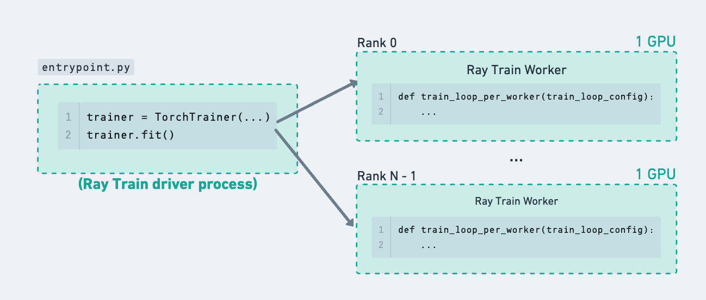
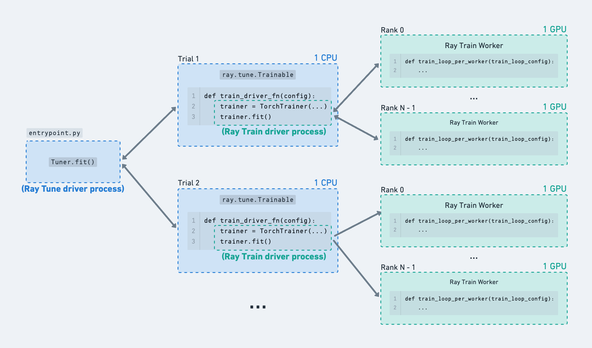

.. _train-tune:

Hyperparameter Tuning with Ray Tune
===================================

.. important::
    This user guide shows how to integrate Ray Train and Ray Tune to tune over distributed hyperparameter runs
    for the revamped Ray Train V2 available starting from Ray 2.43 by enabling the environment variable ``RAY_TRAIN_V2_ENABLED=1``.
    **This user guide assumes that the environment variable has been enabled.**

    Please see :ref:`here <train-tune-deprecation>` for information about the deprecation and migration.

Ray Train can be used together with Ray Tune to do hyperparameter sweeps of distributed training runs.
This is often useful when you want to do a small sweep over critical hyperparameters,
before launching a run with the best performing hyperparameters on all available cluster resources for a long duration.

Quickstart
----------

In the example below:

* :class:`~ray.tune.Tuner` launches the tuning job, which runs trials of ``train_driver_fn`` with different hyperparameter configurations.
* ``train_driver_fn``, which (1) takes in a hyperparameter configuration, (2) instantiates a ``TorchTrainer`` (or some other framework trainer), and (3) launches the distributed training job.
* :class:`~ray.train.ScalingConfig` defines the number of training workers and resources per worker for a single Ray Train run.
* ``train_fn_per_worker`` is the Python code that executes on each distributed training worker for a trial.

.. literalinclude:: ../doc_code/train_tune_interop.py
    :language: python
    :start-after: __quickstart_start__
    :end-before: __quickstart_end__

What does Ray Tune provide?
---------------------------

Ray Tune provides utilities for:

* :ref:`Defining hyperparameter search spaces <tune-search-space-tutorial>` and :ref:`launching multiple trials concurrently <tune-parallel-experiments-guide>` on a Ray cluster
* :ref:`Using search algorithms <tune-search-alg>`
* :ref:`Early stopping runs based on metrics <tune-stopping-guide>`

This user guide only focuses on the integration layer between Ray Train and Ray Tune. For more details on how to use Ray Tune, refer to the :ref:`Ray Tune documentation <tune-main>`.

Configuring resources for multiple trials
-----------------------------------------

Ray Tune launches multiple trials which :ref:`run a user-defined function in a remote Ray actor <tune-function-api>`, where each trial gets a different sampled hyperparameter configuration.

When using Ray Tune by itself, trials do computation directly inside the Ray actor. For example, each trial could request 1 GPU and do some single-process model
training within the remote actor itself. When using Ray Train inside Ray Tune functions, the Tune trial is actually not doing extensive computation inside this actor
-- instead it just acts as a driver process to launch and monitor the Ray Train workers running elsewhere.

Ray Train requests its own resources via the :class:`~ray.train.ScalingConfig`.
See :ref:`train_scaling_config` for more details.

    A single Ray Train run to showcase how using Ray Tune in the next figure just adds a layer of hierarchy to this tree of processes.

    Example of Ray Train runs being launched from within Ray Tune trials.

Limit the number of concurrent Ray Train runs
~~~~~~~~~~~~~~~~~~~~~~~~~~~~~~~~~~~~~~~~~~~~~

Ray Train runs can only start when resources for all workers can be acquired at once.
This means that multiple Tune trials spawning Train runs will be competing for the logical resources available in the Ray cluster.

If there is a limiting cluster resource such as GPUs, then it won't be possible to run training for all hyperparameter configurations concurrently.
Since the cluster only has enough resources for a handful of trials to run concurrently,
set :class:`tune.TuneConfig(max_concurrent_trials) <ray.tune.TuneConfig>` on the Tuner to limit the number of “in-flight” Train runs so that no trial is being starved of resources.

.. literalinclude:: ../doc_code/train_tune_interop.py
    :language: python
    :start-after: __max_concurrent_trials_start__
    :end-before: __max_concurrent_trials_end__

As a concrete example, consider a fixed sized cluster with 128 CPUs and 8 GPUs.

* The ``Tuner(param_space)`` sweeps over 4 hyperparameter configurations with a grid search: ``param_space={“train_loop_config”: {“batch_size”: tune.grid_search([8, 16, 32, 64])}}``
* Each Ray Train run is configured to train with 4 GPU workers: ``ScalingConfig(num_workers=4, use_gpu=True)``. Since there are only 8 GPUs, only 2 Train runs can acquire their full set of resources at a time.
* However, since there are many CPUs available in the cluster, the 4 total Ray Tune trials (which default to requesting 1 CPU) can be launched immediately.
  This results in 2 extra Ray Tune trial processes being launched, even though their inner Ray Train run just waits for resources until one of the other trials finishes.
  This introduces some spammy log messages when Train waits for resources. There may also be an excessive number of Ray Tune trial processes if the total number of hyperparameter configurations is large.
* To fix this issue, set ``Tuner(tune_config=tune.TuneConfig(max_concurrent_trials=2))``. Now, only two Ray Tune trial processes will be running at a time.
  This number can be calculated based on the limiting cluster resource and the amount of that resources required by each trial.

Advanced: Set Train driver resources
~~~~~~~~~~~~~~~~~~~~~~~~~~~~~~~~~~~~

The default Train driver runs as a Ray Tune function with 1 CPU. Ray Tune will schedule these functions to run anywhere on the cluster that has free logical CPU resources.

**Recommendation:** If you are launching longer-running training jobs or using spot instances, these Tune functions which act as the Ray Train driver process should be run on “safe nodes” that are at lower risk of going down. For example, they should not be scheduled to run on preemptible spot instances and should not be colocated with training workers. This could be the head node or a dedicated CPU node in your cluster.

This is because the Ray Train driver process is responsible for handling fault tolerance of the worker processes, which are more likely to error. Nodes that are running Train workers can crash due to spot preemption or other errors that come up due to the user-defined model training code.

* If a Train worker node dies, the Ray Train driver process that is still alive on a different node can gracefully handle the error.
* On the other hand, if the driver process dies, then all Ray Train workers will ungracefully exit and some of the run state may not be committed fully.

One way to achieve this behavior is to set custom resources on certain node types and configure the Tune functions to request those resources.

.. literalinclude:: ../doc_code/train_tune_interop.py
    :language: python
    :start-after: __trainable_resources_start__
    :end-before: __trainable_resources_end__

Reporting metrics and checkpoints
---------------------------------

Both Ray Train and Ray Tune provide utilities to help upload and track checkpoints via the :func:`ray.train.report <ray.train.report>` and :func:`ray.tune.report <ray.tune.report>` APIs.
See the :ref:`train-checkpointing` user guide for more details.

If the Ray Train workers report checkpoints, saving another Ray Tune checkpoint at the Train driver level is not needed because it does not hold any extra training state. The Ray Train driver process will already periodically snapshot its status to the configured storage_path, which is further described in the next section on fault tolerance.

In order to access the checkpoints from the Tuner output, you can append the checkpoint path as a metric. The provided :class:`~ray.tune.integration.ray_train.TuneReportCallback`
does this by propagating reported Ray Train results over to Ray Tune, where the checkpoint path is attached as a separate metric.

Advanced: Fault Tolerance
~~~~~~~~~~~~~~~~~~~~~~~~~

In the event that the Ray Tune trials running the Ray Train driver process crash, you can enable trial fault tolerance on the Ray Tune side via:
:class:`ray.tune.Tuner(run_config=ray.tune.RunConfig(failure_config)) <ray.tune.FailureConfig>`.

Fault tolerance on the Ray Train side is configured and handled separately. See the :ref:`train-fault-tolerance` user guide for more details.

.. literalinclude:: ../doc_code/train_tune_interop.py
    :language: python
    :start-after: __fault_tolerance_start__
    :end-before: __fault_tolerance_end__

.. _train-with-tune-callbacks:

Advanced: Using Ray Tune callbacks
~~~~~~~~~~~~~~~~~~~~~~~~~~~~~~~~~~

Ray Tune callbacks should be passed into the :class:`ray.tune.RunConfig(callbacks) <ray.tune.RunConfig>` at the Tuner level. 

For Ray Train users that depend on behavior of built-in or custom Ray Tune callbacks, it's possible to use them by running Ray Train as a single trial Tune run
and passing in the callbacks to the Tuner.

If any callback functionality depends on reported metrics, make sure to pass the :class:`ray.tune.integration.ray_train.TuneReportCallback` to the trainer callbacks,
which propagates results to the Tuner. 

.. testcode::
    :skipif: True

    import ray.tune
    from ray.tune.integration.ray_train import TuneReportCallback
    from ray.tune.logger import TBXLoggerCallback

    def train_driver_fn(config: dict):
        trainer = TorchTrainer(
            ...,
            run_config=ray.train.RunConfig(..., callbacks=[TuneReportCallback()])
        )
        trainer.fit()

    tuner = ray.tune.Tuner(
        train_driver_fn,
        run_config=ray.tune.RunConfig(callbacks=[TBXLoggerCallback()])
    )

.. _train-tune-deprecation:

``Tuner(trainer)`` API Deprecation 
----------------------------------

The ``Tuner(trainer)`` API which directly takes in a Ray Train trainer instance is deprecated as of Ray 2.43 and will be removed in a future release. 

Motivation
~~~~~~~~~~

This API change provides several benefits:

1. **Better separation of concerns**: Decouples Ray Train and Ray Tune responsibilities
2. **Improved configuration experience**: Makes hyperparameter and run configuration more explicit and flexible

Migration Steps
~~~~~~~~~~~~~~~

To migrate from the old ``Tuner(trainer)`` API to the new pattern:

1. Enable the environment variable ``RAY_TRAIN_V2_ENABLED=1``.
2. Replace ``Tuner(trainer)`` with a function-based approach where Ray Train is launched inside a Tune trial.
3. Move your training logic into a driver function that Tune will call with different hyperparameters.

Additional Resources
~~~~~~~~~~~~~~~~~~~~

* `Train V2 REP <https://github.com/ray-project/enhancements/blob/main/reps/2024-10-18-train-tune-api-revamp/2024-10-18-train-tune-api-revamp.md>`_: Technical details about the API change
* `Train V2 Migration Guide <https://github.com/ray-project/ray/issues/49454>`_: Full migration guide for Train V2
* :ref:`train-tune-deprecated-api`: Documentation for the old API

