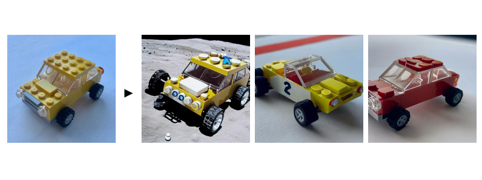

<!-- ATTN: This should be kept in sync with release/air_examples/dreambooth/dreambooth_run.sh -->

# Fine-tuning DreamBooth with Ray AIR

This example shows how to fine-tune a DreamBooth model using Ray AIR.

Because of the large model sizes, you'll need 2 A10G GPUs per worker.

The example can leverage data-parallel training to speed up training time. Of course, this will
require more GPUs.

The demo tunes both the text_encoder and unet parts of Stable Diffusion, and utilizes the prior preserving loss function.

<p align="center">
  
</p>

### Overview

First, we download the pre-trained stable diffusion model as a starting point.

We will then train this model with a few images of our subject.

To achieve this, we choose a non-word as an identifier, e.g. "unqtkn". When fine-tuning the model with our subject, we will teach it that the prompt is "A photo of a unqtkn <class>". 

After fine-tuning we can run inference with this specific prompt. For instance: "A photo of a unqtkn <class>" will create an image of our subject.

### Step 0

Clone this repository and install dependencies.

```bash
git clone [repo]
cd DreamBoothOnRay
pip install -Ur requirements.txt
```

Prepare some directories and environment variables.

```bash
export ORIG_MODEL_NAME="CompVis/stable-diffusion-v1-4"
export ORIG_MODEL_HASH="249dd2d739844dea6a0bc7fc27b3c1d014720b28"
export ORIG_MODEL_DIR="./model-orig"
export ORIG_MODEL_PATH="$ORIG_MODEL_DIR/$ORIG_MODEL_NAME/snapshots/$ORIG_MODEL_HASH"
export TUNED_MODEL_DIR="./model-tuned"
export IMAGES_REG_DIR="./images-reg"
export IMAGES_OWN_DIR="./images-own"
export IMAGES_NEW_DIR="./images-new"

export CLASS_NAME="toy car"

mkdir -p $ORIG_MODEL_DIR $TUNED_MODEL_DIR $IMAGES_REG_DIR $IMAGES_OWN_DIR $IMAGES_NEW_DIR
```

Copy some images for fine-tuning into `$IMAGES_OWN_DIR`.

### Step 1
Download and cache a pre-trained Stable-Diffusion model locally.
Default model and version are ``CompVis/stable-diffusion-v1-4``
at git hash ``3857c45b7d4e78b3ba0f39d4d7f50a2a05aa23d4``.
```
python cache_model.py --model_dir=$ORIG_MODEL_DIR --model_name=$ORIG_MODEL_NAME --revision=$ORIG_MODEL_HASH
```
Note that actual model files will be downloaded into
``\<model_dir>\snapshots\<git_hash>\`` directory.

### Step 2
Create a regularization image set for a class of subjects:
```
python run_model.py \
  --model_dir=$ORIG_MODEL_PATH \
  --output_dir=$IMAGES_REG_DIR \
  --prompts="photo of a $CLASS_NAME" \
  --num_samples_per_prompt=200
```

### Step 3
Save a few (4 to 5) images of the subject being fine-tuned
in a local directory. Then launch the training job with:
```
python train.py \
  --model_dir=$ORIG_MODEL_PATH \
  --output_dir=$TUNED_MODEL_DIR \
  --instance_images_dir=$IMAGES_OWN_DIR \
  --instance_prompt="a photo of unqtkn $CLASS_NAME" \
  --class_images_dir=$IMAGES_REG_DIR \
  --class_prompt="a photo of a $CLASS_NAME"
```

### Step 4
Try your model with the same commandline as Step 2, but point
to your own model this time!

```
python run_model.py \
  --model_dir=$TUNED_MODEL_DIR \
  --output_dir=$IMAGES_NEW_DIR \
  --prompts="photo of a unqtkn $CLASS_NAME" \
  --num_samples_per_prompt=20
```