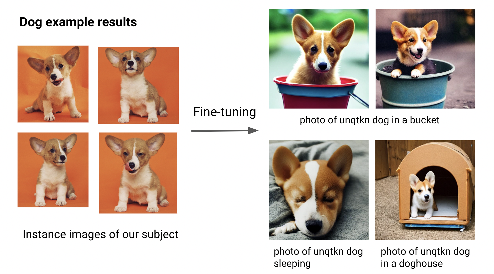

Fine-tuning DreamBooth with Ray AIR
===================================

..
   ATTN: This should be kept in sync with release/air_examples/dreambooth/dreambooth_run.sh

..
  section_intro

This example shows how to fine-tune a DreamBooth model using Ray AIR.

Because of the large model sizes, you'll need 2 A10G GPUs per worker.

The example can leverage data-parallel training to speed up training time. Of course, this will
require more GPUs.

The demo tunes both the text_encoder and unet parts of Stable Diffusion, and utilizes the prior preserving loss function.

The full code repository can be found here: `https://github.com/ray-project/ray/blob/master/python/ray/air/examples/dreambooth/ <https://github.com/ray-project/ray/blob/master/python/ray/air/examples/dreambooth/>`_

How it works
------------

For an up-to-date description of how the code works, 
`please refer to the example in our documentation <https://docs.ray.io/en/master/ray-air/examples/dreambooth_finetuning.html>`_. 

Run the example
---------------

..
  section_run_example

First, we download the pre-trained stable diffusion model as a starting point.

We will then train this model with a few images of our subject.

To achieve this, we choose a non-word as an identifier, e.g. ``unqtkn``. When fine-tuning the model with our subject, we will teach it that the prompt is ``A photo of a unqtkn <class>``.

After fine-tuning we can run inference with this specific prompt. For instance: ``A photo of a unqtkn <class>`` will create an image of our subject.

Step 0: Preparation
^^^^^^^^^^^^^^^^^^^

Clone the Ray repository, go to the example directory, and install dependencies.

.. code-block:: bash

   git clone https://github.com/ray-project/ray.git
   cd ray/python/ray/air/examples/dreambooth
   pip install -Ur requirements.txt

Prepare some directories and environment variables.

.. code-block:: bash

   export DATA_PREFIX="./"
   export ORIG_MODEL_NAME="CompVis/stable-diffusion-v1-4"
   export ORIG_MODEL_HASH="249dd2d739844dea6a0bc7fc27b3c1d014720b28"
   export ORIG_MODEL_DIR="$DATA_PREFIX/model-orig"
   export ORIG_MODEL_PATH="$ORIG_MODEL_DIR/models--${ORIG_MODEL_NAME/\//--}/snapshots/$ORIG_MODEL_HASH"
   export TUNED_MODEL_DIR="$DATA_PREFIX/model-tuned"
   export IMAGES_REG_DIR="$DATA_PREFIX/images-reg"
   export IMAGES_OWN_DIR="$DATA_PREFIX/images-own"
   export IMAGES_NEW_DIR="$DATA_PREFIX/images-new"

   export CLASS_NAME="toy car"

   mkdir -p $ORIG_MODEL_DIR $TUNED_MODEL_DIR $IMAGES_REG_DIR $IMAGES_OWN_DIR $IMAGES_NEW_DIR

Copy some images for fine-tuning into ``$IMAGES_OWN_DIR``.

Step 1: Download the pre-trained model
^^^^^^^^^^^^^^^^^^^^^^^^^^^^^^^^^^^^^^

Download and cache a pre-trained Stable-Diffusion model locally.
Default model and version are ``CompVis/stable-diffusion-v1-4``
at git hash ``3857c45b7d4e78b3ba0f39d4d7f50a2a05aa23d4``.

.. code-block::

   python cache_model.py --model_dir=$ORIG_MODEL_DIR --model_name=$ORIG_MODEL_NAME --revision=$ORIG_MODEL_HASH

Note that actual model files will be downloaded into
``\<model_dir>\snapshots\<git_hash>\`` directory.

Step 2: Create the regularization images
^^^^^^^^^^^^^^^^^^^^^^^^^^^^^^^^^^^^^^^^

Create a regularization image set for a class of subjects:

.. code-block::

   python run_model.py \
     --model_dir=$ORIG_MODEL_PATH \
     --output_dir=$IMAGES_REG_DIR \
     --prompts="photo of a $CLASS_NAME" \
     --num_samples_per_prompt=200

Step 3: Fine-tune the model
^^^^^^^^^^^^^^^^^^^^^^^^^^^

Save a few (4 to 5) images of the subject being fine-tuned
in a local directory. Then launch the training job with:

.. code-block::

   python train.py \
     --model_dir=$ORIG_MODEL_PATH \
     --output_dir=$TUNED_MODEL_DIR \
     --instance_images_dir=$IMAGES_OWN_DIR \
     --instance_prompt="a photo of unqtkn $CLASS_NAME" \
     --class_images_dir=$IMAGES_REG_DIR \
     --class_prompt="a photo of a $CLASS_NAME"

Step 4: Generate images of our subject
^^^^^^^^^^^^^^^^^^^^^^^^^^^^^^^^^^^^^^

Try your model with the same commandline as Step 2, but point
to your own model this time!

.. code-block::

   python run_model.py \
     --model_dir=$TUNED_MODEL_DIR \
     --output_dir=$IMAGES_NEW_DIR \
     --prompts="photo of a unqtkn $CLASS_NAME" \
     --num_samples_per_prompt=20
