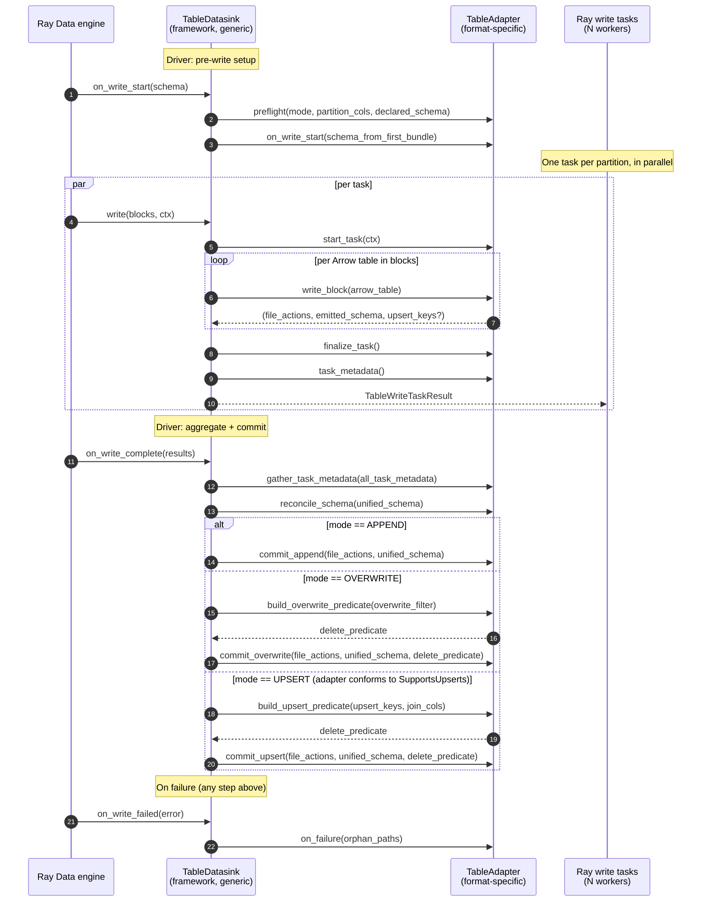

# Table-datasink write sequence

This is the canonical sequence diagram for the table-format write
abstraction (`TableDatasink` + `TableAdapter`). An ASCII version is
reproduced inline in the `adapter.py` and `table_datasink.py` module
docstrings; this file is the higher-fidelity Mermaid source for the docs
site and GitHub-rendered Markdown.

The diagram describes one driver-orchestrated write. Worker steps run
inside Ray write tasks, one task per data partition, in parallel.

## Step glossary

| Step | Owner | Purpose |
|---|---|---|
| `preflight` | adapter | Load table from catalog/log; validate mode legality + schema/partitions. |
| `on_write_start` | adapter | Optional pre-write hook fed the first bundle's schema. Iceberg evolves schema here; Delta no-ops and evolves at commit. |
| `start_task` | adapter | Per-task setup (e.g. open a per-task file writer). |
| `write_block` | adapter | Persist one Arrow table as object-store files. Returns per-file actions, the emitted schema, and the upsert-key projection (UPSERT mode only). |
| `finalize_task` | adapter | Flush any per-task buffer; return extra file actions and schemas. |
| `task_metadata` | adapter | Free-form per-task state the driver needs (e.g. Delta's per-write UUID). |
| `gather_task_metadata` | adapter | Driver-side merge of per-task metadata across workers. |
| `reconcile_schema` | adapter | Apply the worker-unified schema to the table state. |
| `build_overwrite_predicate` | adapter | Translate a user `overwrite_filter` into the format's predicate type. |
| `build_upsert_predicate` | adapter (`SupportsUpserts`) | Translate upsert-key table into the format's predicate type. |
| `commit_append` / `commit_overwrite` / `commit_upsert` | adapter | One atomic transaction per mode. |
| `on_failure` | adapter | Best-effort cleanup of files written by failed tasks. Never destroys committed data. |
