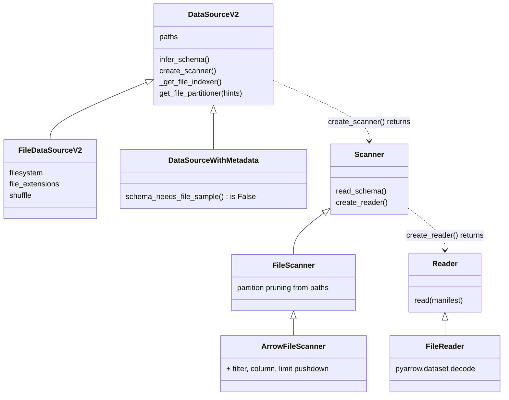
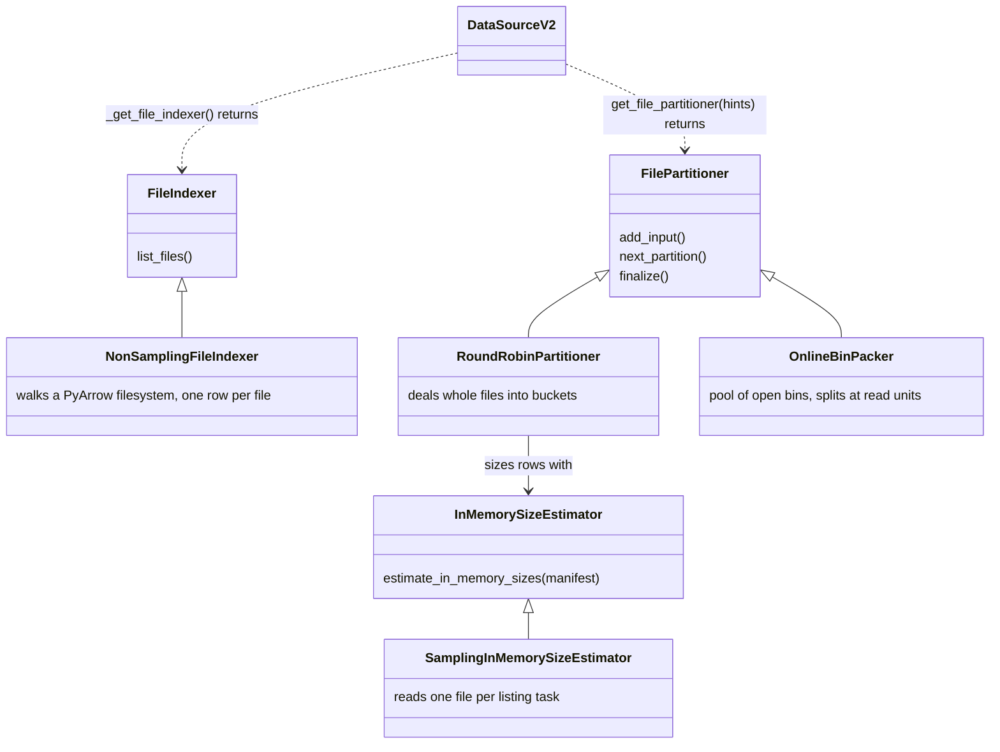

# Datasource V2

The read path behind `ray.data.read_*` when
`DataContext.use_datasource_v2 = True`. A datasource says *where* the data is
and *how* to decode it; the framework does listing, planning, pushdown, task
grouping and execution. Parquet is the file-based reference implementation.
Hive uses the metadata-backed path to stream one HiveServer2 query per execution.

## Layout

```
interfaces/       abstract classes and the types in their signatures. Imports nothing else here.
common/           format-independent implementations. Imports only interfaces/.
formats/<name>/   one folder per format. May import both.
```

A new format adds one folder under `formats/` and changes nothing in
`interfaces/`.

## How a read works

The unit of work is a `FileManifest`: an Arrow block with one row per piece
of data a reader can open, in columns `__path`, `__file_size` and
`__file_chunk_metadata` (`None` for the whole file, or a `FileChunk` naming
a run of read units inside it). `__path` is any string the reader can act
on, not necessarily a filesystem path.

A call to `read_*` runs these steps. The datasource supplies the object in
each; the framework calls it.

| Step | Object | Runs where | Does |
| --- | --- | --- | --- |
| 1. Plan | `DataSourceV2` | driver, in `_read_datasource_v2` | infers the schema (a `FileDataSourceV2` lists a sample of files for it; a `DataSourceWithMetadata` answers from its metadata), builds a `Scanner`, picks the `FileIndexer` and `FilePartitioner`, and emits two logical operators: `ListFiles(paths, indexer, partitioner)` feeding `ReadFiles(scanner)`. |
| 2. Optimize | `Scanner` | driver, optimizer rules | each rule calls a `push_*` method on the scanner and gets a new scanner back; the pushdowns it accepted are copied onto `ListFiles` as a `ListFilesPushdown`. |
| 3. Index | `FileIndexer` | `ListFiles` tasks | turns the datasource's `paths` into `FileManifest` rows, skipping pieces the pushdowns rule out by metadata. |
| 4. Partition | `FilePartitioner` | same tasks | regroups manifest rows into one manifest per read task. |
| 5. Read | `Reader` | `ReadFiles` tasks, one per manifest | `scanner.create_reader().read(manifest)` yields `pyarrow.Table`s, honouring every pushdown. |

Indexing skips whole pieces; the reader filters rows and is what makes the
result correct, so a scanner must never report a pushdown its reader does not
enforce. Manifests travel through the object store; the `Scanner`,
`FileIndexer` and `FilePartitioner` are pickled into the task functions, so
open connections belong inside `list_files` and `read`.

## Class hierarchy

Arrows: solid with a hollow head is inheritance, dotted is "creates or
returns", solid with a plain head is "holds a reference to".



A pushdown mixin on a scanner is a promise the optimizer believes.
`ArrowFileScanner` carries the three data pushdowns only because it knows
`FileReader` enforces them through `pyarrow.dataset`.



Parquet sits at the bottom of every ladder: `ParquetDatasourceV2`,
`FooterFileIndexer(NonSamplingFileIndexer)`, `OnlineBinPacker`,
`ParquetScanner(ArrowFileScanner)`, `ParquetFileReader(FileReader)`.

## Adding a format

Extend `FileDataSourceV2` when the framework finds the files by walking a
filesystem, `DataSourceWithMetadata` when a catalog or database knows them.
Never extend `DataSourceV2` directly.

| Piece | File format | Catalog or engine source |
| --- | --- | --- |
| `<Name>DatasourceV2` | `paths`, `filesystem`, `_get_file_indexer`, `get_file_partitioner`, `infer_schema`, `create_scanner` | `paths` (one label the indexer interprets), `_get_file_indexer`, `get_file_partitioner`, `infer_schema(None)`, `create_scanner` |
| Indexer | `NonSamplingFileIndexer` as is | implement `FileIndexer.list_files`: ask the catalog, emit manifest rows |
| Partitioner | `RoundRobinPartitioner(SamplingInMemorySizeEstimator(reader), hints=hints)` | `None` (one task per listing block) or `OnlineBinPacker` |
| `<Name>Scanner` | `ArrowFileScanner` when `FileReader` decodes the format; otherwise `FileScanner` plus the `Supports*` mixins your reader honours | `Scanner` plus the `Supports*` mixins your reader honours |
| Reader | `FileReader(format=...)` when it decodes the format; otherwise implement `Reader.read` | implement `Reader.read` |

Wire it up in `read_api.py` under the `use_datasource_v2` branch of the
matching `read_*` function, which calls `_read_datasource_v2(datasource, ...)`.
A file format then gets parallel listing, extension filtering,
`ignore_missing_paths`, `skip_paths`, schema sampling, task sizing from
`DataContext`, file shuffle and checkpoint resume for free.

Every hook's docstring says when to override it and what you gain.

## How does HiveServer2 fit?

`HiveDatasourceV2` extends `DataSourceWithMetadata`. `_HiveIndexer` emits one `hive://read` manifest entry for the complete table or query operation. `get_file_partitioner()` returns `None`, keeping this manifest as one read unit.

`infer_schema(None)` resolves the table schema on the driver through HiveServer2 (HS2) metadata, or returns the explicit Arrow schema for a query. `_HiveScanner.read_schema()` reports that schema. The scanner carries the read specification and schema to the worker, where it creates a `_HiveReader`. The reader executes at most one HS2 data query and uses `fetchmany()` to yield Arrow tables incrementally.

Once the data connection is open, `read_hs2_batches()` attempts to cancel the operation and close any cursor and the connection in `finally`. This covers completion, errors, and early generator closure. Cleanup is best effort. Abrupt worker termination can prevent `finally` from running, so immediate server cancellation isn't guaranteed.
