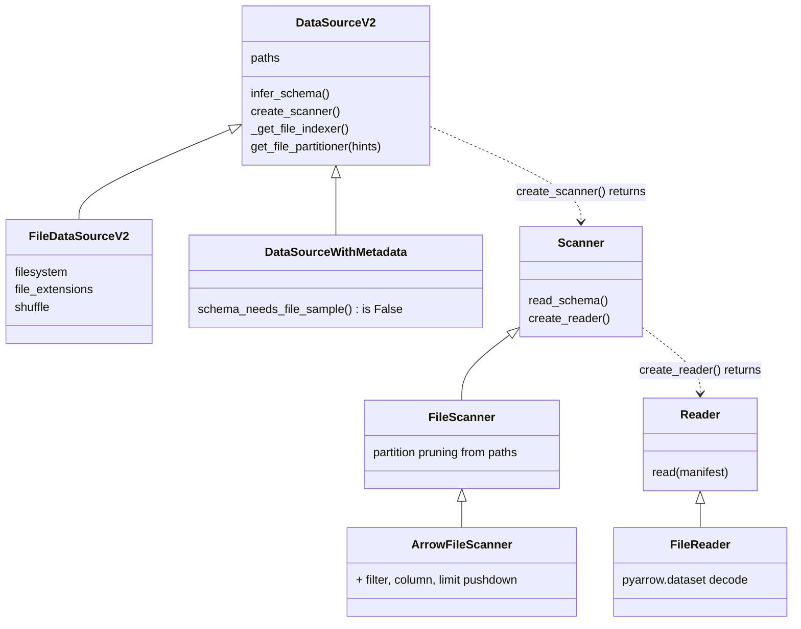
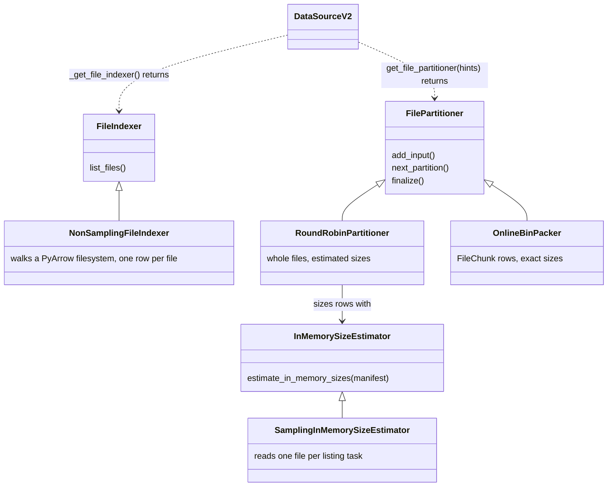

# Datasource V2

The read path behind `ray.data.read_*` when
`DataContext.use_datasource_v2 = True`. A datasource says *where* the data is
and *how* to decode it; the framework does listing, planning, pushdown, task
grouping and execution. Parquet is the reference implementation.

## Layout

```
interfaces/       abstract classes and the types in their signatures. Imports nothing else here.
common/           format-independent implementations. Imports only interfaces/.
formats/<name>/   one folder per format. May import both.
```

A new format adds one folder under `formats/` and changes nothing in
`interfaces/`.

## How a read works

Four stages. The datasource supplies one object per stage; the framework runs
them.

| Stage | Object | Runs where | Does |
| --- | --- | --- | --- |
| Plan | `Scanner` | driver | holds the schema and the pushdowns the optimizer handed it. Immutable: every `push_*` returns a new scanner. |
| List | `FileIndexer` | `ListFiles` tasks | turns `paths` into `FileManifest` rows, one per piece of data a reader can open. |
| Group | `FilePartitioner` | same tasks | regroups manifest rows into one manifest per read task. |
| Read | `Reader` | `ReadFiles` tasks | decodes one manifest into `pyarrow.Table`s, honouring the scanner's pushdowns. |

Accepted pushdowns go two ways: to the `Reader` through `create_reader()`,
and to `ListFiles` as a `ListFilesPushdown`. Listing skips whole pieces by
metadata; the reader filters rows and is what makes the result correct, so a
scanner must never report a pushdown its reader does not enforce.

`FileManifest` is the only type that crosses stages: an Arrow block with
`__path`, `__file_size` and `__file_chunk_metadata` (`None` for the whole
file, or a `FileChunk` naming a run of read units inside it). `__path` is any
string the reader can act on. Manifests travel through the object store; the
`Scanner`, `FileIndexer` and `FilePartitioner` are pickled into the task
functions, so open connections belong inside `list_files` and `read`.

## Class hierarchy

Arrows: solid with a hollow head is inheritance, dotted is "creates or
returns", solid with a plain head is "holds a reference to".



A pushdown mixin on a scanner is a promise the optimizer believes.
`ArrowFileScanner` carries the three data pushdowns only because it knows
`FileReader` enforces them through `pyarrow.dataset`.



Parquet sits at the bottom of every ladder: `ParquetDatasourceV2`,
`FooterFileIndexer(NonSamplingFileIndexer)`, `OnlineBinPacker`,
`ParquetScanner(ArrowFileScanner)`, `ParquetFileReader(FileReader)`.

## Adding a format

Extend `FileDataSourceV2` when the framework finds the files by walking a
filesystem, `DataSourceWithMetadata` when a catalog or database knows them.
Never extend `DataSourceV2` directly.

| Piece | File format | Catalog or engine source |
| --- | --- | --- |
| `<Name>DatasourceV2` | `paths`, `filesystem`, `_get_file_indexer`, `get_file_partitioner`, `infer_schema`, `create_scanner` | `paths` (one label the indexer interprets), `_get_file_indexer`, `get_file_partitioner`, `infer_schema(None)`, `create_scanner` |
| Indexer | `NonSamplingFileIndexer` as is | implement `FileIndexer.list_files`: ask the catalog, emit manifest rows |
| Partitioner | `RoundRobinPartitioner(SamplingInMemorySizeEstimator(reader), hints=hints)` | `None` (one task per listing block) or `OnlineBinPacker` |
| `<Name>Scanner` | `ArrowFileScanner` when `pyarrow.dataset` decodes the format (Parquet, CSV, JSON, ORC, Arrow IPC); otherwise `FileScanner` plus the `Supports*` mixins your reader honours | `Scanner` plus the `Supports*` mixins your reader honours |
| Reader | `FileReader(format=...)` for the `pyarrow.dataset` formats; otherwise implement `Reader.read` | implement `Reader.read` |

Wire it up in `read_api.py` under the `use_datasource_v2` branch of the
matching `read_*` function, which calls `_read_datasource_v2(datasource, ...)`.
A file format then gets parallel listing, extension filtering,
`ignore_missing_paths`, `skip_paths`, schema sampling, task sizing from
`DataContext`, file shuffle and checkpoint resume for free.

Every hook's docstring says when to override it and what you gain.
