# Ray Data Complete Architecture

## 1. System Overview Diagram

```mermaid
graph TB
    classDef api fill:#4A90D9,stroke:#2C5F8A,color:#fff
    classDef logical fill:#7B68EE,stroke:#5B48CE,color:#fff
    classDef execution fill:#E8743B,stroke:#C05A2C,color:#fff
    classDef blocks fill:#2ECC71,stroke:#1B9E50,color:#fff
    classDef datasource fill:#F39C12,stroke:#C87F0A,color:#fff
    classDef optimizer fill:#E74C3C,stroke:#C0392B,color:#fff
    classDef config fill:#95A5A6,stroke:#7F8C8D,color:#fff
    classDef aggregate fill:#1ABC9C,stroke:#16A085,color:#fff
    classDef shuffle fill:#AF7AC5,stroke:#7D3C98,color:#fff
    classDef autoscale fill:#D4AC0D,stroke:#B7950B,color:#fff
    classDef diagnostics fill:#CB4335,stroke:#A93226,color:#fff
    classDef checkpoint fill:#2471A3,stroke:#1A5276,color:#fff
    classDef batching fill:#D35400,stroke:#A04000,color:#fff
    classDef resource fill:#5B2C6F,stroke:#4A235A,color:#fff
    classDef dsv2 fill:#16A085,stroke:#117A65,color:#fff
    classDef detached fill:#1C1C1C,stroke:#F5B041,color:#F5B041,stroke-width:3px,stroke-dasharray:5 5

    subgraph API["API Layer"]
        Dataset[Dataset]
        MatDataset[MaterializedDataset]
        DataIterator[DataIterator]
        DataIteratorImpl[DataIteratorImpl]
        StreamSplitIter[StreamSplitDataIterator]
        Schema[Schema]
        ReadAPI[Read/From API]
        GroupedData[GroupedData]
    end

    subgraph CONFIG["Configuration"]
        DataContext[DataContext]
        ExecOptions[ExecutionOptions]
    end

    subgraph LOGICAL["Logical Plan"]
        LogicalPlan[LogicalPlan]
        subgraph LogOps["Logical Operators"]
            Read[Read]
            MapBatches[MapBatches]
            MapRows[MapRows]
            FlatMap[FlatMap]
            Filter[Filter]
            Project[Project]
            Write[Write]
            Limit[Limit]
            Repartition[Repartition]
            RandomShuffle[RandomShuffle]
            Sort[Sort]
            Aggregate[Aggregate]
            Union[Union]
            Zip[Zip]
            Join[Join]
            InputData[InputData]
            Count[Count]
            FromOps[From*]
            StreamingSplit[StreamingSplit]
            StreamingRepart[StreamingRepartition]
        end
    end

    subgraph OPTIM["Optimizer"]
        LogicalOptimizer[LogicalOptimizer]
        PhysicalOptimizer[PhysicalOptimizer]
        Ruleset[Ruleset]
        subgraph LogRules["Logical Rules"]
            ProjectionPD[ProjectionPushdown]
            PredicatePD[PredicatePushdown]
            LimitPD[LimitPushdown]
            CombineShuf[CombineShuffles]
            InheritBF[InheritBatchFormat]
        end
        subgraph PhysRules["Physical Rules"]
            SetReadPar[SetReadParallelism]
            InheritBS[InheritBlockSize]
            FuseOps[FuseOperators]
            ConfigMem[ConfigureMapMemory]
        end
    end

    subgraph EXEC["Execution Engine"]
        StreamingExecutor[StreamingExecutor]
        Planner[Planner]
        ExecutionPlan[ExecutionPlan]
        subgraph PhysOps["Physical Operators"]
            PhysicalOp[PhysicalOperator]
            MapOp[MapOperator]
            TaskPoolOp[TaskPoolMapOperator]
            ActorPoolOp[ActorPoolMapOperator]
            AllToAllOp[AllToAllOperator]
            InputDataBuf[InputDataBuffer]
            LimitPhysOp[LimitOperator]
            UnionPhysOp[UnionOperator]
            ZipPhysOp[ZipOperator]
            JoinPhysOp[JoinOperator]
            OutputSplitter[OutputSplitter]
        end
        subgraph ExecState["Execution State"]
            Topology[Topology]
            OpState[OpState]
            OpBufferQueue[OpBufferQueue]
        end
        subgraph Scheduling["Scheduling"]
            Ranker[DefaultRanker]
            SchedulingFns[SchedulingFunctions]
            ActorLocTracker["ActorLocationTracker 🔗"]
        end
        subgraph TaskTypes["Tasks"]
            DataOpTask[DataOpTask]
            MetadataOpTask[MetadataOpTask]
        end
    end

    subgraph RESOURCE["Resource Allocation"]
        ResourceMgr[ResourceManager]
        OpResAllocator[ReservationOpResourceAllocator]
        subgraph BPPolicies["Backpressure Policies"]
            BackpressurePolicy[ResourceBudgetPolicy]
            ConcurrencyCapPolicy[ConcurrencyCapPolicy]
            DownstreamCapPolicy[DownstreamCapacityPolicy]
        end
        ExecResources[ExecutionResources]
    end

    subgraph BLOCKS["Block Layer"]
        RefBundle[RefBundle]
        BlockAccessor[BlockAccessor]
        TableBlockAccessor[TableBlockAccessor]
        ArrowAccessor[ArrowBlockAccessor]
        PandasAccessor[PandasBlockAccessor]
        ArrowBuilder[ArrowBlockBuilder]
        PandasBuilder[PandasBlockBuilder]
        TableBuilder[TableBlockBuilder]
        ColAccessor[BlockColumnAccessor]
        ArrowColAcc[ArrowColumnAccessor]
        PandasColAcc[PandasColumnAccessor]
        RefBundler[BlockRefBundler]
        ReorderQueue[ReorderingBundleQueue]
    end

    subgraph DATASRC["Datasource / Datasink"]
        Datasource[Datasource]
        Datasink[Datasink]
        FileBasedDS[FileBasedDatasource]
        FileDatasink[FileDatasink]
        RowSink[RowBasedFileDatasink]
        BlockSink[BlockBasedFileDatasink]
        ParquetDS[ParquetDatasource]
        ParquetSink[ParquetDatasink]
        CSVDS[CSVDatasource]
        CSVSink[CSVDatasink]
        JSONDS[JSONDatasource]
        JSONSink[JSONDatasink]
        FileMetaProv[FileMetadataProvider]
        Partitioning[Partitioning]
        FilenameProv[FilenameProvider]
    end

    subgraph AGG["Aggregation"]
        AggregateFnV2[AggregateFnV2]
        CountAgg[Count]
        SumAgg[Sum]
        MinAgg[Min]
        MaxAgg[Max]
        MeanAgg[Mean]
        StdAgg[Std]
        QuantileAgg[Quantile]
        UniqueAgg[Unique]
    end

    subgraph METRICS["Metrics & Stats"]
        OpRuntimeMetrics[OpRuntimeMetrics]
        DatasetStats[DatasetStats]
        StatsManager[StatsManager]
        StatsActor["_StatsActor 🔗"]
        ProgressMgr[ProgressManager]
        DatasetState[DatasetState]
        MemTracingActor["_MemActor 🔗"]
    end

    subgraph BATCHING["Block Batching & Collation"]
        BatchIterator[BatchIterator]
        BatchingIter[BatchingIterator]
        Batcher[Batcher]
        ShufflingBatcher[ShufflingBatcher]
        BlockPrefetcher[WaitBlockPrefetcher]
        FormatBatches[format_batches]
    end

    subgraph CHECKPOINT["Checkpoint & Recovery"]
        CheckpointConfig[CheckpointConfig]
        CheckpointWriter[CheckpointWriter]
        CheckpointFilter[CheckpointFilter]
        LoadCheckpointCB[LoadCheckpointCallback]
        PrefixTrie[PrefixTrie]
    end

    subgraph SHUFFLE["Shuffle Subsystem"]
        subgraph CPUShuffle["CPU Shuffle"]
            HashShuffleOp[HashShuffleOperator]
            HashAggOp[HashAggregateOperator]
            ShuffleAgg[ShuffleAggregation]
            HashShuffleAggregator[HashShuffleAggregator]
            PartitionBucket[PartitionBucket]
        end
        subgraph GPUShuffle["GPU Shuffle"]
            GPUShuffleOp[GPUShuffleOperator]
            GPURankPool[GPURankPool]
            GPUShuffleActor[GPUShuffleActor]
            RapidsMPF[BulkRapidsMPFShuffler]
        end
    end

    subgraph DSV2["DatasourceV2 Framework"]
        DataSourceV2[DataSourceV2]
        DSV2Scanner[Scanner / FileScanner]
        DSV2Reader[Reader / FileReader]
        FileIndexer[FileIndexer]
        FileManifest[FileManifest]
        FilePartitioner[RoundRobinPartitioner]
        SizeEstimator[SamplingInMemorySizeEstimator]
        subgraph DSV2Pushdowns["Pushdown Mixins"]
            FilterPD[SupportsFilterPushdown]
            ColumnPrune[SupportsColumnPruning]
            LimitPD2[SupportsLimitPushdown]
            PartPrune[SupportsPartitionPruning]
        end
    end

    subgraph DIAGNOSTICS["Issue Detection"]
        IssueDetectorMgr[IssueDetectorManager]
        HangingDetector[HangingExecutionIssueDetector]
        HashShuffleDetector[HashShuffleAggregatorIssueDetector]
        HighMemDetector[HighMemoryIssueDetector]
        IssueCallback[IssueDetectionExecutionCallback]
    end

    subgraph AUTOSCALE["Autoscaling"]
        subgraph ActorScale["Actor Pool Autoscaling"]
            ActorAutoscaler[DefaultActorAutoscaler]
            AutoscalingActorPool[AutoscalingActorPool]
            ScalingRequest[ActorPoolScalingRequest]
        end
        subgraph ClusterScale["Cluster Autoscaling"]
            ClusterAutoscaler[DefaultClusterAutoscalerV2]
            UtilGauge[RollingLogicalUtilizationGauge]
            AutoscaleCoord[AutoscalingCoordinator]
            CoordActor["CoordinatorActor 🔗"]
            AutoscaleRequester["AutoscalingRequester 🔗"]
        end
    end

    %% === Cross-subsystem edges ===
    Dataset --> MatDataset
    Dataset -->|"iterator()"| DataIterator
    DataIterator --> DataIteratorImpl
    DataIterator --> StreamSplitIter
    Dataset --> Schema
    ReadAPI -->|creates| Dataset
    Dataset -->|"groupby()"| GroupedData
    DataIteratorImpl -->|"_execute_to_iterator"| Dataset

    Dataset -->|"each transform builds"| LogicalPlan
    ReadAPI -->|"Read operator"| Read
    Dataset --> DataContext
    LogicalPlan --> LogicalOptimizer
    LogicalOptimizer --> Planner
    PhysicalOptimizer --> StreamingExecutor
    Dataset -->|"_execute_to_iterator"| ExecutionPlan
    ExecutionPlan --> StreamingExecutor
    ExecutionPlan --> Planner
    Planner --> PhysicalOp
    LogicalOptimizer --> Ruleset
    PhysicalOptimizer --> Ruleset

    PhysicalOp --> MapOp
    MapOp --> TaskPoolOp
    MapOp --> ActorPoolOp
    PhysicalOp --> AllToAllOp
    PhysicalOp --> HashShuffleOp
    PhysicalOp --> HashAggOp
    PhysicalOp --> InputDataBuf
    PhysicalOp --> LimitPhysOp
    PhysicalOp --> UnionPhysOp
    PhysicalOp --> ZipPhysOp
    PhysicalOp --> JoinPhysOp
    PhysicalOp --> OutputSplitter

    StreamingExecutor --> Topology
    StreamingExecutor -->|"update_usages"| ResourceMgr
    StreamingExecutor --> SchedulingFns
    Topology --> OpState
    OpState --> OpBufferQueue
    SchedulingFns --> Ranker
    SchedulingFns -->|"can_add_input"| BackpressurePolicy
    ResourceMgr --> OpResAllocator
    OpResAllocator -->|"budget enforcement"| BackpressurePolicy
    OpResAllocator --> ConcurrencyCapPolicy
    OpResAllocator --> DownstreamCapPolicy
    ResourceMgr --> ExecResources
    DataContext --> ResourceMgr

    StreamingExecutor -->|"produces/consumes"| RefBundle
    MapOp --> BlockAccessor
    MapOp --> RefBundler
    MapOp --> ReorderQueue
    AllToAllOp --> BlockAccessor
    BlockAccessor --> TableBlockAccessor
    TableBlockAccessor --> ArrowAccessor
    TableBlockAccessor --> PandasAccessor
    TableBuilder --> ArrowBuilder
    TableBuilder --> PandasBuilder
    ColAccessor --> ArrowColAcc
    ColAccessor --> PandasColAcc

    Read -->|wraps| Datasource
    Write -->|wraps| Datasink
    InputDataBuf -->|"loads from"| Datasource
    Datasource --> FileBasedDS
    FileBasedDS --> CSVDS
    FileBasedDS --> JSONDS
    Datasource --> ParquetDS
    Datasink --> FileDatasink
    FileDatasink --> RowSink
    FileDatasink --> BlockSink
    FileDatasink --> ParquetSink
    BlockSink --> CSVSink
    BlockSink --> JSONSink
    FileBasedDS --> FileMetaProv
    FileBasedDS --> Partitioning
    FileDatasink --> FilenameProv

    HashAggOp -->|uses| AggregateFnV2
    HashShuffleOp -->|uses| ShuffleAgg
    Aggregate -->|contains| AggregateFnV2
    AggregateFnV2 --> CountAgg
    AggregateFnV2 --> SumAgg
    AggregateFnV2 --> MinAgg
    AggregateFnV2 --> MaxAgg
    AggregateFnV2 --> MeanAgg
    AggregateFnV2 --> StdAgg
    AggregateFnV2 --> QuantileAgg
    AggregateFnV2 --> UniqueAgg
    ShuffleAgg --> HashShuffleAggregator
    HashShuffleAggregator --> PartitionBucket

    StreamingExecutor --> OpRuntimeMetrics
    StreamingExecutor --> StatsManager
    StatsManager --> StatsActor
    StreamingExecutor --> ProgressMgr
    StreamingExecutor --> DatasetState
    OpRuntimeMetrics --> DatasetStats
    DataContext --> StreamingExecutor
    ExecOptions --> StreamingExecutor

    %% === Autoscaling edges ===
    StreamingExecutor -->|"every scheduling step"| ActorAutoscaler
    StreamingExecutor -->|"every scheduling step"| ClusterAutoscaler
    ActorAutoscaler --> AutoscalingActorPool
    ActorAutoscaler --> ScalingRequest
    ActorAutoscaler -->|"checks budget"| ResourceMgr
    ActorPoolOp -->|"provides"| AutoscalingActorPool
    ClusterAutoscaler --> UtilGauge
    UtilGauge -->|"observes"| ResourceMgr
    ClusterAutoscaler --> AutoscaleCoord
    AutoscaleCoord --> CoordActor

    %% === Issue Detection edges ===
    StreamingExecutor -->|"on_execution_step"| IssueCallback
    IssueCallback --> IssueDetectorMgr
    IssueDetectorMgr --> HangingDetector
    IssueDetectorMgr --> HashShuffleDetector
    IssueDetectorMgr --> HighMemDetector
    HangingDetector -->|"reads"| OpRuntimeMetrics
    HighMemDetector -->|"reads"| MapOp
    HashShuffleDetector -->|"checks"| HashShuffleOp

    %% === GPU Shuffle edges ===
    Planner -->|"GPU_SHUFFLE strategy"| GPUShuffleOp
    PhysicalOp --> GPUShuffleOp
    GPUShuffleOp --> GPURankPool
    GPURankPool --> GPUShuffleActor
    GPUShuffleActor --> RapidsMPF
    DataContext -->|"shuffle_strategy"| GPUShuffleOp

    %% === Checkpoint edges ===
    DataContext --> CheckpointConfig
    Planner -->|"injects checkpoint"| CheckpointFilter
    Planner -->|"injects checkpoint"| CheckpointWriter
    LoadCheckpointCB -->|"before_execution_starts"| CheckpointFilter
    CheckpointWriter -->|"wraps"| Datasink
    CheckpointFilter -->|"filters"| Read
    LoadCheckpointCB -->|"after_execution_fails"| PrefixTrie

    %% === Batching edges ===
    DataIteratorImpl -->|"creates"| BatchIterator
    BatchIterator --> BlockPrefetcher
    BatchIterator --> BatchingIter
    BatchingIter --> Batcher
    BatchingIter --> ShufflingBatcher
    Batcher -->|"slices"| BlockAccessor
    BatchIterator --> FormatBatches
    FormatBatches -->|"to_batch_format"| BlockAccessor
    BatchIterator -->|"consumes"| RefBundle

    %% === DatasourceV2 edges ===
    DataSourceV2 -->|"_get_file_indexer"| FileIndexer
    DataSourceV2 -->|"create_scanner"| DSV2Scanner
    FileIndexer -->|"yields"| FileManifest
    DSV2Scanner -->|"plan"| FilePartitioner
    DSV2Scanner -->|"create_reader"| DSV2Reader
    FilePartitioner -->|"size estimates"| SizeEstimator
    DSV2Scanner --> FilterPD
    DSV2Scanner --> ColumnPrune
    DSV2Scanner --> LimitPD2
    DSV2Scanner --> PartPrune
    Datasource -.->|"future: replaced by"| DataSourceV2
    ReadAPI -.->|"future: V2 path"| DataSourceV2

    class Dataset,MatDataset,DataIterator,DataIteratorImpl,StreamSplitIter,Schema,ReadAPI,GroupedData api
    class LogicalPlan,Read,MapBatches,MapRows,FlatMap,Filter,Project,Write,Limit,Count,Repartition,RandomShuffle,Sort,Aggregate,Union,Zip,Join,InputData,FromOps,StreamingSplit,StreamingRepart logical
    class StreamingExecutor,Planner,ExecutionPlan,PhysicalOp,MapOp,TaskPoolOp,ActorPoolOp,AllToAllOp,InputDataBuf,LimitPhysOp,UnionPhysOp,ZipPhysOp,JoinPhysOp,OutputSplitter,OpState,OpBufferQueue,Topology,Ranker,SchedulingFns,DataOpTask,MetadataOpTask execution
    class ResourceMgr,OpResAllocator,BackpressurePolicy,ConcurrencyCapPolicy,DownstreamCapPolicy,ExecResources resource
    class RefBundle,BlockAccessor,TableBlockAccessor,ArrowAccessor,PandasAccessor,ArrowBuilder,PandasBuilder,TableBuilder,ColAccessor,ArrowColAcc,PandasColAcc,RefBundler,ReorderQueue blocks
    class Datasource,Datasink,FileBasedDS,FileDatasink,RowSink,BlockSink,ParquetDS,ParquetSink,CSVDS,CSVSink,JSONDS,JSONSink,FileMetaProv,Partitioning,FilenameProv datasource
    class LogicalOptimizer,PhysicalOptimizer,Ruleset,ProjectionPD,PredicatePD,LimitPD,CombineShuf,InheritBF,SetReadPar,InheritBS,FuseOps,ConfigMem optimizer
    class DataContext,ExecOptions config
    class AggregateFnV2,CountAgg,SumAgg,MinAgg,MaxAgg,MeanAgg,StdAgg,QuantileAgg,UniqueAgg aggregate
    class OpRuntimeMetrics,DatasetStats,StatsManager,StatsActor,ProgressMgr,DatasetState api
    class ActorAutoscaler,AutoscalingActorPool,ScalingRequest,ClusterAutoscaler,UtilGauge,AutoscaleCoord,CoordActor autoscale
    class IssueDetectorMgr,HangingDetector,HashShuffleDetector,HighMemDetector,IssueCallback diagnostics
    class HashShuffleOp,HashAggOp,ShuffleAgg,HashShuffleAggregator,PartitionBucket,GPUShuffleOp,GPURankPool,GPUShuffleActor,RapidsMPF shuffle
    class CheckpointConfig,CheckpointWriter,CheckpointFilter,LoadCheckpointCB,PrefixTrie checkpoint
    class BatchIterator,BatchingIter,Batcher,ShufflingBatcher,BlockPrefetcher,FormatBatches batching
    class DataSourceV2,DSV2Scanner,DSV2Reader,FileIndexer,FileManifest,FilePartitioner,SizeEstimator,FilterPD,ColumnPrune,LimitPD2,PartPrune dsv2
    class StatsActor,CoordActor,AutoscaleRequester,ActorLocTracker,MemTracingActor detached
```

**System Overview color key** (subsystem identity):

| Color | Subsystem |
|-------|-----------|
| Blue | API Layer |
| Purple | Logical Plan |
| Orange | Execution Engine |
| Green | Block Layer |
| Yellow-Orange | Datasource / Datasink |
| Red | Optimizer |
| Gray | Configuration |
| Teal | Aggregation |
| Dark Purple | Resource Allocation |
| Lavender | Shuffle (CPU + GPU) |
| Gold | Autoscaling |
| Dark Red | Issue Detection |
| Steel Blue | Checkpoint & Recovery |
| Burnt Orange | Block Batching & Collation |
| Teal-Green | DatasourceV2 Framework |
| **Dark + gold dashed border + 🔗** | **Detached Ray actor** (`lifetime="detached"`, survives creator scope) |

**Detached actors** (5 total, all `num_cpus=0`, `get_if_exists=True`, pinned to driver node):

| Actor | Name | Namespace | Purpose |
|-------|------|-----------|---------|
| **_StatsActor** | `datasets_stats_actor` | `_dataset_stats_actor` | Cluster-wide execution metrics collection, Prometheus export |
| **CoordinatorActor** | `AutoscalingCoordinator` | `AutoscalingCoordinator` | Merges autoscaling resource requests across all executions |
| **AutoscalingRequester** | `AutoscalingRequester` | `AutoscalingRequester` | V1 autoscaler: aggregates resource requests with TTL expiration |
| **ActorLocationTracker** | `ActorLocationTracker` | `ActorLocationTracker` | Tracks logical actor → physical node ID mappings |
| **_MemActor** | `mem_tracing_actor` | (default) | Debug: traces object store allocation/deallocation for memory profiling |

---

## 2. Component Reference by Subsystem

### 2.1 Public API Subsystem


| Component                   | File                                  | Intent                                                                                                                                                     | Key Methods                                                                                                                                                                                                           | Invokes                                                   |
| --------------------------- | ------------------------------------- | ---------------------------------------------------------------------------------------------------------------------------------------------------------- | --------------------------------------------------------------------------------------------------------------------------------------------------------------------------------------------------------------------- | --------------------------------------------------------- |
| **Dataset**                 | `dataset.py`                          | Central lazy, immutable abstraction for distributed data. Every transform returns a new Dataset; execution deferred until consumption.                     | `map`, `map_batches`, `filter`, `repartition`, `sort`, `join`, `union`, `iter_batches`, `iter_rows`, `iter_torch_batches`, `take`, `count`, `materialize`, `write_parquet`, `streaming_split`, `groupby`, `aggregate` | LogicalPlan, ExecutionPlan, DataContext, DataIteratorImpl |
| **MaterializedDataset**     | `dataset.py:7219`                     | Dataset with blocks pinned in Ray object store. Allows repeated consumption without re-executing the pipeline.                                             | Inherits all Dataset methods; blocks already cached in `_ExecutionCache`                                                                                                                                              | Dataset (superclass)                                      |
| **DataIterator**            | `iterator.py`                         | Abstract interface for reading records. Each iteration is a complete read. Used by Ray Train for per-worker shard iterators.                               | `iter_batches`, `iter_rows`, `iter_torch_batches`, `_to_ref_bundle_iterator` (abstract)                                                                                                                               | BatchIterator                                             |
| **DataIteratorImpl**        | `_internal/iterator/iterator_impl.py` | Concrete iterator wrapping a Dataset. Bridges iteration to execution by calling `_execute_to_iterator`.                                                    | `_to_ref_bundle_iterator`, `stats`, `schema`                                                                                                                                                                          | `Dataset._execute_to_iterator`                            |
| **StreamSplitDataIterator** | `_internal/iterator/stream_split_iterator.py` | Iterator from `streaming_split()` for parallel training. Coordinates N consumers with implicit barrier at iteration start.                                 | `_to_ref_bundle_iterator`                                                                                                                                                                                             | OutputSplitter, `OpState.get_output_blocking`             |
| **Schema**                  | `dataset.py:7245`                     | Unified wrapper normalizing Arrow/Pandas schemas into a common interface.                                                                                  | `names`, `types`, `base_schema`                                                                                                                                                                                       | pyarrow.Schema or PandasBlockSchema                       |
| **Read/From API**           | `read_api.py`                         | Module-level factories creating lazy Datasets from external sources. Each instantiates a Datasource, wraps in a Read operator, returns unexecuted Dataset. | `read_parquet`, `read_csv`, `read_json`, `read_sql`, `read_mongo`, `from_pandas`, `from_arrow`, `from_numpy`, `from_torch`, `range`                                                                                   | Datasource, Read op, ExecutionPlan, LogicalPlan           |
| **GroupedData**             | `grouped_data.py`                     | Intermediate from `Dataset.groupby()`. Holds grouping key, provides aggregation methods creating Aggregate operators.                                      | `aggregate`, `map_groups`, `count`, `sum`, `min`, `max`, `mean`, `std`                                                                                                                                                | Aggregate op, AggregateFnV2                               |


### 2.2 Configuration Subsystem


| Component            | File                   | Intent                                                                                                                                                                                       | Key Methods                                                                     | Invokes                                        |
| -------------------- | ---------------------- | -------------------------------------------------------------------------------------------------------------------------------------------------------------------------------------------- | ------------------------------------------------------------------------------- | ---------------------------------------------- |
| **DataContext**      | `context.py`           | Global settings singleton. Controls block sizing, shuffle strategy, scheduling, format, retries, resource reservation. Must configure BEFORE creating a Dataset. Auto-propagated to workers. | `get_current`, `current` (ctx mgr), `copy`, `set_config`, `get_config`          | Serialized to workers on Dataset creation      |
| **ExecutionOptions** | `_internal/execution/interfaces/execution_options.py` | Per-execution overrides for resource limits, locality, ordering, verbosity.                                                                                                                  | `resource_limits`, `locality_with_output`, `preserve_order`, `verbose_progress` | Consumed by StreamingExecutor, ResourceManager |


**Key DataContext fields:**


| Field                              | Default      | Purpose                          |
| ---------------------------------- | ------------ | -------------------------------- |
| `target_max_block_size`            | 128 MB       | Max block size in bytes          |
| `target_min_block_size`            | 1 MB         | Min block size in bytes          |
| `read_op_min_num_blocks`           | 200          | Min read output blocks           |
| `shuffle_strategy`                 | HASH_SHUFFLE | Shuffle implementation           |
| `default_hash_shuffle_parallelism` | 200          | Hash shuffle parallelism         |
| `max_hash_shuffle_aggregators`     | 128          | Max aggregator actors            |
| `scheduling_strategy`              | SPREAD       | Default task scheduling          |
| `large_args_threshold`             | 50 MB        | Large args size threshold        |
| `enable_pandas_block`              | True         | Use pandas block format          |
| `use_polars`                       | False        | Use Polars for sort/groupby      |
| `eager_free`                       | False        | Eagerly free object store memory |
| `op_resource_reservation_enabled`  | True         | Reserve resources per operator   |
| `op_resource_reservation_ratio`    | 0.5          | Reservation ratio                |
| `max_errored_blocks`               | 0            | Max errored blocks before abort  |


### 2.3 Logical Plan Subsystem


| Component           | File                                     | Intent                                                                                                                     | Key Methods                                                                                    | Invokes                                                    |
| ------------------- | ---------------------------------------- | -------------------------------------------------------------------------------------------------------------------------- | ---------------------------------------------------------------------------------------------- | ---------------------------------------------------------- |
| **LogicalPlan**     | `_internal/logical/interfaces/logical_plan.py`     | DAG of logical operators describing the full pipeline. Input to optimizer and planner.                                     | `dag`, `sources`, `has_lazy_input`, `require_preserve_order`, `initial_num_blocks`             | LogicalOperator.post_order_iter; fed into LogicalOptimizer |
| **LogicalOperator** | `_internal/logical/interfaces/logical_operator.py` | Abstract base describing a single transformation. Converted to physical operator by Planner. Declares optimization traits. | `num_outputs`, `estimated_num_outputs`, `infer_schema`, `infer_metadata`, `input_dependencies` | Upstream operators via input_dependencies                  |


**Logical Operator Types:**


| Operator                 | File                                                  | Intent                                                                                                         | Optimization Traits                                  |
| ------------------------ | ----------------------------------------------------- | -------------------------------------------------------------------------------------------------------------- | ---------------------------------------------------- |
| **Read**                 | `_internal/logical/operators/read_operator.py`            | Source: reads from external Datasource. Parallelism detected at physical planning time.                        | ProjectionPushdown, PredicatePushdown                |
| **MapBatches**           | `_internal/logical/operators/map_operator.py`             | UDF on entire batches for vectorized processing. `batch_size`, `batch_format`, `zero_copy_batch`.              | Converted to MapOperator                             |
| **MapRows**              | `_internal/logical/operators/map_operator.py`             | UDF on individual rows. Simpler API, no vectorization.                                                         | Converted to MapOperator                             |
| **FlatMap**              | `_internal/logical/operators/map_operator.py`             | UDF producing 0..N output rows per input. For tokenization, exploding nested structures.                       | Converted to MapOperator                             |
| **Filter**               | `_internal/logical/operators/map_operator.py`             | Remove rows by predicate expression (pushable) or UDF (arbitrary).                                             | Expression filters pushed into datasources           |
| **Project**              | `_internal/logical/operators/map_operator.py`             | Select/rename/compute columns via expression list.                                                             | PredicatePassthrough with column substitution        |
| **Write**                | `_internal/logical/operators/write_operator.py`           | Terminal: persist to Datasink. Triggers lifecycle: `on_write_start` -> `write` -> `on_write_complete`.         | N/A                                                  |
| **Limit**                | `_internal/logical/operators/one_to_one_operator.py`      | Truncate to first N rows. Optimizer pushes upstream and sets per-block limits on Read.                         | PredicatePassthrough                                 |
| **Count**                | `_internal/logical/operators/count_operator.py`           | Optimized row count without materializing data. Returns count directly.                                        | N/A                                                  |
| **Repartition**          | `_internal/logical/operators/all_to_all_operator.py`      | Change block count. Hash shuffle when keys specified. All-to-all barrier.                                      | PredicatePassthrough                                 |
| **RandomShuffle**        | `_internal/logical/operators/all_to_all_operator.py`      | Randomly reorder entire dataset with seed for reproducibility.                                                 | PredicatePassthrough                                 |
| **Sort**                 | `_internal/logical/operators/all_to_all_operator.py`      | Global sort by key columns. All-to-all barrier. Optional Polars backend.                                       | PredicatePassthrough                                 |
| **Aggregate**            | `_internal/logical/operators/all_to_all_operator.py`      | Distributed group-by using AggregateFnV2 combine-finalize pattern.                                             | N/A                                                  |
| **Union**                | `_internal/logical/operators/n_ary_operator.py`           | Concatenate multiple datasets. N-ary input.                                                                    | PredicatePushdown into branches                      |
| **Zip**                  | `_internal/logical/operators/n_ary_operator.py`           | Column-wise combine at matching positions. Requires equal row counts. Forces order preservation.               | N/A                                                  |
| **Join**                 | `_internal/logical/operators/join_operator.py`            | Join on key columns via hash shuffle. 8 types: INNER, LEFT/RIGHT/FULL_OUTER, LEFT/RIGHT_SEMI, LEFT/RIGHT_ANTI. | Conditional predicate pushdown (analyzes which side) |
| **InputData**            | `_internal/logical/operators/input_data_operator.py`      | Source: cached blocks from prior materialization. Not serializable.                                            | N/A                                                  |
| **From**                 | `_internal/logical/operators/from_operators.py`           | Source: wrap in-memory data (FromItems, FromBlocks, FromNumpy, FromArrow, FromPandas).                         | N/A                                                  |
| **StreamingSplit**       | `_internal/logical/operators/streaming_split_operator.py` | Split output to N parallel sub-streams for distributed training.                                               | N/A                                                  |
| **StreamingRepartition** | `_internal/logical/operators/map_operator.py`             | Re-batch blocks in streaming fashion to target rows/block. No all-to-all barrier.                              | N/A                                                  |


### 2.4 Optimizer Subsystem


| Component             | File            | Intent                                                                                             | Invokes                            |
| --------------------- | --------------- | -------------------------------------------------------------------------------------------------- | ---------------------------------- |
| **LogicalOptimizer**  | `_internal/logical/optimizers.py` | Repeatedly applies logical rules until DAG stabilizes. Reduces I/O, data movement, operator count. | Ruleset iteration, each Rule.apply |
| **PhysicalOptimizer** | `_internal/logical/optimizers.py` | Applies physical rules after planning. Tunes parallelism, memory, fuses operator chains.           | Ruleset iteration, each Rule.apply |
| **Ruleset**           | `_internal/logical/ruleset.py`    | Dependency-ordered rule collection. Topological sort ensures prerequisites run first.              | Rule.dependencies, Rule.dependents |


**Logical Rules:**


| Rule                   | File                            | Intent                                                                                                                                                                                                                                        |
| ---------------------- | ------------------------------- | --------------------------------------------------------------------------------------------------------------------------------------------------------------------------------------------------------------------------------------------- |
| **ProjectionPushdown**      | `_internal/logical/rules/projection_pushdown.py`  | Push column projections into Read so datasource reads only needed columns. Fuse consecutive Projects.                                                                                                                                         |
| **PredicatePushdown**       | `_internal/logical/rules/predicate_pushdown.py`   | Push filter predicates down to eliminate rows early. PASSTHROUGH for Sort/Repartition/Limit; WITH_SUBSTITUTION for Project renames; INTO_BRANCHES for Union; CONDITIONAL for Join side analysis. Fuse chained Filters. Push into datasources. |
| **LimitPushdownRule**       | `_internal/logical/rules/limit_pushdown.py`       | Push Limit upstream through row-preserving ops (Project, MapRows). Push into Union branches. Fuse `Limit[N]->Limit[M]` to `Limit[min(N,M)]`. Set per-block limits on Read.                                                                    |
| **CombineShuffles**         | `_internal/logical/rules/combine_shuffles.py`     | Eliminate redundant shuffle barriers. Merge Repartition+Repartition, Sort+Sort. Remove Repartition before Aggregate.                                                                                                                          |
| **InheritBatchFormatRule**  | `_internal/logical/rules/inherit_batch_format.py` | Propagate `batch_format` from upstream MapBatches to downstream AllToAll operators.                                                                                                                                                           |


**Physical Rules:**


| Rule                                      | File                                                               | Intent                                                                                                                                        |
| ----------------------------------------- | ------------------------------------------------------------------ | --------------------------------------------------------------------------------------------------------------------------------------------- |
| **SetReadParallelismRule**                | `_internal/logical/rules/set_read_parallelism.py`                  | Determine optimal read task count from cluster CPUs, file count, target block size, in-memory data size.                                      |
| **InheritTargetMaxBlockSizeRule**         | `_internal/logical/rules/inherit_target_max_block_size.py`         | Propagate `target_max_block_size` from downstream to upstream so readers produce correctly-sized blocks.                                      |
| **FuseOperators**                         | `_internal/logical/rules/operator_fusion.py`                       | Fuse compatible MapOperator chains into single operators. Also fuse Map into AllToAll. Checks scheduling strategy and resource compatibility. |
| **ConfigureMapTaskMemoryUsingOutputSize** | `_internal/logical/rules/configure_map_task_memory.py`             | Set task memory requirement from average output size to prevent OOMs.                                                                         |


### 2.5 Execution Engine Subsystem


| Component             | File                              | Intent                                                                                                                                       | Key Methods                                                                | Invokes                                                         |
| --------------------- | --------------------------------- | -------------------------------------------------------------------------------------------------------------------------------------------- | -------------------------------------------------------------------------- | --------------------------------------------------------------- |
| **ExecutionPlan**     | `_internal/plan.py`                              | Lazy execution plan building RefBundle chains. Caches computed blocks for reuse.                                                             | `execute_to_iterator`, `execute`, `schema`, `explain`, `link_logical_plan` | LogicalOptimizer, Planner, PhysicalOptimizer, StreamingExecutor |
| **Planner**           | `_internal/planner/planner.py`                   | Converts optimized logical DAG to physical DAG. Post-order walk so inputs planned first.                                                     | `plan`, `_plan_recursively`, `get_plan_fn`                                 | plan_fn registry per op type                                    |
| **StreamingExecutor** | `_internal/execution/streaming_executor.py`      | Fully streaming executor routing blocks through operators to maximize throughput under resource constraints. Background control loop thread. | `execute`, `run`, `_scheduling_loop_step`, `shutdown`, `update_metrics`    | Topology, ResourceManager, BackpressurePolicy, Ranker, ray.wait |


**Planner Mapping (Logical -> Physical):**


| Logical                        | Physical                     |
| ------------------------------ | ---------------------------- |
| Read                           | InputDataBuffer + scan tasks |
| Filter                         | MapOperator                  |
| MapBatches/MapRows/FlatMap     | MapOperator                  |
| Repartition/RandomShuffle/Sort | HashShuffleOperator or AllToAllOperator |
| Aggregate                      | HashAggregateOperator        |
| Union                          | UnionOperator                |
| Zip                            | ZipOperator                  |
| Limit                          | LimitOperator                |
| Join                           | JoinOperator                 |
| Write                          | MapOperator (write tasks)    |
| StreamingSplit                 | OutputSplitter               |
| InputData/From*                | InputDataBuffer              |


**Physical Operators:**


| Operator             | File                                   | Intent                                                                                                                                                                    |
| -------------------- | -------------------------------------- | ------------------------------------------------------------------------------------------------------------------------------------------------------------------------- |
| **PhysicalOperator**       | `_internal/execution/interfaces/physical_operator.py`          | Abstract base. Transforms RefBundle input streams into output stream. Stateful, non-serializable, driver-side. Supports interleaved `add_input`/`get_next` for streaming. |
| **MapOperator**            | `_internal/execution/operators/map_operator.py`                | 1:1 streaming map via Ray tasks or actors. Includes RefBundler for coalescing and ReorderingQueue for order preservation.                                                 |
| **TaskPoolMapOperator**    | `_internal/execution/operators/task_pool_map_operator.py`      | Stateless Ray task pool. Each input block processed by independent `ray.remote` call.                                                                                     |
| **ActorPoolMapOperator**   | `_internal/execution/operators/actor_pool_map_operator.py`     | Stateful Ray actor pool. For ML inference. Manages lifecycle, autoscaling, locality-aware dispatch.                                                                       |
| **AllToAllOperator**       | `_internal/execution/operators/base_physical_operator.py`      | Blocking materializing op. Accumulates ALL inputs before executing bulk_fn. For sort, aggregate.                                                                          |
| **HashShuffleOperator**    | `_internal/execution/operators/hash_shuffle.py`                | Map-reduce shuffle: hash-partition inputs, distribute to aggregators, reduce partition shards. Push or pull mode.                                                         |
| **HashAggregateOperator**  | `_internal/execution/operators/hash_aggregate.py`              | Group-by via hash-partition by key, then AggregateFnV2 combine+finalize per partition.                                                                                    |
| **InputDataBuffer**        | `_internal/execution/operators/input_data_buffer.py`           | Source: holds pre-loaded or lazy-loaded RefBundles. No upstream inputs.                                                                                                   |
| **LimitOperator**          | `_internal/execution/operators/limit_operator.py`              | Enforces exact row limit by slicing blocks. Signals completion when limit reached.                                                                                        |
| **UnionOperator**          | `_internal/execution/operators/union_operator.py`              | Merges multiple input streams. Round-robin for order preservation.                                                                                                        |
| **ZipOperator**            | `_internal/execution/operators/zip_operator.py`                | Column-wise zip of matching-position blocks from multiple inputs.                                                                                                         |
| **JoinOperator**           | `_internal/execution/operators/join.py`                        | Hash-shuffle join: partition both sides by key, join matched partitions locally.                                                                                          |
| **OutputSplitter**         | `_internal/execution/operators/output_splitter.py`             | Partition single output into N sub-streams by split index for `streaming_split` consumers.                                                                                |


**Execution State:**


| Component         | File                          | Intent                                                                                                                                        |
| ----------------- | ----------------------------- | --------------------------------------------------------------------------------------------------------------------------------------------- |
| **Topology**      | `_internal/execution/streaming_executor_state.py` | `Dict[PhysicalOperator, OpState]` — the complete execution graph mapping every operator to its state.                                         |
| **OpState**       | `_internal/execution/streaming_executor_state.py` | Per-operator execution state. Manages input/output buffering external to operator. Thread-safe deques for executor/consumer thread sharing.   |
| **OpBufferQueue** | `_internal/execution/streaming_executor_state.py` | Thread-safe FIFO queue holding RefBundles between operators. Tracks memory usage and block counts. Multiple output splits for OutputSplitter. |


**Scheduling Components:**


| Component                | File                            | Intent                                                                                                                                                                                          |
| ------------------------ | ------------------------------- | ----------------------------------------------------------------------------------------------------------------------------------------------------------------------------------------------- |
| **ResourceManager**      | `_internal/execution/resource_manager.py`                    | Tracks CPU, GPU, memory budgets per operator and globally. Enforces allocation limits. Dynamic allocation via OpResourceAllocator.                                                              |
| **BackpressurePolicy**   | `_internal/execution/backpressure_policy/`                   | Controls execution speed. `can_add_input` blocks task submission; `max_task_output_bytes_to_read` limits streaming output. Implementations: ResourceBudget, ConcurrencyCap, DownstreamCapacity. |
| **DefaultRanker**        | `_internal/execution/ranker.py`                              | Ranks eligible operators for dispatch. Lower rank = higher priority. Prefers not-throttled, then lowest object store memory.                                                                    |
| **Scheduling Functions** | `_internal/execution/streaming_executor_state.py`            | `select_operator_to_run`: maximize throughput under constraints. `process_completed_tasks`: ray.wait + pull blocks. `update_operator_states`: propagate input_done signals.                     |


**Task Types:**


| Component          | File                   | Intent                                                                                                                                                                             |
| ------------------ | ---------------------- | ---------------------------------------------------------------------------------------------------------------------------------------------------------------------------------- |
| **DataOpTask**     | `_internal/execution/interfaces/physical_operator.py` | Wraps streaming ObjectRefGenerator yielding blocks. `on_data_ready(max_bytes)` pulls blocks incrementally for backpressure. Callbacks: `output_ready`, `block_ready`, `task_done`. |
| **MetadataOpTask** | `_internal/execution/interfaces/physical_operator.py` | Wraps metadata-only Ray task. `task_done_callback` on completion.                                                                                                                  |


### 2.6 Block Subsystem


| Component                 | File                                 | Intent                                                                                                                                                                                          | Key Methods                                                                                                  |
| ------------------------- | ------------------------------------ | ----------------------------------------------------------------------------------------------------------------------------------------------------------------------------------------------- | ------------------------------------------------------------------------------------------------------------ |
| **RefBundle**             | `_internal/execution/interfaces/ref_bundle.py` | Group of block ObjectRefs + metadata. Unit of data flow between operators. Ownership semantics (shared/unique) for eager deallocation. Block slicing for row-precise splitting without copying. | `num_rows`, `size_bytes`, `destroy_if_owned`, `slice`, `merge_ref_bundles`, `get_preferred_object_locations` |
| **BlockAccessor**         | `block.py`                           | Abstract accessor over Arrow/Pandas blocks. Factory `for_block()` auto-selects implementation.                                                                                                  | `num_rows`, `iter_rows`, `slice`, `take`, `to_pandas`, `to_arrow`, `sort`, `random_shuffle`, `_aggregate`    |
| **TableBlockAccessor**    | `_internal/table_block.py`           | Base for tabular accessors. Shared logic for aggregation, merging, type normalization.                                                                                                          | `zip`, `_aggregate`, `normalize_block_types`, `hstack`                                                       |
| **ArrowBlockAccessor**    | `_internal/arrow_block.py`           | Wraps `pyarrow.Table`. Arrow compute kernels. Optional Polars for sorting.                                                                                                                      | `column_names`, `slice`, `sort`, `merge_sorted_blocks`, `filter`                                             |
| **PandasBlockAccessor**   | `_internal/pandas_block.py`          | Wraps `pandas.DataFrame`. Native pandas APIs. Memory estimation via object column sampling.                                                                                                     | `slice`, `sort`, `size_bytes` (with sampling)                                                         |
| **TableBlockBuilder**     | `_internal/table_block.py`           | Incremental block construction with auto-compaction at 128MB threshold.                                                                                                                         | `add` (row), `add_block`, `build`, `_compact_if_needed`                                                      |
| **ArrowBlockBuilder**     | `_internal/arrow_block.py`           | Builds `pyarrow.Table` incrementally.                                                                                                                                                           | `_table_from_pydict`, `_combine_tables` (concat)                                                             |
| **PandasBlockBuilder**    | `_internal/pandas_block.py`          | Builds `pandas.DataFrame` incrementally. Handles TensorArray conversion.                                                                                                                        | `_table_from_pydict`, `_combine_tables` (pd.concat)                                                          |
| **BlockColumnAccessor**   | `block.py`                           | Column-level accessor for per-column aggregation. Uniform interface over Arrow/Pandas.                                                                                                          | `count`, `sum`, `min`, `max`, `mean`, `quantile`, `unique`, `hash`                                           |
| **BlockRefBundler**       | `_internal/execution/operators/map_operator.py` | Coalesces small RefBundles into task-sized units. Targets `min_rows_per_bundle`.                                                                                                                | `add_bundle`, `has_bundle`, `get_next_bundle`                                                                |
| **ReorderingBundleQueue** | `_internal/execution/bundle_queue/`             | Order-preserving output queue. Maps `task_idx -> bundles`, only advances when current task finalized.                                                                                           | `add(bundle, key)`, `has_next`, `finalize(key)`                                                              |


### 2.7 Datasource / Datasink Subsystem


| Component                  | File                                         | Intent                                                                                                                | Key Methods                                                                                                            |
| -------------------------- | -------------------------------------------- | --------------------------------------------------------------------------------------------------------------------- | ---------------------------------------------------------------------------------------------------------------------- |
| **Datasource**             | `datasource/datasource.py`                   | Interface for custom read. Implement `get_read_tasks` for parallel ReadTask generation.                               | `get_read_tasks`, `estimate_inmemory_data_size`, `supports_projection_pushdown`, `apply_projection`, `apply_predicate` |
| **Datasink**               | `datasource/datasink.py`                     | Interface for custom write. Lifecycle hooks for setup, per-block write, commit, error handling.                       | `on_write_start`, `write`, `on_write_complete`, `on_write_failed`                                                      |
| **FileBasedDatasource**    | `datasource/file_based_datasource.py`        | Base for file reads. Override `_read_stream`. Handles path resolution, metadata, partitioning, compression.           | `_read_stream` (override), `resolve_compression`                                                                       |
| **_FileDatasink**          | `datasource/file_datasink.py`                | Base for file writes. Directory creation, SaveMode (APPEND/OVERWRITE/IGNORE/ERROR), filename generation.              | `on_write_start`, `write_block` (override)                                                                             |
| **RowBasedFileDatasink**   | `datasource/file_datasink.py`                | One file per row (e.g., images).                                                                                      | `write_row_to_file` (override)                                                                                         |
| **BlockBasedFileDatasink** | `datasource/file_datasink.py`                | One file per block (Parquet, CSV, JSON).                                                                              | `write_block_to_file` (override)                                                                                       |
| **ParquetDatasource**      | `_internal/datasource/parquet_datasource.py` | Native Parquet with projection + predicate pushdown via PyArrow ParquetDataset.                                       | PyArrow ParquetDataset, fragment scan                                                                                  |
| **ParquetDatasink**        | `_internal/datasource/parquet_datasink.py`   | Write Parquet with Hive partitioning, row group sizing, compression.                                                  | PyArrow `write_dataset`                                                                                                |
| **CSVDatasource**          | `_internal/datasource/csv_datasource.py`     | Streaming CSV via PyArrow. Auto compression detection.                                                                | PyArrow CSVStreamingReader                                                                                             |
| **JSONDatasource**         | `_internal/datasource/json_datasource.py`    | JSON/JSONL via PyArrow with Python json fallback.                                                                     | PyArrow JSON reader                                                                                                    |
| **FileMetadataProvider**   | `datasource/file_meta_provider.py`           | 3-tier file discovery: serial (<16 paths), common-prefix (shared parent), parallel (Ray tasks).                       | `expand_paths`                                                                                                         |
| **Partitioning**           | `datasource/partitioning.py`                 | Path-based partition schemes (HIVE `key=val` or DIRECTORY positional). Parser extracts kv pairs, filter prunes files. | `PathPartitionParser`, `PathPartitionFilter`                                                                           |
| **FilenameProvider**       | `datasource/filename_provider.py`            | Deterministic write filenames: `uuid_writeUuid_taskIdx.ext`.                                                          | `get_filename_for_task` (override)                                                                                     |


### 2.8 Aggregation Subsystem


| Component                 | File                        | Intent                                                                                                                                                                                       |
| ------------------------- | --------------------------- | -------------------------------------------------------------------------------------------------------------------------------------------------------------------------------------------- |
| **AggregateFnV2**         | `aggregate.py`              | Interface for distributed aggregations. 4-step: `zero_factory` -> `aggregate_block` -> `combine` -> `finalize`. Generic over AccumulatorType and AggOutputType. Built-in null-safe wrappers. |
| **Count**                 | `aggregate.py`              | Count rows or non-null values. Acc: int, Out: int.                                                                                                                                           |
| **Sum**                   | `aggregate.py`              | Sum numeric values with null skipping. Acc: number, Out: number.                                                                                                                             |
| **Min / Max**             | `aggregate.py`              | Find minimum/maximum. Combine via `min()`/`max()`. Acc/Out: comparable.                                                                                                                      |
| **Mean**                  | `aggregate.py`              | Arithmetic mean tracking `[sum, count]`. Finalize: `sum/count`. Acc: `[sum,count]`, Out: float.                                                                                              |
| **Std**                   | `aggregate.py`              | Standard deviation via Welford's numerically stable algorithm. Tracks `[M2, mean, count]`. Parallel merge. Acc: `[M2,mean,count]`, Out: float.                                               |
| **Quantile**              | `aggregate.py`              | Exact quantile: collect all values, sort, interpolate. Requires full materialization. Acc: list, Out: value.                                                                                 |
| **Unique**                | `aggregate.py`              | Unique values via set union. List column support (FLATTEN/HASH encoding). Acc: set, Out: list.                                                                                               |
| **ShuffleAggregation**    | `_internal/execution/operators/hash_shuffle.py` | Reduce stage of hash shuffle. `compact` for incremental partial aggregation. `finalize` for final output. ConcatAggregation: concat + sort.                                                  |
| **HashShuffleAggregator** | `_internal/execution/operators/hash_shuffle.py` | Stateful Ray actor accumulating partition shards into PartitionBuckets. Periodic compaction. Managed by AggregatorPool.                                                                      |
| **PartitionBucket**       | `_internal/execution/operators/hash_shuffle.py` | Per-partition thread-safe container. Lock protects compaction. Queue for block accumulation.                                                                                                 |


### 2.9 Metrics & Stats Subsystem


| Component            | File                               | Intent                                                                                                                                                                                                      |
| -------------------- | ---------------------------------- | ----------------------------------------------------------------------------------------------------------------------------------------------------------------------------------------------------------- |
| **OpRuntimeMetrics** | `_internal/execution/interfaces/op_runtime_metrics.py` | 60+ per-operator runtime metrics: inputs received/processed, outputs generated/taken, tasks submitted/running/finished/failed, backpressure time, block size histograms, actor counts, object store memory. |
| **DatasetStats**     | `_internal/stats.py`                                   | Per-execution statistics: total time, iteration wait/get/format/collate times, block locality, memory spill, per-operator breakdowns.                                                                       |
| **_StatsManager**    | `_internal/stats.py`                                   | Aggregates OpRuntimeMetrics from all operators, sends to _StatsActor periodically (every 5s).                                                                                                               |
| **_StatsActor**      | `_internal/stats.py`                                   | Remote Ray actor converting metrics to Prometheus gauges/counters/histograms. Maintains per-node and per-operator state.                                                                                    |
| **ProgressManager**  | `_internal/progress/`                                  | Live progress display. Rich formatting for operator-level progress, resource usage, blocks/rows processed.                                                                                                  |
| **DatasetState**     | `_internal/execution/dataset_state.py`                 | Enum: UNKNOWN(0), RUNNING(1), FINISHED(2), FAILED(3), PENDING(4).                                                                                                                                           |


---

## 3. Execution Flow: Top to Bottom

This section traces the complete data path as a single logical narrative, from the StreamingExecutor control loop down to the worker and back.

### 3.1 The Two Threads

```
CONSUMER THREAD (user code)              EXECUTOR THREAD (daemon)
─────────────────────────                ────────────────────────
Dataset._execute_to_iterator()
  ExecutionPlan.execute_to_iterator()
    LogicalOptimizer.optimize()
    Planner.plan()
    PhysicalOptimizer.optimize()
    StreamingExecutor.execute(dag)
      build_streaming_topology()
      ResourceManager.__init__()
      BackpressurePolicy setup
      Autoscaler setup                   ←── self.start() launches thread
      returns _ClosingIterator                │
         │                                    ▼
         │                               run() loop:
         │                                 while True:
         ▼                                   _scheduling_loop_step()
    iter.get_next()                            ... (see 3.2)
      OpState.get_output_blocking()          if not continue or shutdown:
        while output_queue empty:              break
          sleep(0.01)                    state.mark_finished(exc)
        return output_queue.pop()
```

The consumer thread blocks on `OpState.get_output_blocking()` which spins on the output queue. The executor thread fills that queue by running the scheduling loop.

### 3.2 Scheduling Loop (_scheduling_loop_step)

Called once per iteration of the executor thread. This is the heartbeat of the entire system.

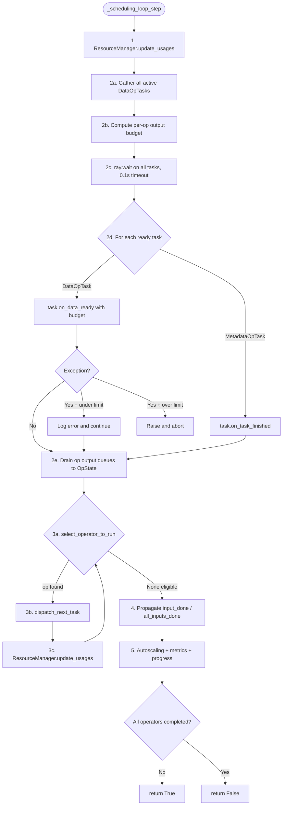


**Step details:**


| Step                              | What happens                                                                                                                                                                                    |
| --------------------------------- | ----------------------------------------------------------------------------------------------------------------------------------------------------------------------------------------------- |
| **1. update_usages**              | For each op (reverse topological): compute CPU/GPU logical usage + estimate object store memory. If allocator enabled: divide budget = 50% reserved equally + 50% shared pool.                  |
| **2a-c. process_completed_tasks** | Collect all active DataOpTasks. Compute output byte budget = min across all BackpressurePolicies. `ray.wait` with 0.1s timeout.                                                                 |
| **2d. on_data_ready**             | Pull blocks from streaming generator up to budget. Each block creates a RefBundle → `output_ready_callback` → MapOperator._output_queue.                                                        |
| **2e. Drain**                     | `while op.has_next(): OpState.add_output(op.get_next())` — moves blocks into OpState.output_queue where consumer thread can see them.                                                           |
| **3a. select_operator_to_run**    | Filter: not completed, can_add_input, has pending bundles. Remove backpressured. Rank by DefaultRanker (low memory = priority). If nothing eligible but consumer idling: override for liveness. |
| **3b. dispatch_next_task**        | Pop RefBundle from OpState input_queue → `op.add_input(bundle)` → triggers task submission (see 3.3).                                                                                           |
| **4. Propagate**                  | If upstream done + queue drained: `input_done(idx)`. If all inputs done: `all_inputs_done()`. Reverse walk: if all downstreams done: `mark_execution_finished()`.                               |


### 3.3 Task Dispatch Path (op.add_input to worker)

When `dispatch_next_task()` calls `MapOperator.add_input(bundle)`:

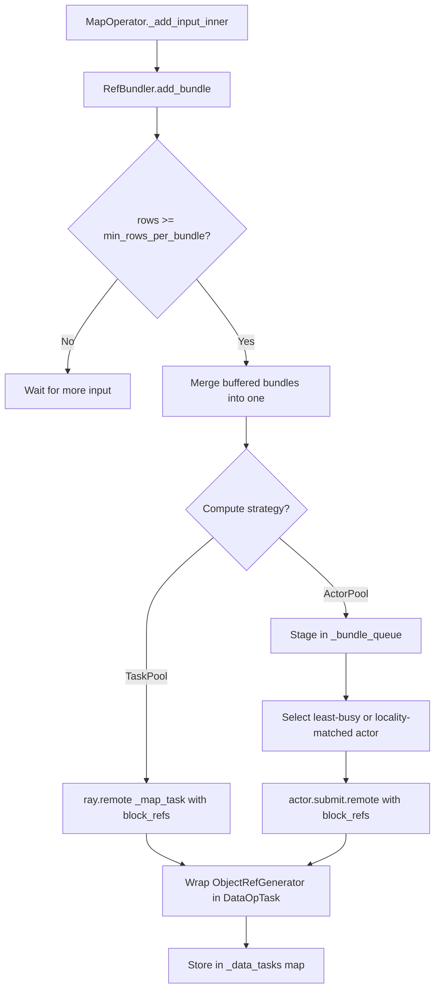


**What gets sent to the worker:**

- `map_transformer_ref`: serialized MapTransformer (contains UDF chain)
- `data_context_ref`: serialized DataContext
- `ctx`: TaskContext with task_idx and block size override
- `*bundle.block_refs`: the actual block ObjectRefs (resolved from object store on worker)
- `slices`: optional row-range offsets

### 3.4 Worker Execution (_map_task remote function)

This runs on a Ray worker (or inside a Ray actor for ActorPool). It is the ONLY place where user code executes.

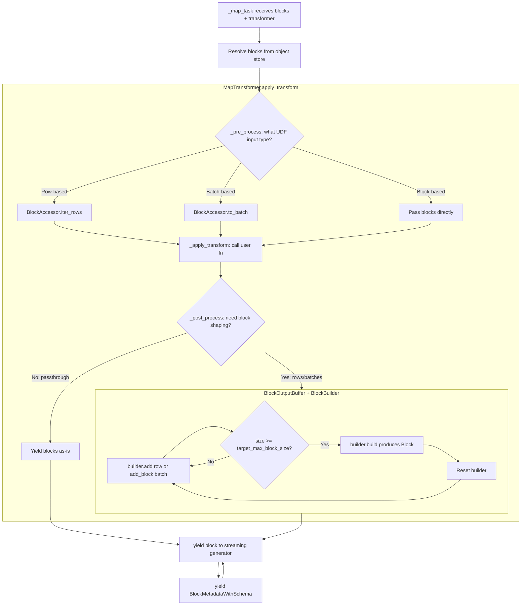


**When is BlockBuilder used?**

- **Always** for row-based UDFs (MapRows, FlatMap, Filter): rows must be accumulated back into columnar blocks
- **Always** for batch-based UDFs (MapBatches) when output batches need reshaping to target block size
- **Never** for internal block-passthrough transforms where `disable_block_shaping=True`

**BlockBuilder compaction inside tasks:**
When `TableBlockBuilder.add(row)` is called repeatedly:

1. Rows accumulate in `_columns` dict (Python lists)
2. When `_uncompacted_size >= 128MB`: auto-compact into a table via `_table_from_pydict`
3. `build()` concatenates all compacted tables + remaining rows into final Block

### 3.5 Output Return Path (worker back to consumer)


> **Legend:** Red = Ray Core calls (`ray.remote`, `ray.wait`, `ray.get`, `gen._next_sync`). Blue = Ray Data components.

**Order preservation:** If `preserve_order=True`, `_output_queue` is a `ReorderingBundleQueue` keyed by `task_idx`. It only yields task 0's blocks, then task 1's, etc. If task 2 finishes before task 1, its blocks wait in the queue until task 1 is finalized.

### 3.6 ResourceManager Budget Cycle

Called at the start of every `_scheduling_loop_step` and after each dispatch:

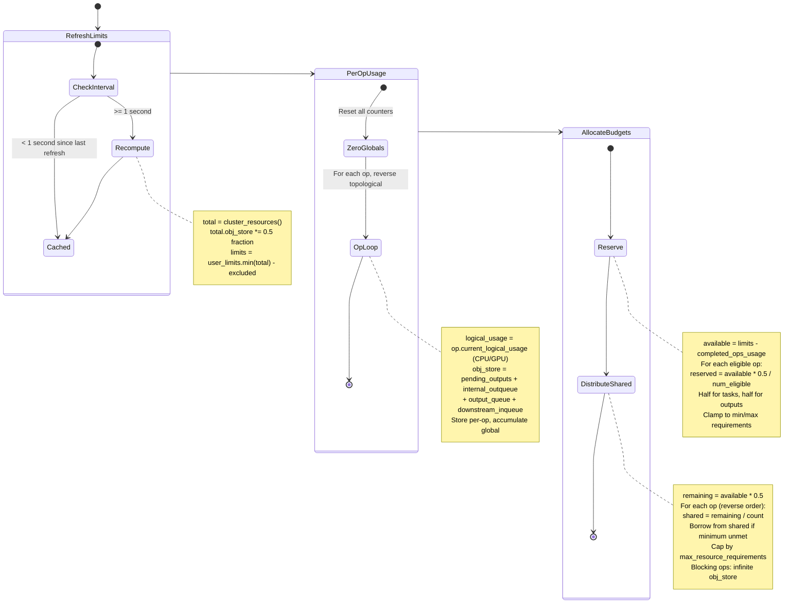


**Operator eligibility:** An operator is eligible for budget allocation when `throttling_disabled=False` AND `has_execution_finished=False`. Once finished, its reservation is freed for others.

**Backpressure enforcement uses budgets:**

- `can_add_input(op)`: True when `op.incremental_resource_usage` fits within budget
- `max_task_output_bytes_to_read(op)`: Remaining budget + reserved-for-outputs minus current output usage
- If downstream is idle and op has zero budget: allow 1 byte to prevent deadlock

### 3.7 Operator State Machine

Each physical operator progresses through these states:

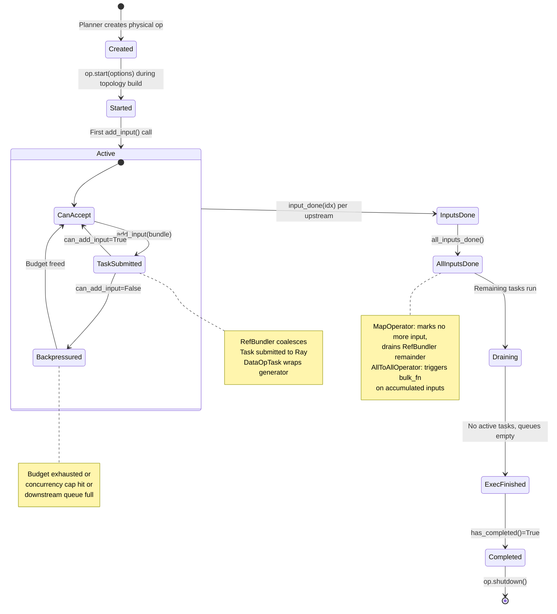


### 3.8 StreamingExecutor Lifecycle

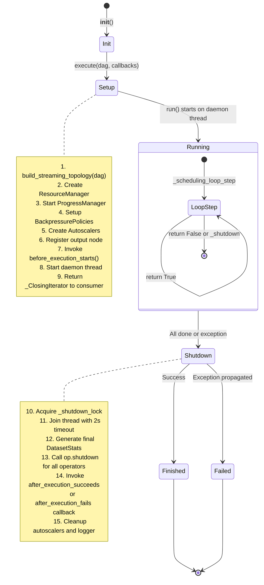


### 3.9 RefBundle Ownership Through the Pipeline

```
STAGE                           owns_blocks    WHY
──────────────────────────────  ─────────────  ──────────────────────────
ReadTask creates block          True           Creator owns the data
RefBundler merges N bundles     all(N own)     Conservative: only own if all inputs own
Submitted to Ray task           True           Bundle passed to remote, still owned
Worker resolves ObjectRefs      (N/A)          Data read from object store into worker memory
Worker yields output block      True           New block created by worker
DataOpTask creates RefBundle    True           Fresh bundle wrapping worker output
_output_queue stores bundle     True           Not yet shared
op.get_next / OpState.add_out   True           Transferred to OpState.output_queue
Consumer pops from queue        True           Consumer has sole reference
bundle.destroy_if_owned()       (freed)        If eager_free=True, object store decrefs

SPECIAL CASES:
bundle.slice(N rows)            False          Both halves share same block refs
merge_ref_bundles(A, B)         all(A,B own)   Only own if all inputs own
```

### 3.10 Complete End-to-End Data Flow

```
USER CODE
    ray.data.read_parquet("s3://data").filter(lambda r: r["x"]>0).map_batches(model).write_parquet("/out")
    │
    ▼
LAZY PLAN CONSTRUCTION (no execution)
    read_parquet  → Dataset(LogicalPlan: Read[ParquetDatasource])
    .filter(fn)   → Dataset(LogicalPlan: Filter → Read)
    .map_batches   → Dataset(LogicalPlan: MapBatches → Filter → Read)
    .write_parquet → Triggers _execute_to_iterator()
    │
    ▼
LOGICAL OPTIMIZATION
    PredicatePushdown  → Filter expression pushed into ParquetDatasource
    ProjectionPushdown → Only needed columns pushed into Read
    CombineShuffles    → Redundant shuffles merged (if any)
    │
    ▼
PLANNING (Logical → Physical)
    Read         → InputDataBuffer (lazy file scan tasks)
    MapBatches   → MapOperator (TaskPool or ActorPool)
    Write        → MapOperator (write tasks calling ParquetDatasink)
    │
    ▼
PHYSICAL OPTIMIZATION
    SetReadParallelism    → Split files across CPUs
    FuseOperators         → Merge compatible MapOperator chains
    ConfigureMapMemory    → Set task memory from output size
    │
    ▼
STREAMING EXECUTION (two threads)
    ┌──────────────────────────────────────────────────────────────────┐
    │ EXECUTOR THREAD (daemon)                                         │
    │                                                                  │
    │ Each _scheduling_loop_step:                                      │
    │                                                                  │
    │  1. ResourceManager.update_usages()                              │
    │     Recalculate CPU/GPU/memory per operator                      │
    │     Allocate budgets: 50% reserved + 50% shared                  │
    │                                                                  │
    │  2. process_completed_tasks()                                    │
    │     ray.wait(all active tasks, timeout=0.1s)                     │
    │     For ready tasks: DataOpTask.on_data_ready(budget)            │
    │       Pull blocks from streaming generator                       │
    │       Create RefBundle per block → output_ready_callback         │
    │       → MapOperator._output_queue                                │
    │     Drain: op.get_next → OpState.output_queue                    │
    │                                                                  │
    │  3. Dispatch new tasks (loop)                                    │
    │     select_operator_to_run:                                      │
    │       Filter eligible (not backpressured, has input)             │
    │       Rank by DefaultRanker (low memory = priority)              │
    │     OpState.dispatch_next_task:                                  │
    │       Pop RefBundle from input_queue                             │
    │       → MapOperator.add_input(bundle)                            │
    │         → RefBundler coalesces small blocks                      │
    │         → _try_schedule_task(merged_bundle)                      │
    │           → ray.remote(_map_task, *block_refs)                   │
    │           → DataOpTask wraps streaming generator                 │
    │                                                                  │
    │  4. update_operator_states()                                     │
    │     Propagate input_done / all_inputs_done signals               │
    │     Mark operators execution_finished when downstream done       │
    │                                                                  │
    │  5. Autoscaling + metrics + progress                             │
    └──────────────────────────────────────────────────────────────────┘

    ┌──────────────────────────────────────────────────────────────────┐
    │ WORKER (Ray task or actor, runs on cluster node)                 │
    │                                                                  │
    │  _map_task(map_transformer, ctx, *blocks, slices):               │
    │                                                                  │
    │  1. Resolve input blocks from object store                       │
    │     Apply slices if present (row-range subsets)                   │
    │                                                                  │
    │  2. MapTransformer.apply_transform(blocks, ctx):                 │
    │     _pre_process: blocks → rows, batches, or pass-through        │
    │     _apply_transform: call user UDF on each row/batch            │
    │     _post_process: results → blocks via BlockOutputBuffer        │
    │       └─ BlockBuilder accumulates rows/batches                   │
    │       └─ Auto-compacts at 128MB threshold                        │
    │       └─ Yields Block when target_max_block_size reached         │
    │                                                                  │
    │  3. For each output Block:                                       │
    │     yield block  (serialized to object store)                    │
    │     yield BlockMetadataWithSchema  (stats + schema)              │
    │     (streaming generator: driver pulls incrementally)            │
    └──────────────────────────────────────────────────────────────────┘

    ┌──────────────────────────────────────────────────────────────────┐
    │ CONSUMER THREAD (user's Python process)                          │
    │                                                                  │
    │  _ClosingIterator.get_next()                                     │
    │    → OpState.get_output_blocking()                               │
    │      Spins on output_queue with 10ms sleep                       │
    │      Returns RefBundle when available                            │
    │    → Process block (iter_batches / to_pandas / write)            │
    │    → bundle.destroy_if_owned() for eager memory cleanup          │
    └──────────────────────────────────────────────────────────────────┘
```

---

## 4. Metrics Reference

### 4.1 OpRuntimeMetrics Fields

**Input Metrics:**


| Metric                        | Type | Description                               |
| ----------------------------- | ---- | ----------------------------------------- |
| `num_inputs_received`         | int  | Input blocks received                     |
| `num_row_inputs_received`     | int  | Input rows received                       |
| `bytes_inputs_received`       | int  | Input bytes received                      |
| `num_task_inputs_processed`   | int  | Input blocks tasks finished processing    |
| `bytes_task_inputs_processed` | int  | Bytes of inputs tasks finished processing |


**Output Metrics:**


| Metric                         | Type | Description                          |
| ------------------------------ | ---- | ------------------------------------ |
| `num_task_outputs_generated`   | int  | Output blocks generated by tasks     |
| `bytes_task_outputs_generated` | int  | Bytes of outputs generated           |
| `rows_task_outputs_generated`  | int  | Output rows generated                |
| `num_outputs_taken`            | int  | Output blocks consumed by downstream |
| `bytes_outputs_taken`          | int  | Bytes consumed by downstream         |
| `num_external_inqueue_blocks`  | int  | Blocks in external input queue       |
| `num_external_outqueue_blocks` | int  | Blocks in external output queue      |


**Task Metrics:**


| Metric                              | Type      | Description                                   |
| ----------------------------------- | --------- | --------------------------------------------- |
| `num_tasks_submitted`               | int       | Tasks submitted to Ray                        |
| `num_tasks_running`                 | int       | Tasks currently running                       |
| `num_tasks_finished`                | int       | Tasks completed                               |
| `num_tasks_failed`                  | int       | Tasks failed                                  |
| `task_submission_backpressure_time` | float     | Seconds unable to launch tasks                |
| `task_output_backpressure_time`     | float     | Seconds unable to read outputs                |
| `task_completion_time_s`            | float     | Cumulative task time (driver-measured)        |
| `task_scheduling_time_s`            | float     | Cumulative scheduling overhead                |
| `task_completion_time`              | Histogram | Per-task duration distribution                |
| `block_completion_time`             | Histogram | Per-block duration distribution               |
| `block_size_bytes`                  | Histogram | Block size distribution (1KB..4TB buckets)    |
| `block_size_rows`                   | Histogram | Block row count distribution (1..10M buckets) |


**Actor Metrics:**


| Metric                  | Type | Description             |
| ----------------------- | ---- | ----------------------- |
| `num_alive_actors`      | int  | Running actors          |
| `num_restarting_actors` | int  | Actors being restarted  |
| `num_pending_actors`    | int  | Actors pending creation |


**Object Store Memory:**


| Metric                               | Type     | Description                     |
| ------------------------------------ | -------- | ------------------------------- |
| `obj_store_mem_freed`                | int      | Bytes freed from object store   |
| `obj_store_mem_spilled`              | int      | Bytes spilled to disk           |
| `obj_store_mem_used`                 | int      | Current bytes in object store   |
| `obj_store_mem_internal_inqueue`     | computed | Bytes in internal input queues  |
| `obj_store_mem_internal_outqueue`    | computed | Bytes in internal output queue  |
| `obj_store_mem_pending_task_outputs` | computed | Estimated bytes being generated |


**Derived Metrics:**


| Metric                                    | Formula                            |
| ----------------------------------------- | ---------------------------------- |
| `average_bytes_per_output`                | `bytes_generated / num_generated`  |
| `average_total_task_completion_time_s`    | `task_time / num_finished`         |
| `average_task_scheduling_time_s`          | `sched_time / num_have_outputs`    |
| `average_task_output_backpressure_time_s` | `backpressure_time / num_finished` |


### 4.2 Metrics Flow

```
Remote Worker
  BlockExecStats: wall_time, ser_time, max_uss, node_id
        |
        v
Driver MapOperator Callbacks
  on_task_output_generated() -> block histograms, scheduling time
  on_task_finished() -> task completion, backpressure accumulation
  on_input_queued/dequeued() -> queue byte tracking
  on_output_queued/dequeued() -> queue byte tracking
        |
        v
OpRuntimeMetrics (per operator, 60+ fields)
        |
        v
StreamingExecutor._update_stats_metrics() [every 5 seconds]
        |
        v
StatsManager.update_execution_metrics()
  Aggregates per-node metrics
  Converts to dicts via as_dict()
        |
        v
StatsActor (remote Ray actor)
  Creates Prometheus Gauge/Counter/Histogram metrics
  Tags: {dataset, operator, node_ip, job_id}
        |
        v
Prometheus endpoint + Ray Dashboard + DatasetStats.to_summary()
```

### 4.3 DatasetStats Iteration Timers


| Timer                        | Description                            |
| ---------------------------- | -------------------------------------- |
| `iter_initialize_s`          | Iterator initialization time           |
| `iter_wait_s`                | Waiting for iteration to start         |
| `iter_get_ref_bundles_s`     | Getting RefBundles from iterator       |
| `iter_get_s`                 | Time in ray.get() resolving block refs |
| `iter_next_batch_s`          | Getting next batch from buffer         |
| `iter_format_batch_s`        | Formatting batch (pandas/arrow/numpy)  |
| `iter_collate_batch_s`       | Collating batch (torch tensors)        |
| `iter_finalize_batch_s`      | Finalizing batch                       |
| `iter_time_to_first_batch_s` | Warmup time to first batch             |
| `iter_total_blocked_s`       | Total time user thread blocked         |
| `iter_user_s`                | Time in user code between batches      |


---

## 5. End-to-End Execution Flow

```
ray.data.read_parquet("s3://...").filter(fn).map_batches(fn).write_parquet("/out")

1. READ API                           2. TRANSFORMS (lazy)
   ParquetDatasource(paths)              .filter() -> LogicalPlan(Filter -> Read)
   Read logical operator                 .map_batches() -> LogicalPlan(MapBatches -> Filter -> Read)
   LogicalPlan(Read)                     .write_parquet() -> triggers _execute_to_iterator()
   ExecutionPlan created
   Dataset returned (NO execution)

2. LOGICAL OPTIMIZATION               4. PLANNING
   PredicatePushdown:                    Read -> InputDataBuffer + scan tasks
     Filter expr into ParquetDS          MapBatches -> MapOperator (TaskPool)
   ProjectionPushdown:                   Write -> MapOperator (write tasks)
     Needed columns into Read
   LimitPushdown, CombineShuffles

3. PHYSICAL OPTIMIZATION              6. STREAMING EXECUTION
   SetReadParallelism:                   build_streaming_topology()
     files / CPUs / block_size           ResourceManager(cluster limits)
   FuseOperators:                        Daemon thread: _scheduling_loop_step()
     Merge compatible MapOps             ┌────────────────────────────────────┐
   ConfigureMapMemory:                   │ process_completed_tasks:           │
     Set task memory from output         │   ray.wait -> pull blocks          │
                                         │ select_operator_to_run:            │
                                         │   eligible + not backpressured     │
                                         │   rank by memory usage             │
                                         │ dispatch_next_task:                │
                                         │   pop RefBundle -> op.add_input()  │
                                         │ update_operator_states:            │
                                         │   input_done / all_inputs_done     │
                                         └────────────────────────────────────┘

4. BLOCK PROCESSING (per task)         8. OUTPUT
   Receive RefBundle (ObjectRefs)         Write tasks: ParquetDatasink.write()
   BlockAccessor.for_block()              PyArrow write_dataset
   Apply UDF via MapTransformer           on_write_complete after all tasks
   BlockBuilder: add rows, compact
   yield Block -> yield Metadata
   (streaming generator protocol)
```


---

## 6. Additional Subsystems

### 6.1 Actor/Cluster Autoscaling Subsystem

The autoscaling subsystem manages two complementary scaling mechanisms: **actor pool autoscaling** (scales individual actor pools within operators) and **cluster autoscaling** (scales the Ray cluster itself). Both are triggered on every StreamingExecutor scheduling decision.

#### Actor Pool Autoscaler Components

| Component | File | Intent | Key Methods | Invokes |
|-----------|------|--------|-------------|---------|
| **ActorAutoscaler** | `_internal/actor_autoscaler/base_actor_autoscaler.py` | Abstract interface for actor pool autoscaling strategies | `try_trigger_scaling()` | N/A (abstract) |
| **DefaultActorAutoscaler** | `_internal/actor_autoscaler/default_actor_autoscaler.py` | Utilization-based scaling for actor pools | `try_trigger_scaling()`, `_derive_target_scaling_config()`, `_compute_upscale_delta()`, `_compute_downscale_delta()` | `actor_pool.scale()`, `actor_pool.get_pool_util()`, `resource_manager.get_budget()` |
| **AutoscalingActorPool** | `_internal/actor_autoscaler/autoscaling_actor_pool.py` | Abstract interface for autoscalable actor pools | `scale()`, `num_running_actors()`, `num_pending_actors()`, `num_tasks_in_flight()`, `get_pool_util()` | N/A (abstract) |
| **ActorPoolScalingRequest** | `_internal/actor_autoscaler/autoscaling_actor_pool.py` | Data class representing a scaling decision with delta, force flag, and reason | `upscale()`, `downscale()`, `no_op()` (factory methods) | N/A |
| **_ActorPool** | `_internal/execution/operators/actor_pool_map_operator.py` | Concrete AutoscalingActorPool for map task execution | `scale()`, `num_running_actors()`, `refresh_actor_state()`, `select_actors()` | `ray.remote()`, `ray.kill()`, `ray.get()` |

#### Cluster Autoscaler Components

| Component | File | Intent | Key Methods | Invokes |
|-----------|------|--------|-------------|---------|
| **ClusterAutoscaler** | `_internal/cluster_autoscaler/base_cluster_autoscaler.py` | Abstract interface for cluster autoscaling | `try_trigger_scaling()`, `on_executor_shutdown()`, `get_total_resources()` | N/A (abstract) |
| **DefaultClusterAutoscalerV2** | `_internal/cluster_autoscaler/default_cluster_autoscaler_v2.py` | Current cluster autoscaler based on rolling utilization gauge | `try_trigger_scaling()`, `on_executor_shutdown()`, `get_total_resources()` | `resource_utilization_calculator.observe()`, `autoscaling_coordinator.request_resources()` |
| **DefaultAutoscalingCoordinator** | `_internal/cluster_autoscaler/default_autoscaling_coordinator.py` | Wraps coordinator actor with timeout handling | `request_resources()`, `cancel_request()`, `get_allocated_resources()` | `_AutoscalingCoordinatorActor` (remote actor) |
| **_AutoscalingCoordinatorActor** | `_internal/cluster_autoscaler/default_autoscaling_coordinator.py` | Ray actor merging resource requests from multiple requesters | `request_resources()`, `cancel_request()`, `_merge_and_send_requests()`, `_reallocate_resources()` | `ray.autoscaler.sdk.request_resources()`, `ray.nodes()` |
| **RollingLogicalUtilizationGauge** | `_internal/cluster_autoscaler/resource_utilization_gauge.py` | Rolling average of logical cluster utilization (CPU, GPU, memory, object store) | `observe()`, `get()` | `resource_manager.get_global_usage()`, `resource_manager.get_global_limits()` |

#### Autoscaling Dataflow

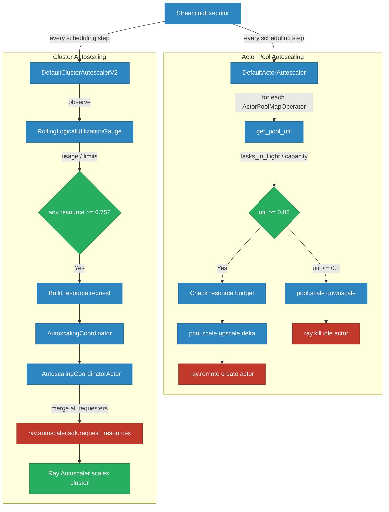

> **Legend:** Red = Ray Core calls (`ray.remote`, `ray.kill`, `ray.autoscaler.sdk`). Blue = Ray Data components. Green = external inputs/decisions.

**Actor autoscaling decision flow:**
1. For each operator's actor pool, calculate utilization = `tasks_in_flight / (max_concurrency × pool_size)`
2. If util >= 0.8 (upscale threshold): compute delta from budget, cap to max, call `pool.scale(upscale)`
3. If util <= 0.2 (downscale threshold): remove idle actors via `ray.kill()`
4. Short-circuit: force scale-down to min_size if operator completed or inputs consumed

**Cluster autoscaling decision flow (V2):**
1. Observe rolling utilization (10s window) across CPU, GPU, memory, object store
2. If any resource >= 0.75 threshold: build resource request with current nodes + delta
3. Cap request to `resource_limits`, send to coordinator actor
4. Coordinator merges requests from multiple executions, sends to Ray autoscaler SDK


### 6.2 Issue Detection & Diagnostics Subsystem

Automated runtime detection of hanging tasks, resource contention, and memory issues. Runs as an ExecutionCallback invoked on every scheduling loop iteration.

#### Components

| Component | File | Intent | Key Methods | Invokes |
|-----------|------|--------|-------------|---------|
| **IssueDetector** (ABC) | `_internal/issue_detection/issue_detector.py` | Abstract base for all issue detectors | `from_executor()`, `detect()`, `detection_time_interval_s()` | N/A (abstract) |
| **Issue** | `_internal/issue_detection/issue_detector.py` | Data class representing a detected issue (type, message, operator) | N/A (dataclass) | N/A |
| **IssueDetectorManager** | `_internal/issue_detection/issue_detector_manager.py` | Orchestrates detection lifecycle and reporting | `invoke_detectors()`, `_report_issues()` | `IssueDetector.detect()`, `OperatorEvent` export |
| **IssueDetectorsConfiguration** | `_internal/issue_detection/issue_detector_configuration.py` | Configuration dataclass holding detector configs and active detector list | N/A (dataclass) | N/A |
| **HangingExecutionIssueDetector** | `_internal/issue_detection/detectors/hanging_detector.py` | Detects tasks stuck longer than statistical threshold (mean + z-score × stddev) | `from_executor()`, `detect()`, `_refresh_state()` | `ray.util.state.get_task()` (Ray State API) |
| **HashShuffleAggregatorIssueDetector** | `_internal/issue_detection/detectors/hash_shuffle_detector.py` | Detects hash shuffle aggregators failing to become ready within timeout | `from_executor()`, `detect()`, `_format_health_warning()` | `ray.wait()`, `ray.available_resources()`, `ray.cluster_resources()` |
| **HighMemoryIssueDetector** | `_internal/issue_detection/detectors/high_memory_detector.py` | Detects MapOperators consuming memory above estimated requirements | `from_executor()`, `detect()` | `MapOperator.metrics.average_max_uss_per_task` |
| **IssueDetectionExecutionCallback** | `_internal/issue_detection/callbacks/insert_issue_detectors.py` | ExecutionCallback hook integrating detectors into the scheduling loop | `before_execution_starts()`, `on_execution_step()` | `IssueDetectorManager.invoke_detectors()` |

#### Detection Dataflow

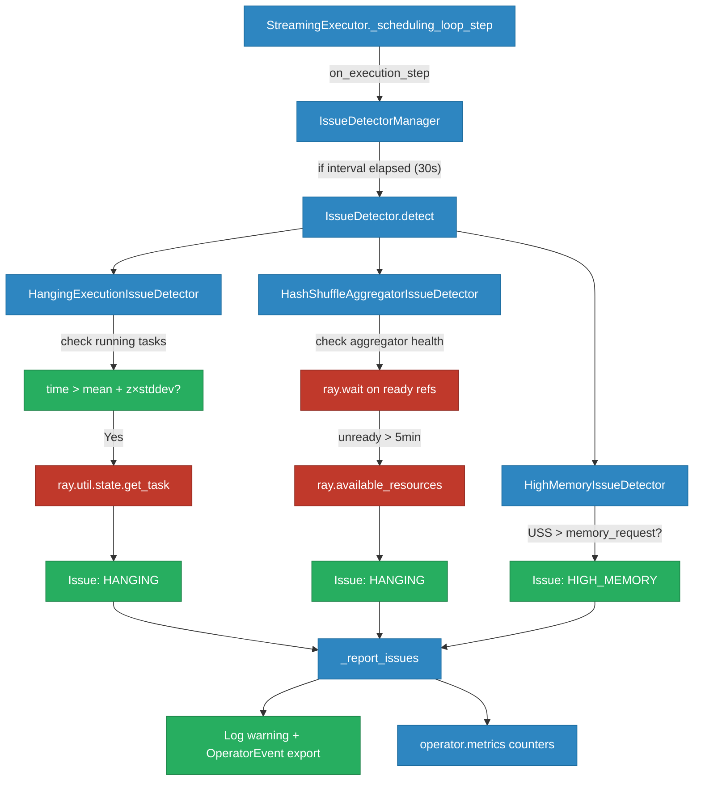

> **Legend:** Red = Ray Core calls (`ray.util.state.get_task`, `ray.wait`, `ray.available_resources`). Blue = Ray Data components. Green = external signals/outputs.

**Detector details:**
- **HangingExecutionIssueDetector**: Uses Welford's online algorithm for incremental mean/stddev of task durations. Only activates after 10+ completed tasks. Queries Ray State API for stuck task metadata (pid, node_id).
- **HashShuffleAggregatorIssueDetector**: Non-blocking readiness check via `ray.wait(timeout=0)`. Reports resource diagnostics (available vs required CPU/memory) after 5-minute grace period.
- **HighMemoryIssueDetector**: Compares average max USS per task against initial memory request and 4 GiB/core heuristic. Only checks MapOperators.

**Configuration** (via `DataContext.issue_detectors_config`):
- All detectors enabled by default with 30s detection interval
- Hanging detector: `op_task_stats_min_count=10`, `op_task_stats_std_factor=10.0`
- Hash shuffle detector: `min_wait_time_s=300`


### 6.3 Shuffle Subsystem

The shuffle subsystem handles all data redistribution operations (repartition, sort, group-by, join). It is selected by `DataContext.shuffle_strategy` and has two implementations sharing the same planner entry point (`plan_all_to_all_op`).

#### CPU Shuffle Components

The CPU path uses `HashShuffleOperator` with a pool of `HashShuffleAggregator` actors that accumulate hash-partitioned shards into `PartitionBucket`s. Already documented in sections 2.5 (Physical Operators) and 2.8 (Aggregation); key components:

| Component | File | Intent |
|-----------|------|--------|
| **HashShuffleOperator** | `_internal/execution/operators/hash_shuffle.py` | Map-reduce shuffle: hash-partition inputs, distribute to aggregator actors, reduce shards |
| **HashAggregateOperator** | `_internal/execution/operators/hash_aggregate.py` | Group-by via hash-partition by key, then AggregateFnV2 combine+finalize per partition |
| **ShuffleAggregation** | `_internal/execution/operators/hash_shuffle.py` | Stateless reduce stage: `compact` for partial aggregation, `finalize` for output |
| **HashShuffleAggregator** | `_internal/execution/operators/hash_shuffle.py` | Stateful Ray actor accumulating partition shards into PartitionBuckets |
| **PartitionBucket** | `_internal/execution/operators/hash_shuffle.py` | Per-partition thread-safe container with lock-protected compaction |

#### GPU Shuffle Components

GPU-accelerated shuffle using RAPIDS MPF (Multi-GPU Partitioning Framework) with UCXX for direct GPU-to-GPU communication, bypassing the Ray object store for inter-rank data movement.

| Component | File | Intent | Key Methods | Invokes |
|-----------|------|--------|-------------|---------|
| **GPUShuffleOperator** | `_internal/gpu_shuffle/hash_shuffle.py` | Physical operator implementing streaming GPU shuffle; extends PhysicalOperator | `start()`, `_add_input_inner()`, `_try_finalize()`, `has_next()`, `_get_next_inner()` | `GPURankPool`, `OpRuntimeMetrics`, `RefBundle` |
| **GPURankPool** | `_internal/gpu_shuffle/hash_shuffle.py` | Manages lifecycle of GPUShuffleActor instances; coordinates UCXX setup | `start()`, `get_actor_for_block()`, `shutdown()` | `GPUShuffleActor.options()`, `ray.get()`, `ray.wait()` |
| **GPUShuffleActor** | `_internal/gpu_shuffle/hash_shuffle.py` | Ray remote actor (1 per GPU) performing RAPIDS MPF shuffle | `setup_root()`, `setup_worker()`, `insert_batch()`, `finish_and_extract()` | `BulkRapidsMPFShuffler`, cuDF, RAPIDS MPF |
| **BulkRapidsMPFShuffler** | `_internal/gpu_shuffle/rapidsmpf_backend.py` | Wrapper around RAPIDS MPF shuffler; manages RMM memory and UCXX | `setup_worker()`, `insert_chunk()`, `insert_finished()`, `extract()`, `cleanup()` | RAPIDS MPF Shuffler, RMM, UCXX |

#### GPU Shuffle Dataflow

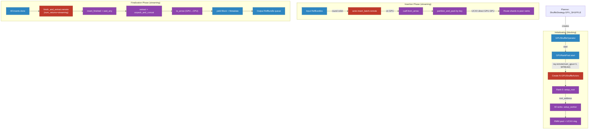

> **Legend:** Red = Ray Core calls (`ray.remote`, `ray.get`, `ray.kill`). Blue = Ray Data components. Purple = GPU/RAPIDS (cuDF, UCXX, RMM, MPF).

**Data path:**
1. **Planning**: When `DataContext.shuffle_strategy == ShuffleStrategy.GPU_SHUFFLE`, the planner creates a `GPUShuffleOperator` instead of `HashShuffleOperator`
2. **Init**: Creates N actors (one per GPU) with SPREAD scheduling. Rank 0 initializes UCXX root communicator; all ranks join the ring. RMM pool allocates 90% of free GPU memory.
3. **Insert**: Input Arrow Tables are round-robin distributed to actors. Each actor converts to cuDF, hash-partitions by key columns, and routes shards directly to peer GPUs via UCXX (no Ray object store).
4. **Finalize**: Streaming generator tasks extract completed partitions. Data converts back to Arrow (GPU→CPU) for downstream compatibility.
5. **Memory**: RMM pool with optional host-memory spill (80% of pool size budget). Spill is transparent to the shuffle logic.

**Ray Core interactions**: `@ray.remote(num_gpus=1)`, `scheduling_strategy="SPREAD"`, `num_returns="streaming"`, `ray.kill()` for shutdown.


### 6.4 Checkpoint & Recovery Subsystem

Row-level checkpointing for write operations with 2-phase commit support for file datasinks (exactly-once semantics) and at-least-once semantics for non-file datasinks.

#### Components

| Component | File | Intent | Key Methods | Invokes |
|-----------|------|--------|-------------|---------|
| **CheckpointConfig** | `checkpoint/interfaces.py` | Configuration for checkpoint behavior (paths, backends, threading) | `__init__()`, `_get_default_checkpoint_path()`, `_infer_backend_and_fs()` | PyArrow FileSystem APIs |
| **CheckpointWriter** | `checkpoint/checkpoint_writer.py` | Abstract base for writing row-level checkpoints | `write_block_checkpoint()`, `write_pending_checkpoint()`, `commit_checkpoint()`, `create()` | BlockAccessor, filesystem ops |
| **BatchBasedCheckpointWriter** | `checkpoint/checkpoint_writer.py` | Batch-based checkpoint with 2-phase commit | `write_block_checkpoint()`, `write_pending_checkpoint()`, `commit_checkpoint()` | PyArrow parquet write, filesystem move/delete |
| **CheckpointFilter** | `checkpoint/checkpoint_filter.py` | Abstract base for filtering checkpointed rows | N/A (abstract) | N/A |
| **BatchBasedCheckpointFilter** | `checkpoint/checkpoint_filter.py` | Binary-search-based filter for recovery | `load_checkpoint()`, `filter_rows_for_block()`, `filter_rows_for_batch()`, `delete_checkpoint()` | `ray.remote` tasks, `ray.get`, `ray.data.read_parquet` |
| **LoadCheckpointCallback** | `checkpoint/load_checkpoint_callback.py` | ExecutionCallback loading checkpoint data before execution and cleaning up after | `before_execution_starts()`, `after_execution_succeeds()`, `after_execution_fails()` | BatchBasedCheckpointFilter, StreamingExecutor callbacks |
| **PrefixTrie** | `checkpoint/util.py` | Trie for efficient prefix matching of pending checkpoint filenames during recovery | `insert()`, `has_prefix_of()` | N/A |

#### Checkpoint Lifecycle

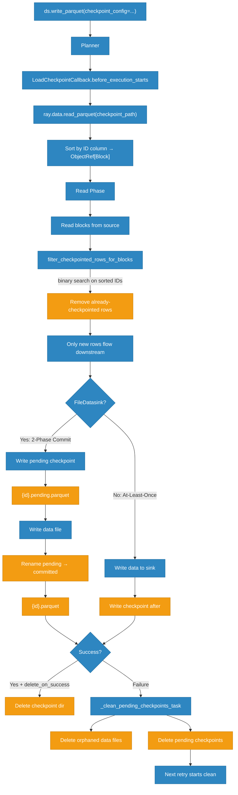

> **Legend:** Red = Ray Core calls (`ray.remote`, `ray.data.read_parquet`). Blue = Ray Data components. Orange = storage/persistence (filesystem, parquet I/O).

**2-phase commit (file datasinks):**
1. **Pre-write**: Extract ID column → write `{id}.pending.parquet` to checkpoint path
2. **Data write**: Write actual data file via FileDatasink
3. **Post-write**: Rename `pending` → `committed` (atomic on most filesystems)
4. **On failure**: `_clean_pending_checkpoints_task` uses PrefixTrie to match pending checkpoints to orphaned data files, deletes both

**Recovery filtering**: Checkpoint IDs loaded via `ray.data.read_parquet`, sorted for binary search. Each read task filters rows against checkpointed IDs using concurrent ThreadPoolExecutor.


### 6.5 Block Batching & Collation Subsystem

Transforms the stream of block ObjectRefs (RefBundles from the execution engine) into user-facing data batches with prefetching, format conversion, collation, and order preservation.

#### Components

| Component | File | Intent | Key Methods | Invokes |
|-----------|------|--------|-------------|---------|
| **BatchIterator** | `_internal/block_batching/iter_batches.py` | Main orchestrator for the batching pipeline with prefetching and threading | `__iter__()`, `_pipeline()`, `_prefetch_blocks()`, `_resolve_block_refs()`, `_blocks_to_batches()`, `_format_batches()`, `_finalize_batches()` | WaitBlockPrefetcher, resolve_block_refs, blocks_to_batches, format_batches, collate, finalize_batches |
| **batch_blocks** | `_internal/block_batching/block_batching.py` | Simplified entry point for batching pre-fetched blocks | `batch_blocks()` | blocks_to_batches, format_batches, collate |
| **Batch / CollatedBatch** | `_internal/block_batching/interfaces.py` | Data classes holding batch data with metadata (batch_idx) | N/A (dataclasses) | N/A |
| **_BatchingIterator** | `_internal/block_batching/util.py` | Converts block stream to batch stream using Batcher or ShufflingBatcher | `__next__()` | `Batcher`, `ShufflingBatcher`, `BlockAccessor.for_block()` |
| **Batcher** | `_internal/batcher.py` | Stateful batcher implementing batch slicing without shuffling | `add()`, `has_batch()`, `next_batch()`, `done_adding()` | `BlockAccessor.for_block()`, `DelegatingBlockBuilder` |
| **ShufflingBatcher** | `_internal/batcher.py` | Stateful batcher with local in-memory shuffle buffer | `add()`, `has_batch()`, `next_batch()`, `done_adding()` | `BlockAccessor`, `DelegatingBlockBuilder`, `random_shuffle()` |
| **resolve_block_refs** | `_internal/block_batching/util.py` | Resolves ObjectRef[Block] to Block via ray.get; tracks local/remote hits | Returns iterator of Block | `ray.get()`, `ray.experimental.get_object_locations()` |
| **WaitBlockPrefetcher** | `_internal/block_batching/util.py` | Prefetcher using ray.wait for local fetching in daemon thread | `prefetch_blocks()`, `stop()` | `ray.wait(fetch_local=True)` |
| **ActorBlockPrefetcher** | `_internal/block_batching/util.py` | Prefetcher using node-affinity actor | `prefetch_blocks()` | `NodeAffinitySchedulingStrategy`, `@ray.remote(num_cpus=0)` |

#### Batching Pipeline

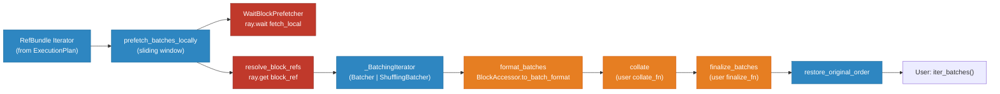

> **Legend:** Red = Ray Core calls (`ray.wait`, `ray.get`). Blue = Ray Data components. Dark orange = format conversion (Arrow, Pandas, NumPy, Torch).

**Pipeline stages:**
1. **Prefetching**: Sliding window of `prefetch_batches × batch_size` rows. `WaitBlockPrefetcher` uses daemon thread calling `ray.wait(fetch_local=True)` to move blocks to local object store.
2. **Resolution**: `ray.get(block_ref)` materializes blocks. Tracks local/remote hit statistics via `ray.experimental.get_object_locations()`.
3. **Batching**: `Batcher` slices blocks to exact `batch_size` using zero-copy `BlockAccessor.slice()`. `ShufflingBatcher` accumulates then shuffles with optional seed.
4. **Formatting**: Threadpool (up to 4 workers) converts blocks: `"pandas"` → DataFrame, `"pyarrow"` → Table, `"numpy"` → Dict[str, ndarray], `"cudf"` → cuDF DataFrame.
5. **Collation**: Optional user `collate_fn` transforms batches (e.g., stack into tensors for ML).
6. **Finalization**: Optional user `finalize_fn` for GPU preloading or device placement (runs in main thread).
7. **Ordering**: `restore_original_order()` buffers out-of-order batches from threadpool and yields by `batch_idx`.

**Configuration**: `batch_size=256`, `prefetch_batches=1`, `batch_format="default"` (NumPy), `local_shuffle_buffer_size=None`, `drop_last=False`.


### 6.6 DatasourceV2 Framework

Next-generation datasource abstraction replacing the monolithic `Datasource.get_read_tasks()` pattern with a modular pipeline of FileIndexer → Scanner → Reader. Currently a **framework/foundation** — no concrete datasource implementations yet (Parquet, CSV, etc. remain V1-only).

#### Components

| Component | File | Intent | Key Methods | Invokes |
|-----------|------|--------|-------------|---------|
| **DataSourceV2** | `_internal/datasource_v2/datasource_v2.py` | Abstract base for V2 datasources | `infer_schema()`, `create_scanner()`, `_get_file_indexer()`, `get_size_estimator()` | FileIndexer, Scanner |
| **Scanner / FileScanner** | `_internal/datasource_v2/scanners/` | Logical read configuration with pushdown capabilities | `read_schema()`, `plan()`, `create_reader()` | Reader, InputSplit planning |
| **Reader / FileReader** | `_internal/datasource_v2/readers/` | Physical data reading | `read(input_split)` → Iterator[pa.Table] | PyArrow Dataset API |
| **FileIndexer** | `_internal/datasource_v2/listing/file_indexer.py` | File discovery; yields FileManifest incrementally | `list_files(paths, filesystem, pruners)` | PyArrow FileSystem, threading |
| **FileManifest** | `_internal/datasource_v2/listing/file_manifest.py` | Structured batch of file paths + sizes as PyArrow Table | `paths`, `file_sizes`, `as_block()`, `construct_manifest()` | PyArrow Table |
| **RoundRobinPartitioner** | `_internal/datasource_v2/partitioners/round_robin_partitioner.py` | Size-aware file distribution across partitions | `add_input()`, `has_partition()`, `next_partition()`, `finalize()` | InMemorySizeEstimator, FileManifest |
| **SamplingInMemorySizeEstimator** | `_internal/datasource_v2/readers/in_memory_size_estimator.py` | Estimates in-memory size via encoding ratio sampling | `estimate_in_memory_sizes()`, `_estimate_encoding_ratio()` | FileReader (samples first file) |
| **SupportsFilterPushdown** | `_internal/datasource_v2/logical_optimizers.py` | Mixin: scanner accepts Expr predicates | `push_filters(predicate)` → (Scanner, residual) | N/A |
| **SupportsColumnPruning** | `_internal/datasource_v2/logical_optimizers.py` | Mixin: scanner prunes to specific columns | `prune_columns(columns)` → Scanner | N/A |
| **SupportsLimitPushdown** | `_internal/datasource_v2/logical_optimizers.py` | Mixin: scanner accepts row limits | `push_limit(limit)` → Scanner | N/A |
| **SupportsPartitionPruning** | `_internal/datasource_v2/logical_optimizers.py` | Mixin: scanner eliminates partitions by predicate | `prune_partitions(predicate, partition_columns)` → Scanner | N/A |
| **FilePruner** | `_internal/datasource_v2/listing/file_pruners.py` | File-level filter (extension, partition) | `should_include(path)` → bool | N/A |

#### V2 Read Pipeline

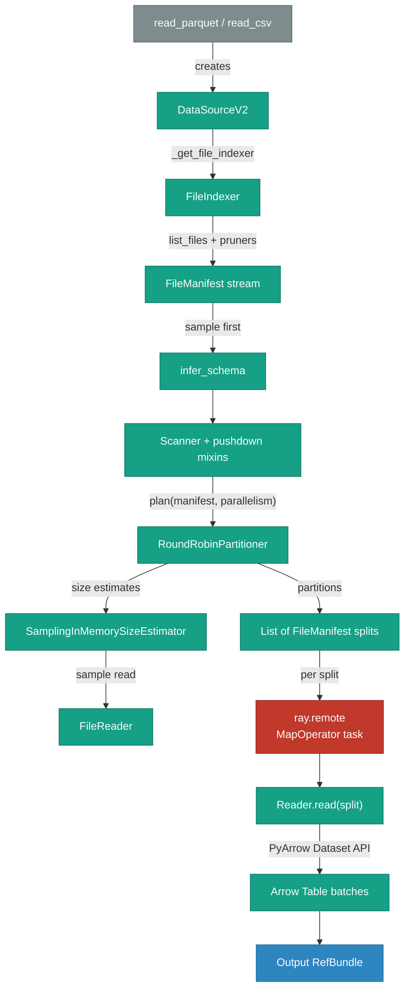

> **Legend:** Red = Ray Core calls. Blue = Ray Data components. Teal = V2-specific components. Gray = legacy entry point.

#### V2 vs V1 Design

| Aspect | V1 (Legacy `Datasource`) | V2 (`DataSourceV2`) |
|--------|--------------------------|---------------------|
| Read model | Monolithic `get_read_tasks(parallelism)` | Declarative: FileIndexer → Scanner → Reader |
| File listing | Embedded in `get_read_tasks()` | Separate `FileIndexer` with streaming `Iterable` output |
| Optimization | Post-hoc via `apply_predicate()` / `apply_projection()` | Built-in via Scanner mixins (`SupportsFilterPushdown`, etc.) |
| Partitioning | Implicit in ReadTask generation | Explicit `FilePartitioner` with size-aware strategies |
| Size estimation | Single aggregate `estimate_inmemory_data_size()` | Per-file `SamplingInMemorySizeEstimator` with encoding ratio |
| Composability | Hard to reuse across formats | Scanner, Reader, Partitioner are independently pluggable |

#### Implementation Status

| Format | V1 | V2 | Notes |
|--------|----|----|-------|
| Parquet | Yes | No | V1 only; V2 planned |
| CSV | Yes | No | V1 only |
| JSON | Yes | No | V1 only |
| Images/Text/Avro/TFRecords | Yes | No | V1 only |

V2 is a **framework-only** foundation. Dashed edges in the system overview diagram (`-.->`) indicate the future migration path from `Datasource` and `ReadAPI` to `DataSourceV2`.


### 6.7 Resource Allocation Subsystem

Manages CPU/GPU/memory budgeting, per-operator resource reservation, and backpressure enforcement during streaming execution. Called multiple times per scheduling loop iteration.

#### Components

| Component | File | Intent | Key Methods | Invokes |
|-----------|------|--------|-------------|---------|
| **ResourceManager** | `_internal/execution/resource_manager.py` | Central orchestrator tracking global and per-operator resource usage and budgets | `update_usages()`, `get_global_limits()`, `get_global_usage()`, `get_op_usage()`, `get_budget()`, `is_op_eligible()`, `max_task_output_bytes_to_read()` | OpResourceAllocator, `ray.cluster_resources()` |
| **ReservationOpResourceAllocator** | `_internal/execution/resource_manager.py` | Per-operator budget allocator using 50% reserved + 50% shared model | `update_budgets()`, `can_submit_new_task()`, `max_task_output_bytes_to_read()`, `get_budget()`, `get_allocation()` | Operator metrics, idle detection |
| **ExecutionResources** | `_internal/execution/interfaces/execution_options.py` | Value object for CPU/GPU/memory/object_store budgets; supports arithmetic | `add()`, `subtract()`, `scale()`, `min()`, `satisfies_limit()` | (pure data) |
| **ResourceBudgetBackpressurePolicy** | `_internal/execution/backpressure_policy/resource_budget_backpressure_policy.py` | Delegates to OpResourceAllocator budget enforcement | `can_add_input()`, `max_task_output_bytes_to_read()` | OpResourceAllocator |
| **ConcurrencyCapBackpressurePolicy** | `_internal/execution/backpressure_policy/concurrency_cap_backpressure_policy.py` | Dynamic concurrency cap via EWMA feedback on queue growth | `can_add_input()`, `_effective_cap()`, `_update_level_and_dev()` | Operator metrics |
| **DownstreamCapacityBackpressurePolicy** | `_internal/execution/backpressure_policy/downstream_capacity_backpressure_policy.py` | Backpressure based on queue/downstream_capacity ratio | `can_add_input()`, `_should_apply_backpressure()` | ResourceManager |

#### Resource Allocation Dataflow

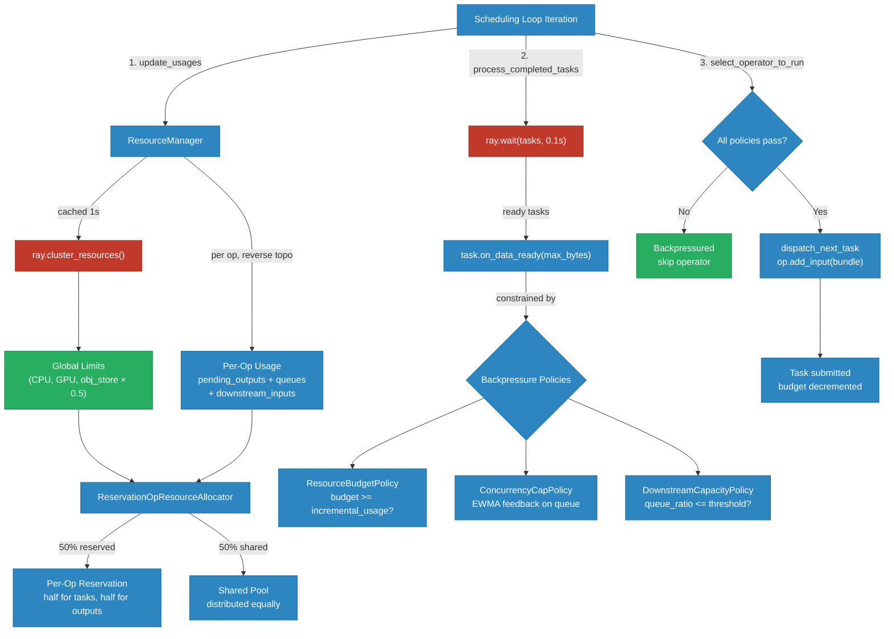

> **Legend:** Red = Ray Core calls (`ray.cluster_resources`, `ray.wait`). Blue = Ray Data components. Green = external state/decisions.

#### Budget Allocation Algorithm

**Per scheduling iteration:**
1. **Global limits**: `min(configured_limits, cluster_resources × obj_store_fraction) - exclude_resources`
2. **Per-op usage**: For each operator (reverse topological): sum pending task outputs + internal queues + output queue + downstream input queues
3. **Reservation** (50% of available): `reserved_per_op = available × reservation_ratio / num_eligible_ops`, split into task budget and output budget
4. **Shared pool** (remaining 50%): distributed equally, with borrowing allowed if an operator's minimum requirements aren't met
5. **Special cases**: Materializing operators (AllToAll, shuffle) get infinite object store budget

**Backpressure enforcement** (checked before every task dispatch):
- **ResourceBudgetPolicy**: `incremental_resource_usage() <= op_budget`
- **ConcurrencyCapPolicy**: EWMA-based feedback — reduces cap when queue grows faster than consumption, increases when queue drains
- **DownstreamCapacityPolicy**: blocks when `queue_bytes / downstream_capacity > threshold` and budget utilization > 90%
- **Liveness guarantee**: If max_bytes = 0 but downstream is idle, allow 1 byte to prevent deadlock

**Configuration**: `op_resource_reservation_enabled=True`, `op_resource_reservation_ratio=0.5`, `DEFAULT_OBJECT_STORE_MEMORY_LIMIT_FRACTION=0.5`
