# Ray Data SQL API Architecture

## Overview

The Ray Data SQL API represents a sophisticated integration between SQL query processing and Ray's distributed computing framework. This system enables users to execute standard SQL queries against Ray Datasets while leveraging Ray's inherent capabilities for parallel processing, fault tolerance, and elastic scaling across distributed clusters.

### Design Philosophy

The architecture follows several key design principles:

1. **SQL Standard Compliance**: The engine implements standard SQL semantics while adapting to Ray's distributed execution model
2. **Lazy Evaluation**: Operations are not executed until materialization, enabling query optimization and efficient resource utilization
3. **Distributed-First**: Every component is designed to work efficiently in distributed environments with automatic parallelization
4. **Type Safety**: Comprehensive type inference and validation ensure SQL operations maintain data integrity
5. **Performance Optimization**: Multi-level optimization passes reduce data movement and computation overhead
6. **Extensibility**: Modular design allows for easy extension of SQL functionality and Ray Dataset integration

### Key Capabilities

The system provides enterprise-grade SQL functionality including:
- **Complex Queries**: Multi-table joins, subqueries, aggregations, and window functions
- **Data Types**: Full support for SQL data types with automatic Python type inference
- **Optimizations**: Advanced query optimization including predicate pushdown and join reordering
- **Scalability**: Linear scalability from single-machine to multi-thousand node clusters
- **Fault Tolerance**: Automatic recovery from node failures during query execution
- **Memory Management**: Intelligent memory usage with spill-to-disk for large datasets

## High-Level Architecture

```mermaid
graph TB
    subgraph "User Interface"
        A[SQL Query String] --> B[ray.data.sql()]
        C[Ray Dataset] --> D[register_table()]
    end

    subgraph "Core Engine"
        B --> E[RaySQL Engine]
        D --> F[DatasetRegistry]
        E --> G[SQLParser]
        G --> H[ASTOptimizer]
        H --> I[LogicalPlanner]
        I --> J[QueryExecutor]
    end

    subgraph "Execution Layer"
        J --> K[ProjectionAnalyzer]
        J --> L[AggregateAnalyzer]
        J --> M[JoinHandler]
        J --> N[FilterHandler]
        J --> O[OrderHandler]
        J --> P[LimitHandler]
    end

    subgraph "Expression System"
        K --> Q[ExpressionCompiler]
        L --> Q
        M --> Q
        N --> Q
        Q --> R[Python Callables]
    end

    subgraph "Schema System"
        F --> S[SchemaManager]
        S --> T[Automatic Type Inference]
    end

    subgraph "Output"
        J --> U[Ray Dataset Result]
    end

    F -.-> J
    S -.-> J
    R -.-> U
```

## Core Components

The Ray Data SQL API consists of several interconnected subsystems that work together to provide comprehensive SQL functionality. Each component is designed for distributed execution and follows Ray's architectural patterns for scalability and fault tolerance.

### 1. Query Processing Pipeline

The SQL engine implements a sophisticated multi-phase query processing pipeline that combines traditional SQL processing techniques with Ray-specific optimizations. This pipeline ensures efficient execution while maintaining SQL standard compliance.

#### Pipeline Overview

The query processing follows these distinct phases:

1. **Registration Phase**: Datasets are registered as named tables with automatic schema inference
2. **Parsing Phase**: SQL strings are converted to Abstract Syntax Trees (ASTs) using SQLGlot
3. **Optimization Phase**: Multiple optimization passes improve query performance
4. **Planning Phase**: Logical execution plans are generated for complex queries
5. **Execution Phase**: ASTs are converted to Ray Dataset operations and executed
6. **Materialization Phase**: Results are collected and returned as Ray Datasets

Each phase is designed to be independently optimizable and can be extended with additional functionality.

#### Phase 1: Registration and Discovery
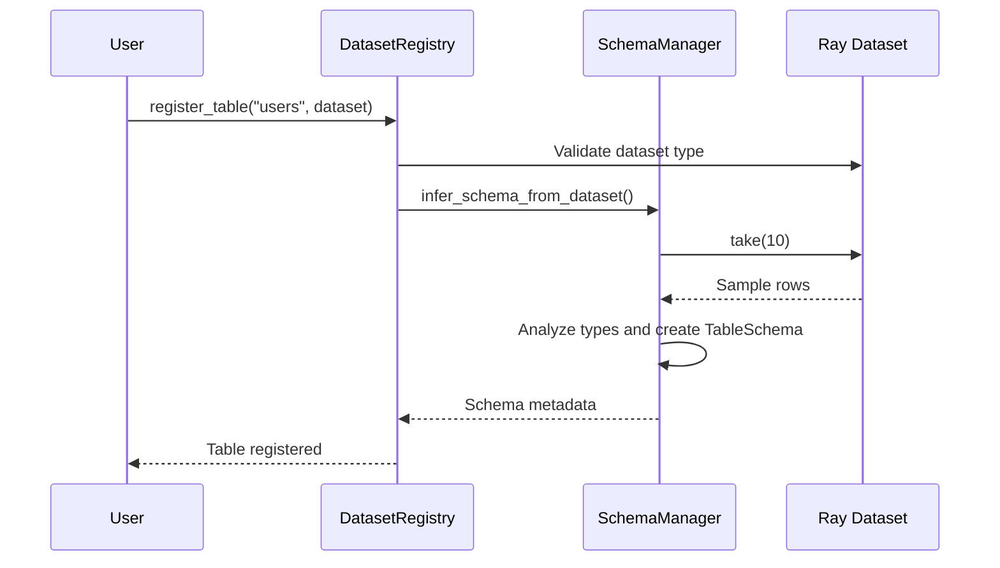

#### Phase 2: Query Execution
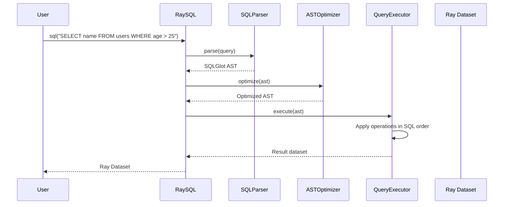

#### Detailed Phase Analysis

**Registration Phase**: This phase establishes the mapping between SQL table names and Ray Datasets. The DatasetRegistry maintains this mapping while the SchemaManager performs automatic type inference by sampling data. This phase is critical for query validation and optimization, as it provides the metadata necessary for type checking and predicate pushdown.

**Parsing Phase**: SQL queries are parsed using SQLGlot, a robust SQL parser that supports multiple SQL dialects. The parser generates an Abstract Syntax Tree (AST) that represents the query structure in a format suitable for analysis and optimization. Error handling during this phase provides detailed syntax error messages with suggestions for correction.

**Optimization Phase**: Multiple optimization passes are applied to the AST to improve query performance. This includes both SQLGlot's built-in optimizations (constant folding, predicate simplification) and custom Ray-specific optimizations (predicate pushdown to dataset level, join reordering based on data statistics).

**Planning Phase**: For complex queries, a logical execution plan is generated that describes the optimal order of operations. This phase considers factors like data locality, network bandwidth, and available compute resources to minimize execution time.

**Execution Phase**: The optimized AST is converted into a series of Ray Dataset operations. Each SQL operation is mapped to corresponding Ray Dataset methods, with compiled expressions handling the detailed computation logic.

**Materialization Phase**: Results are collected from distributed computation and returned as Ray Datasets, maintaining lazy evaluation semantics until the user explicitly requests data materialization.

### 2. Component Architecture

The system architecture follows a layered design with clear separation of concerns. Each layer builds upon the previous one, creating a robust and maintainable system.

#### DatasetRegistry and SchemaManager

The DatasetRegistry serves as the central catalog for all available datasets, providing a SQL-like table abstraction over Ray Datasets. It works closely with the SchemaManager to maintain comprehensive metadata about each registered table.
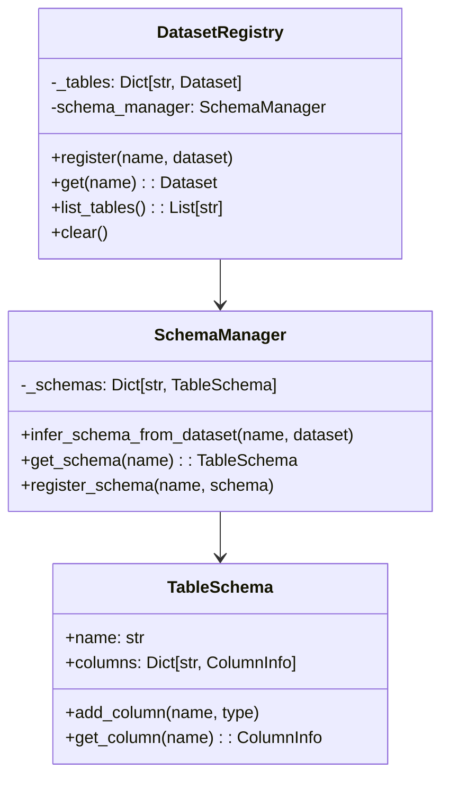

**Key Features of DatasetRegistry:**
- **Thread-Safe Operations**: Multiple concurrent registrations and lookups are safely handled
- **Automatic Validation**: Input datasets are validated for type correctness and Ray Dataset compliance
- **Name Resolution**: SQL table names are resolved to actual Ray Dataset objects with case sensitivity options
- **Lifecycle Management**: Tables can be registered, updated, and removed dynamically during execution

**SchemaManager Capabilities:**
- **Sample-Based Inference**: Uses statistical sampling to infer column types without full dataset scans
- **Type Mapping**: Comprehensive mapping from Python types to SQL types with support for complex nested structures
- **Schema Caching**: Inferred schemas are cached to avoid repeated inference operations
- **Consistency Validation**: Schema changes are detected and validated across query executions

#### Query Execution Components

The execution layer contains specialized components that handle different aspects of SQL query execution. Each component is optimized for specific operation types while maintaining compatibility with the overall execution framework.
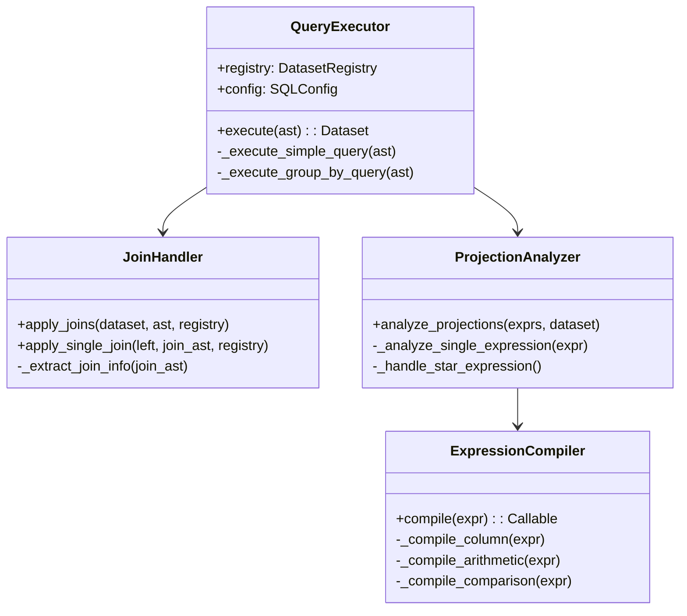

**Component Responsibilities:**

**QueryExecutor**: Acts as the central coordinator for query execution, managing the overall flow from AST to result. It determines whether a query requires simple processing or complex aggregation handling, and dispatches to appropriate execution paths.

**JoinHandler**: Specializes in processing JOIN operations of all types (INNER, LEFT, RIGHT, FULL OUTER). It handles the complex logic of column validation, join condition parsing, and mapping SQL JOIN semantics to Ray Dataset join operations.

**ProjectionAnalyzer**: Responsible for analyzing SELECT clauses and generating the appropriate column projections. It handles everything from simple column selection to complex expressions involving arithmetic, functions, and literals.

**ExpressionCompiler**: The core compilation engine that converts SQL expressions into Python callable functions. It supports a wide range of expression types and generates optimized code for distributed execution.

## SQL Evaluation Order

The engine strictly follows standard SQL evaluation semantics, ensuring compatibility with existing SQL knowledge while optimizing for Ray's distributed execution model. This adherence to standards is crucial for user adoption and correctness.

```mermaid
flowchart TD
    A[FROM clause] --> B[JOIN operations]
    B --> C[WHERE filtering]
    C --> D[GROUP BY aggregation]
    D --> E[HAVING filtering]
    E --> F[SELECT projection]
    F --> G[ORDER BY sorting]
    G --> H[LIMIT row restriction]

    subgraph "Ray Dataset Operations"
        A1[Dataset lookup from registry]
        B1[dataset.join() with Ray join API]
        C1[dataset.filter() with compiled predicates]
        D1[dataset.groupby().aggregate()]
        E1[dataset.filter() on aggregated results]
        F1[dataset.map() with compiled expressions]
        G1[dataset.sort() with sort keys]
        H1[dataset.limit() with row count]
    end

    A -.-> A1
    B -.-> B1
    C -.-> C1
    D -.-> D1
    E -.-> E1
    F -.-> F1
    G -.-> G1
    H -.-> H1
```

### Execution Order Details

The SQL evaluation order is implemented through a carefully orchestrated sequence of Ray Dataset operations:

1. **FROM Clause Processing**: Table names are resolved to Ray Datasets through the DatasetRegistry. This phase validates table existence and retrieves the base datasets for query execution.

2. **JOIN Operations**: If the query contains JOINs, they are processed left-to-right as they appear in the SQL. Each JOIN operation creates a new Ray Dataset that combines data from the participating tables.

3. **WHERE Filtering**: Filter conditions are compiled into Python functions and applied using Ray Dataset's filter() method. Predicate pushdown optimizations may move some filters to earlier stages.

4. **GROUP BY Aggregation**: Grouping operations use Ray Dataset's groupby() functionality, with custom aggregation functions compiled from SQL aggregate expressions.

5. **HAVING Filtering**: Post-aggregation filters are applied to the grouped results, enabling complex analytical queries.

6. **SELECT Projection**: Column selections and computed expressions are applied using Ray Dataset's map() method with compiled expression functions.

7. **ORDER BY Sorting**: Sorting operations use Ray Dataset's sort() method with appropriate sort keys and ordering specifications.

8. **LIMIT Restriction**: Row count limitations are applied using Ray Dataset's limit() method, enabling efficient result set management.

### Ray Dataset Operation Mapping

Each SQL operation is carefully mapped to equivalent Ray Dataset operations while preserving SQL semantics:

- **Table Scans**: Ray Dataset objects from the registry
- **Joins**: `dataset.join(other, on=columns, join_type=type)`
- **Filters**: `dataset.filter(lambda row: compiled_predicate(row))`
- **Aggregations**: `dataset.groupby(columns).aggregate(compiled_agg_functions)`
- **Projections**: `dataset.map(lambda row: compiled_projection(row))`
- **Sorting**: `dataset.sort(key=compiled_sort_key, descending=desc)`
- **Limits**: `dataset.limit(count)`

## Expression Compilation System

The expression compilation system represents one of the most sophisticated aspects of the Ray Data SQL API. It transforms SQL expressions into highly optimized Python functions that can execute efficiently in Ray's distributed environment.

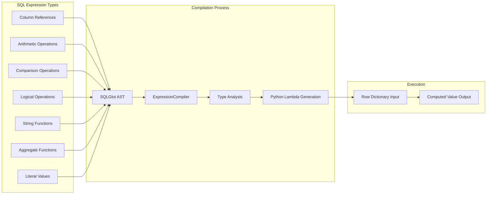

### Compilation Process Details

The ExpressionCompiler operates through several sophisticated phases:

1. **AST Analysis**: SQLGlot expressions are analyzed to determine their type and dependencies
2. **Type Inference**: Column types are inferred from schema information to enable type-safe operations
3. **Optimization**: Constant folding and other optimizations are applied at the expression level
4. **Code Generation**: Python lambda functions are generated with appropriate error handling
5. **Validation**: Generated functions are validated for correctness and performance characteristics

### Expression Type Support

The compiler supports a comprehensive range of SQL expression types:

**Column References**: Simple and qualified column names with case-sensitive handling
- `name` → Access to row["name"] with null checking
- `users.name` → Qualified access with table validation
- `"Name"` → Case-sensitive column access

**Arithmetic Operations**: Full mathematical operation support with proper null propagation
- `+`, `-`, `*`, `/`, `%` with type coercion
- Overflow detection and handling
- Division by zero protection

**Comparison Operations**: Relational comparisons with SQL null semantics
- `=`, `<>`, `<`, `>`, `<=`, `>=`
- Three-value logic (TRUE, FALSE, NULL)
- Type compatibility checking

**Logical Operations**: Boolean logic with proper short-circuiting
- `AND`, `OR` with lazy evaluation
- `NOT` with null handling
- Complex logical expressions

**String Functions**: Comprehensive text processing capabilities
- `UPPER()`, `LOWER()`, `LENGTH()`
- `SUBSTRING()`, `CONCAT()`, `TRIM()`
- Pattern matching with `LIKE`

**Aggregate Functions**: Statistical and analytical operations
- `COUNT()`, `SUM()`, `AVG()`, `MIN()`, `MAX()`
- `STDDEV()`, `VARIANCE()` for statistical analysis
- Custom aggregate function support

### Expression Compilation Examples

```python
# SQL: SELECT name, age + 5 AS age_plus_5 FROM users WHERE age > 25

# Column reference compilation:
# "name" -> lambda row: safe_get_column(row, "name", case_sensitive=False)

# Arithmetic expression compilation with null handling:
# "age + 5" -> lambda row: (row["age"] + 5) if row["age"] is not None else None

# Comparison expression with type checking:
# "age > 25" -> lambda row: row["age"] > 25 if row["age"] is not None else None

# Complex expression with multiple operations:
# "UPPER(name) LIKE 'A%'" -> lambda row: str(row["name"]).upper().startswith('A')
#                            if row["name"] is not None else None
```

### Performance Optimizations

The compilation system includes several performance optimizations:

**Constant Folding**: Compile-time evaluation of constant expressions
```python
# "5 + 3" -> lambda row: 8  (evaluated at compile time)
```

**Type Specialization**: Type-specific code generation for better performance
```python
# For integer columns: direct arithmetic without type checking
# For mixed types: type coercion with validation
```

**Null Handling Optimization**: Efficient null propagation patterns
```python
# Early null detection to avoid unnecessary computation
# Batch null checking for multiple column access
```

## Join Processing Architecture

The join processing system represents a critical component that bridges SQL JOIN semantics with Ray Dataset's distributed join capabilities. This system handles the complex mapping between SQL's declarative JOIN syntax and Ray's imperative join operations while maintaining performance and correctness.

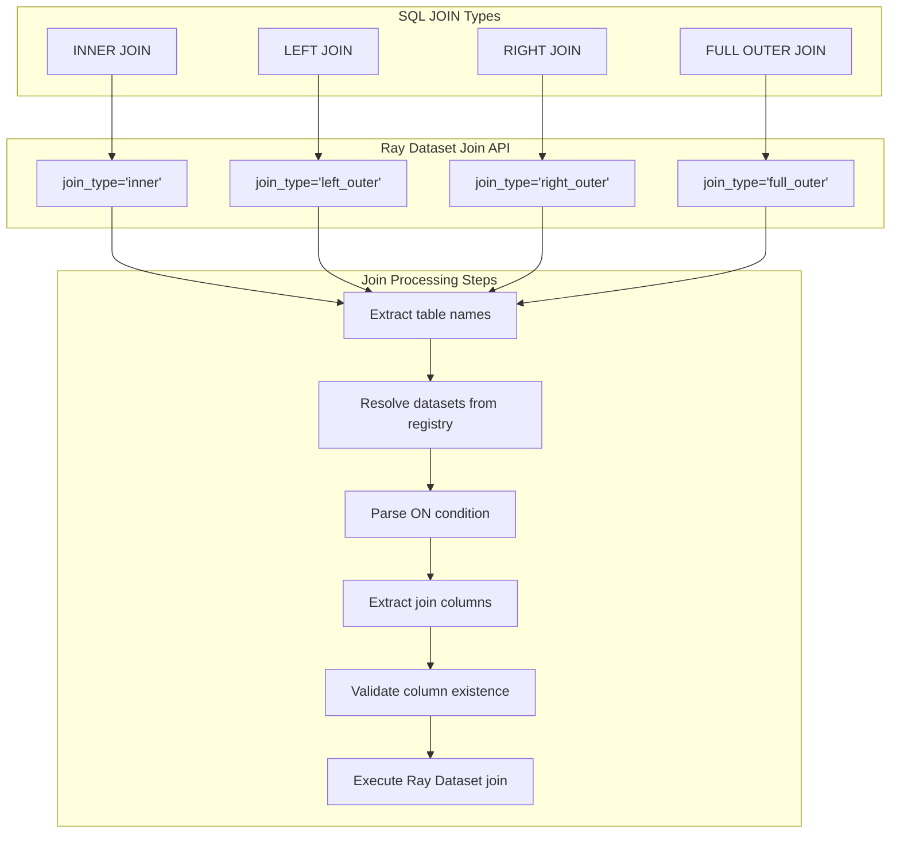

### Join Processing Deep Dive

The join processing system handles several complex challenges inherent in distributed join operations:

**Join Type Mapping**: SQL JOIN types are mapped to Ray Dataset join types with careful consideration for semantic equivalence:
- `INNER JOIN` → `join_type='inner'`: Only rows with matching join keys from both datasets
- `LEFT JOIN` → `join_type='left_outer'`: All rows from left dataset, matching rows from right
- `RIGHT JOIN` → `join_type='right_outer'`: All rows from right dataset, matching rows from left
- `FULL OUTER JOIN` → `join_type='full_outer'`: All rows from both datasets with nulls for non-matches

**Column Resolution**: The system performs intelligent column resolution to handle various JOIN syntax patterns:
- Qualified column names (e.g., `users.id = orders.user_id`)
- Unqualified column names with automatic table inference
- Column name conflicts resolution with configurable suffixes
- Case-sensitive and case-insensitive column matching

**Performance Optimization**: Join operations are optimized based on data characteristics:
- **Broadcast Joins**: Small datasets are broadcasted to all nodes for efficiency
- **Shuffle Joins**: Large datasets use shuffle-based joins with optimal partitioning
- **Partition-Aware Joins**: Pre-partitioned data leverages existing partitioning schemes
- **Join Reordering**: Multi-table joins are reordered based on estimated cardinalities

**Memory Management**: Join operations handle memory constraints through:
- **Streaming Joins**: Large joins are processed in streaming fashion to control memory usage
- **Spill-to-Disk**: Memory pressure triggers automatic spilling of intermediate results
- **Chunk Processing**: Very large joins are processed in manageable chunks
- **Resource Monitoring**: Dynamic resource allocation based on available cluster capacity

## Schema Inference System

The schema inference system provides automatic discovery and management of table schemas, eliminating the need for manual schema definition while ensuring type safety and query optimization. This system is essential for usability and performance in distributed environments where schema information drives optimization decisions.

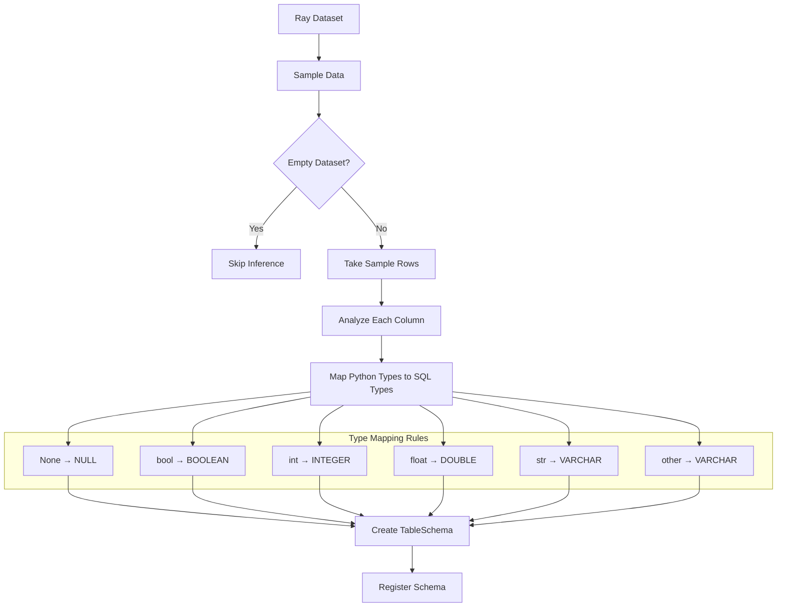

### Schema Inference Implementation

The schema inference process involves several sophisticated techniques to handle the complexity of distributed data:

**Sampling Strategy**: The system uses intelligent sampling to gather representative data:
- **Statistical Sampling**: Random sampling ensures representative type distribution
- **Stratified Sampling**: For partitioned datasets, samples from each partition
- **Adaptive Sampling**: Sample size adjusts based on data characteristics and variance
- **Minimal Impact**: Sampling is designed to minimize performance impact on large datasets

**Type Inference Rules**: Comprehensive type mapping handles diverse data scenarios:
- **Primitive Types**: Direct mapping from Python types to SQL types
- **Nested Structures**: Complex types like lists and dictionaries are handled appropriately
- **Null Handling**: Null values don't override inferred types from non-null samples
- **Mixed Types**: Columns with mixed types default to flexible VARCHAR representation
- **Temporal Types**: Date and timestamp detection with format inference

**Schema Evolution**: The system handles schema changes gracefully:
- **Version Tracking**: Schema versions are tracked to detect changes
- **Backward Compatibility**: New schemas maintain compatibility with existing queries
- **Incremental Updates**: Schema updates only affect changed columns
- **Conflict Resolution**: Schema conflicts are resolved with configurable strategies

**Performance Considerations**: Schema inference is optimized for large-scale data:
- **Lazy Inference**: Schemas are inferred only when needed
- **Parallel Processing**: Inference across multiple partitions happens in parallel
- **Caching**: Inferred schemas are cached to avoid repeated computation
- **Resource Bounds**: Inference operations have configurable resource limits

## Optimization Pipeline

The optimization pipeline represents a multi-layered approach to query optimization, combining traditional database optimization techniques with Ray-specific optimizations. This pipeline is crucial for achieving high performance on distributed workloads and large datasets.

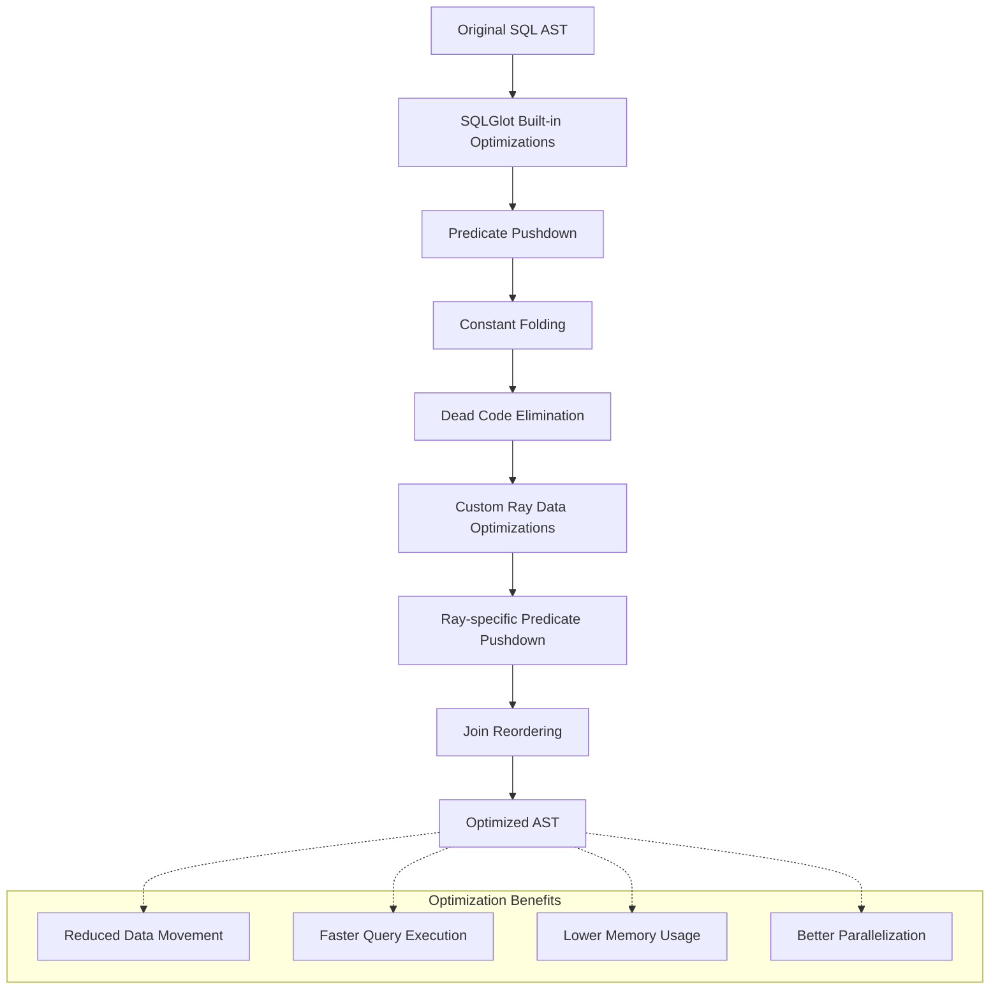

### Optimization Techniques

The optimization pipeline employs multiple sophisticated techniques:

**SQLGlot Built-in Optimizations**: Leverages proven database optimization techniques:
- **Predicate Pushdown**: Moves filter conditions closer to data sources
- **Constant Folding**: Evaluates constant expressions at compile time
- **Dead Code Elimination**: Removes unreachable or unnecessary code paths
- **Expression Simplification**: Simplifies complex expressions for better performance
- **Join Reordering**: Optimizes join order based on selectivity estimates

**Custom Ray Data Optimizations**: Ray-specific optimizations for distributed processing:
- **Partition-Aware Processing**: Leverages data partitioning for better locality
- **Broadcast Optimization**: Identifies opportunities for broadcast joins
- **Shuffle Minimization**: Reduces data movement across cluster nodes
- **Parallel Execution Planning**: Maximizes parallelism while avoiding resource contention
- **Memory Usage Optimization**: Minimizes memory footprint for large operations

**Cost-Based Optimization**: Statistical analysis drives optimization decisions:
- **Cardinality Estimation**: Estimates result set sizes for operation planning
- **Cost Models**: Evaluates different execution strategies for optimal performance
- **Statistics Collection**: Maintains statistics about data distribution and query patterns
- **Dynamic Adaptation**: Adjusts optimization strategies based on runtime feedback

**Query Rewriting**: Transforms queries for better performance:
- **Subquery Flattening**: Converts correlated subqueries to joins where possible
- **Predicate Transformation**: Rewrites predicates for better selectivity
- **Aggregate Pushdown**: Moves aggregations closer to data sources
- **Projection Elimination**: Removes unnecessary column projections

## Configuration System

The configuration system provides comprehensive control over SQL engine behavior, enabling fine-tuning for different workloads, environments, and performance requirements. The system follows a hierarchical configuration model with sensible defaults and extensive customization options.

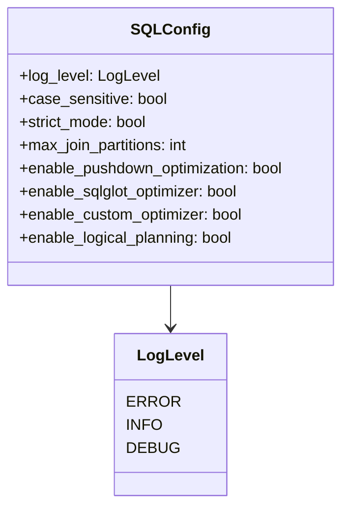

### Configuration Categories

The configuration system is organized into several logical categories:

**Logging and Debugging Configuration**:
- **Log Level**: Controls verbosity of execution logs (ERROR, INFO, DEBUG)
- **Performance Logging**: Enables detailed performance metrics collection
- **Query Tracing**: Provides execution trace information for debugging
- **Error Reporting**: Configures error message detail and formatting

**SQL Behavior Configuration**:
- **Case Sensitivity**: Controls identifier case sensitivity for tables and columns
- **Strict Mode**: Enables strict SQL standard compliance vs. permissive mode
- **Null Handling**: Configures null value behavior in operations and comparisons
- **Type Coercion**: Controls automatic type conversion behavior

**Performance Tuning Configuration**:
- **Max Join Partitions**: Controls parallelism level for join operations
- **Memory Limits**: Sets memory usage bounds for operations
- **Batch Sizes**: Configures processing batch sizes for optimal throughput
- **Timeout Settings**: Sets execution timeout limits for long-running queries

**Optimization Configuration**:
- **Enable/Disable Optimizations**: Granular control over optimization passes
- **Cost Model Parameters**: Tuning parameters for cost-based optimization
- **Statistics Collection**: Controls automatic statistics gathering
- **Cache Settings**: Configures query result and metadata caching

### Configuration Inheritance and Override

The system supports flexible configuration management:

**Default Configuration**: Sensible defaults that work well for most workloads
**Environment-Based**: Configuration can be loaded from environment variables
**Programmatic Override**: Runtime configuration through SQLConfig objects
**Query-Level Override**: Per-query configuration for specific requirements
**Dynamic Updates**: Some configuration changes can be applied without restart

## Error Handling and Validation

The error handling and validation system provides comprehensive error detection, reporting, and recovery mechanisms. This system is designed to provide clear, actionable error messages while maintaining system stability and data integrity in distributed environments.

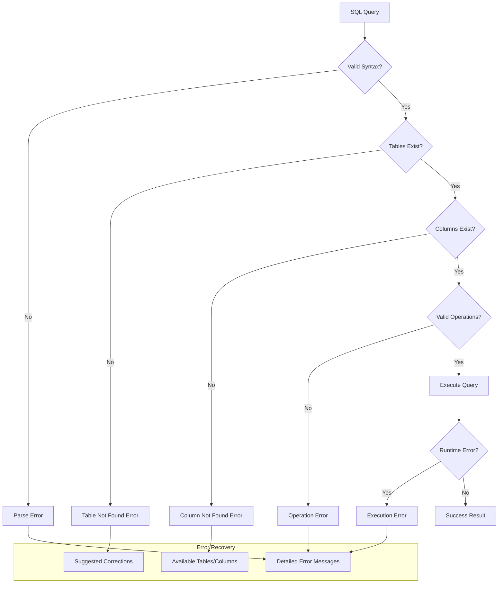

### Error Classification and Handling

The system implements a comprehensive error taxonomy with specific handling strategies:

**Syntax Errors**: Issues with SQL query structure and grammar
- **Parse Errors**: Invalid SQL syntax detected during parsing phase
- **Lexical Errors**: Unrecognized tokens or invalid characters
- **Grammar Violations**: Structurally incorrect SQL constructs
- **Recovery Strategy**: Detailed error messages with position information and suggestions

**Semantic Errors**: Logically invalid operations despite correct syntax
- **Table Not Found**: References to non-existent tables in the registry
- **Column Not Found**: References to non-existent columns in tables
- **Type Mismatch**: Operations between incompatible data types
- **Ambiguous References**: Column names that could refer to multiple tables
- **Recovery Strategy**: Context-aware suggestions and available alternatives

**Runtime Errors**: Issues that occur during query execution
- **Data Conversion Errors**: Type conversion failures during processing
- **Resource Exhaustion**: Memory or compute resource limitations
- **Network Failures**: Distributed execution communication issues
- **Timeout Errors**: Operations exceeding configured time limits
- **Recovery Strategy**: Automatic retry with exponential backoff and graceful degradation

**Validation Errors**: Schema and constraint violations
- **Schema Mismatch**: Data doesn't conform to expected schema
- **Constraint Violations**: Data violates defined constraints
- **Cardinality Errors**: Unexpected result set sizes
- **Recovery Strategy**: Data cleaning suggestions and alternative query formulations

### Error Recovery Mechanisms

The system provides multiple levels of error recovery:

**Graceful Degradation**: When possible, the system continues execution with reduced functionality
- **Partial Results**: Return available results even if some partitions fail
- **Fallback Strategies**: Use alternative execution paths when primary methods fail
- **Error Isolation**: Isolate errors to prevent cascade failures
- **Progress Preservation**: Maintain partial progress for long-running operations

**Automatic Retry**: Transient errors are automatically retried with intelligent backoff
- **Exponential Backoff**: Progressively longer delays between retry attempts
- **Circuit Breaking**: Stop retrying after repeated failures to prevent resource waste
- **Selective Retry**: Only retry operations that are likely to succeed on retry
- **State Preservation**: Maintain operation state across retry attempts

**Error Context Preservation**: Comprehensive error information for debugging
- **Stack Traces**: Full execution stack traces for developer debugging
- **Query Context**: Original query and execution parameters
- **Data Context**: Information about data that caused the error
- **System State**: Cluster state and resource utilization at error time

## Performance Characteristics

### Scalability Model
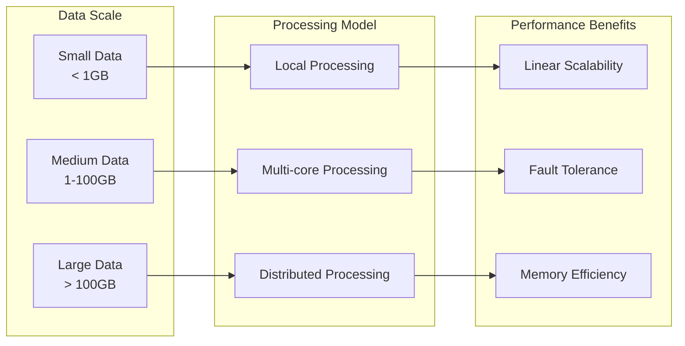

### Memory Management

The memory management system provides sophisticated techniques for handling large-scale data processing while maintaining system stability and performance:

**Lazy Evaluation Strategy**: Operations are deferred until materialization to enable optimization
- **Computation Graphs**: Build execution graphs without immediate data processing
- **Optimization Windows**: Lazy evaluation creates opportunities for query optimization
- **Resource Planning**: Defer resource allocation until execution requirements are known
- **Memory Efficiency**: Avoid intermediate materialization of large datasets

**Streaming Processing Architecture**: Large datasets are processed incrementally
- **Chunk-based Processing**: Data is processed in manageable chunks to control memory usage
- **Pipeline Parallelism**: Multiple stages of processing execute concurrently
- **Backpressure Management**: Automatic flow control prevents memory overflow
- **Adaptive Chunking**: Chunk sizes adapt based on available memory and data characteristics

**Automatic Spill-to-Disk**: Intelligent memory pressure management
- **Memory Monitoring**: Continuous monitoring of memory usage across the cluster
- **Selective Spilling**: Strategic selection of data structures to spill based on access patterns
- **Efficient Serialization**: Optimized serialization formats for spilled data
- **Transparent Recovery**: Automatic loading of spilled data when needed

**Partition-based Parallelism**: Configurable parallelism for optimal resource utilization
- **Dynamic Partitioning**: Partition sizes adjust based on data characteristics and cluster capacity
- **Load Balancing**: Even distribution of work across available compute resources
- **Memory Budgeting**: Per-partition memory limits prevent individual operations from consuming excessive resources
- **Fault Isolation**: Partition-level fault isolation prevents failure propagation

**Advanced Memory Techniques**:
- **Memory Pooling**: Reuse of memory allocations to reduce garbage collection overhead
- **Columnar Processing**: Columnar data formats for improved memory efficiency
- **Compression**: Automatic compression of data in memory and during transfers
- **Memory-Aware Scheduling**: Schedule operations based on available memory resources

## Integration with Ray Ecosystem

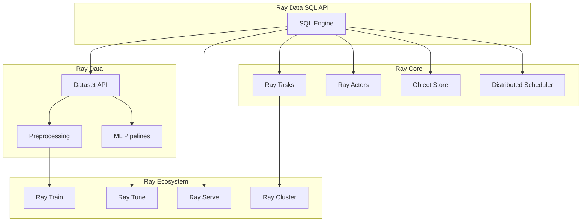

### Ray Ecosystem Integration Details

The Ray Data SQL API is designed to seamlessly integrate with the broader Ray ecosystem, providing a unified experience across different Ray components:

**Ray Core Integration**: Deep integration with Ray's fundamental distributed computing primitives
- **Task Scheduling**: SQL operations are executed as Ray tasks with automatic scheduling
- **Object Store**: Intermediate results leverage Ray's distributed object store for efficient sharing
- **Actor Model**: Long-running SQL sessions can utilize Ray actors for state management
- **Fault Tolerance**: Automatic fault recovery using Ray's built-in failure detection and recovery

**Ray Data Integration**: Native integration with Ray Data preprocessing and ML pipelines
- **Unified API**: SQL operations seamlessly chain with other Ray Data transformations
- **Format Compatibility**: Support for all Ray Data supported formats (Parquet, CSV, JSON, etc.)
- **Schema Sharing**: Schemas are shared between SQL operations and other Ray Data operations
- **Performance Optimization**: Shared optimization techniques across SQL and non-SQL operations

**Ray Train Integration**: SQL preprocessing for machine learning workflows
- **Feature Engineering**: SQL-based feature extraction and transformation for ML models
- **Data Validation**: SQL queries for data quality checks before training
- **Distributed Preprocessing**: Large-scale data preprocessing using SQL before model training
- **Pipeline Integration**: SQL operations as preprocessing steps in Ray Train pipelines

**Ray Tune Integration**: SQL-based hyperparameter optimization and experiment management
- **Experiment Data**: SQL queries for analyzing experiment results and metrics
- **Parameter Sweeps**: SQL-based filtering and selection of hyperparameter combinations
- **Results Analysis**: Complex analytical queries on tuning experiment outcomes
- **Data-Driven Tuning**: Use SQL to identify optimal training data subsets

**Ray Serve Integration**: SQL-powered model serving and real-time analytics
- **Feature Serving**: Real-time feature computation using SQL for model inference
- **Analytics Serving**: SQL-based analytics endpoints for real-time dashboards
- **Model Monitoring**: SQL queries for monitoring model performance and data drift
- **Dynamic Serving**: SQL-based routing and filtering for intelligent model serving

**Ray Cluster Integration**: Distributed execution across Ray clusters
- **Auto-scaling**: SQL workloads automatically scale with cluster size
- **Resource Management**: Intelligent resource allocation based on SQL query characteristics
- **Multi-tenancy**: Isolated SQL execution environments for different users and workloads
- **Monitoring**: Comprehensive monitoring and observability for SQL operations across clusters

## Best Practices

### Query Optimization Best Practices

Effective query optimization requires understanding both SQL principles and Ray's distributed execution model:

**Join Strategy Selection**: Choose optimal join strategies based on data characteristics
1. **Small-Large Joins**: Use broadcast joins when one dataset is significantly smaller
2. **Equi-Join Optimization**: Ensure join conditions use equality for optimal performance
3. **Join Order**: Place most selective joins first to reduce intermediate result sizes
4. **Column Selection**: Select only necessary columns before joins to reduce data movement
5. **Partition Alignment**: Align join keys with data partitioning when possible

**Predicate Optimization**: Strategic placement of filter conditions
1. **Early Filtering**: Apply WHERE clauses as early as possible in the execution pipeline
2. **Selective Predicates**: Use highly selective predicates to reduce data early
3. **Index Leveraging**: Structure predicates to leverage data partitioning and sorting
4. **Avoid Functions in Predicates**: Use raw column comparisons when possible
5. **Range Partitioning**: Leverage range predicates for partition pruning

**Aggregation Optimization**: Efficient aggregation strategies
1. **Pre-Aggregation**: Use partial aggregations to reduce data movement
2. **Grouping Key Optimization**: Choose efficient grouping keys with good cardinality
3. **Aggregate Pushdown**: Push aggregations close to data sources when possible
4. **Memory-Aware Grouping**: Consider memory implications of high-cardinality grouping

**Result Set Management**: Efficient handling of query results
1. **LIMIT Usage**: Use LIMIT for exploratory queries to avoid unnecessary computation
2. **Projection Minimization**: Select only necessary columns to reduce data transfer
3. **Result Materialization**: Understand when to materialize vs. keep lazy evaluation
4. **Pagination**: Use offset/limit patterns for large result set pagination

### Memory Management Best Practices

Effective memory management is crucial for stable and performant SQL operations:

**Resource Allocation**: Strategic resource planning and allocation
1. **Batch Size Tuning**: Adjust `max_join_partitions` based on cluster memory and data size
2. **Memory Budgeting**: Allocate appropriate memory per operation based on data characteristics
3. **Concurrent Query Limiting**: Limit concurrent queries to prevent memory contention
4. **Resource Monitoring**: Monitor memory usage patterns to identify optimization opportunities

**Data Locality Optimization**: Minimize data movement and maximize cache efficiency
1. **Co-location Strategy**: Co-locate frequently joined datasets on the same nodes
2. **Partition Alignment**: Align data partitioning with query patterns
3. **Cache Utilization**: Leverage Ray's object store caching for frequently accessed data
4. **Temporal Locality**: Group related operations to maximize data reuse

**Schema Management**: Efficient schema handling for better performance
1. **Schema Pre-registration**: Pre-register schemas to avoid inference overhead
2. **Type Optimization**: Use appropriate data types to minimize memory usage
3. **Schema Evolution**: Plan for schema changes with backward compatibility
4. **Metadata Caching**: Cache schema metadata to reduce repeated inference

### Error Handling and Debugging Best Practices

Robust error handling improves development productivity and system reliability:

**Proactive Validation**: Prevent errors through early validation
1. **Schema Validation**: Validate table and column existence before query execution
2. **Type Checking**: Verify data type compatibility for operations
3. **Resource Validation**: Check resource availability before starting large operations
4. **Constraint Checking**: Validate data constraints and business rules

**Development and Testing**: Best practices for development workflows
1. **Incremental Development**: Build and test queries incrementally
2. **Data Sampling**: Use data samples for development and testing
3. **Error Simulation**: Test error conditions and recovery scenarios
4. **Performance Testing**: Profile queries with representative data sizes

**Production Operations**: Best practices for production deployments
1. **Monitoring**: Implement comprehensive monitoring for SQL operations
2. **Alerting**: Set up alerts for error conditions and performance degradation
3. **Logging**: Use appropriate log levels for different environments
4. **Documentation**: Maintain documentation for complex queries and schema designs

**Debugging Techniques**: Effective debugging strategies
1. **Query Decomposition**: Break complex queries into simpler components for debugging
2. **Execution Tracing**: Use debug logging to trace query execution steps
3. **Performance Profiling**: Profile query performance to identify bottlenecks
4. **Error Analysis**: Analyze error patterns to identify systemic issues

## Future Enhancements

The Ray Data SQL API has a comprehensive roadmap for expanding functionality and improving performance. These enhancements are designed to maintain backward compatibility while adding enterprise-grade features.

### Planned Features

**Advanced SQL Functionality**: Expanding SQL standard compliance and functionality
- **Window Functions**: Complete support for OVER clauses, ranking functions, and analytical windows
  - ROW_NUMBER(), RANK(), DENSE_RANK() for ranking operations
  - LAG(), LEAD() for accessing previous/next row values
  - SUM(), AVG(), COUNT() with window frames
  - Partition-aware window processing for distributed execution
- **Subqueries**: Comprehensive subquery support for complex analytical queries
  - Correlated subqueries with efficient execution strategies
  - Uncorrelated subqueries with automatic optimization
  - EXISTS and NOT EXISTS predicates
  - Scalar subqueries in SELECT and WHERE clauses
- **Common Table Expressions (CTEs)**: Recursive and non-recursive CTE support
  - WITH clause for complex query structuring
  - Recursive CTEs for hierarchical data processing
  - Multiple CTE definitions in single queries
  - CTE result caching for performance optimization
- **Advanced Aggregates**: Extended statistical and analytical functions
  - PERCENTILE_CONT(), PERCENTILE_DISC() for quantile analysis
  - STDDEV(), VARIANCE() for statistical analysis
  - FIRST_VALUE(), LAST_VALUE() for analytical processing
  - Custom aggregate function definition framework

**Query Planning and Optimization**: Advanced query planning capabilities
- **Cost-Based Optimization**: Sophisticated cost models for execution planning
  - Cardinality estimation using histograms and statistics
  - Cost models accounting for distributed execution overhead
  - Dynamic plan adaptation based on runtime feedback
  - Multi-dimensional optimization considering CPU, memory, and network
- **Adaptive Query Execution**: Runtime query plan adaptation
  - Dynamic join strategy selection based on data skew
  - Adaptive partition sizing based on data distribution
  - Runtime filter pushdown based on intermediate results
  - Speculative execution for uncertain optimization decisions

### Performance Improvements

**Advanced Processing Models**: Next-generation processing architectures
- **Columnar Processing**: Deep integration with Apache Arrow for columnar operations
  - Vectorized execution for analytical workloads
  - SIMD optimizations for numerical computations
  - Memory-efficient columnar data structures
  - Zero-copy data transfers between operations
- **Streaming SQL**: Real-time streaming query processing
  - Continuous query execution over streaming data
  - Window-based aggregations for time-series analysis
  - Event-time processing with watermark support
  - Low-latency query results for real-time analytics

**Optimization Enhancements**: Advanced optimization techniques
- **Enhanced Predicate Pushdown**: Sophisticated predicate optimization
  - Complex predicate rewriting and simplification
  - Cross-table predicate inference
  - Dynamic predicate pushdown based on selectivity
  - Bloom filter generation for join optimization
- **Advanced Join Optimization**: Next-generation join processing
  - Adaptive join algorithms based on data characteristics
  - Multi-way join optimization with dynamic programming
  - Join result size estimation and memory management
  - Partition-wise joins for pre-partitioned data

**Caching and Materialization**: Intelligent result caching systems
- **Query Result Caching**: Automatic caching of query results
  - Semantic caching with query equivalence detection
  - Cache invalidation based on data dependencies
  - Distributed cache management across cluster nodes
  - Cache hit ratio optimization with usage analytics
- **Materialized Views**: Precomputed view management
  - Automatic materialized view recommendation
  - Incremental view maintenance for changing data
  - Multi-level view hierarchies
  - Cost-based view selection for query answering

### Infrastructure Enhancements

**Observability and Monitoring**: Enterprise-grade monitoring capabilities
- **Query Performance Monitoring**: Comprehensive query performance tracking
  - Real-time query execution monitoring
  - Historical performance trend analysis
  - Resource utilization tracking per query
  - Bottleneck identification and recommendations
- **Advanced Debugging**: Enhanced debugging and troubleshooting tools
  - Visual query execution plan analysis
  - Step-by-step execution tracing
  - Performance profiling with detailed metrics
  - Automated performance regression detection

**Security and Governance**: Enterprise security features
- **Access Control**: Fine-grained access control for SQL operations
  - Role-based access control (RBAC) for tables and columns
  - Dynamic data masking for sensitive information
  - Audit logging for all SQL operations
  - Integration with enterprise identity providers
- **Data Governance**: Comprehensive data governance capabilities
  - Data lineage tracking through SQL operations
  - Schema versioning and migration management
  - Data quality validation and monitoring
  - Compliance reporting for regulatory requirements

This comprehensive enhancement roadmap ensures that the Ray Data SQL API will continue to evolve as a leading solution for distributed SQL processing, maintaining its position at the forefront of modern data analytics platforms while preserving the core benefits of Ray's distributed execution model.
