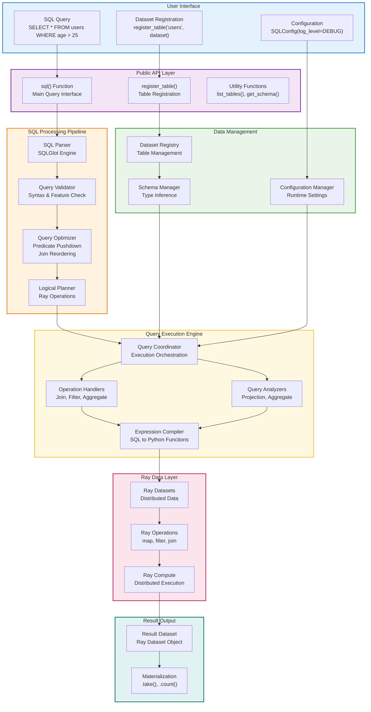
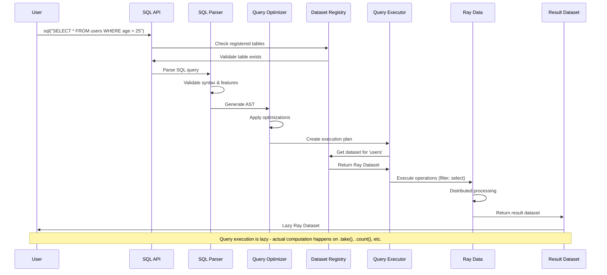
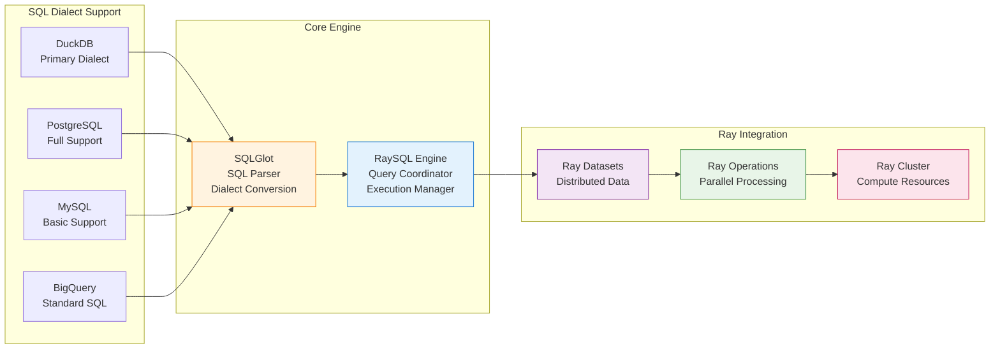

# Ray Data SQL API

<div align="center">

**A SQL interface for Ray Datasets**

*Execute SQL queries on distributed data using Ray's parallel processing*

[](https://ray.io)
[](https://sqlglot.com)

</div>

---

## Table of Contents

- [Overview](#overview)
- [Architecture](#architecture)
- [Installation](#installation)
- [Quick Start](#quick-start)
- [SQL Operations](#sql-operations)
- [Advanced Features](#advanced-features)
- [Performance & Optimization](#performance--optimization)
- [Configuration](#configuration)
- [Limitations & Workarounds](#limitations--workarounds)
- [API Reference](#api-reference)
- [Examples](#examples)
- [Troubleshooting](#troubleshooting)

---

## Overview

The Ray Data SQL API allows you to run SQL queries on Ray Datasets. It supports standard SQL operations like SELECT, WHERE, JOIN, GROUP BY, and ORDER BY, with results returned as Ray Datasets that work with the full Ray Data API.

### Key Features

- **Distributed SQL Execution**: Leverages Ray's distributed computing for large-scale data processing
- **SQLGlot-Powered**: Uses SQLGlot for robust SQL parsing and multi-dialect support
- **Lazy Evaluation**: Queries are optimized and executed lazily, following Ray Data patterns
- **Native Integration**: Seamlessly integrates with Ray Data transformations and operations
- **Auto-Registration**: Automatically detects and registers datasets from local scope
- **Memory Efficient**: Supports streaming execution for datasets larger than memory

---

## Architecture

### Architecture Overview



### Data Flow Diagram



### Component Architecture



### Component Details

**SQL Parser & Optimizer**
- Uses SQLGlot for robust SQL parsing across multiple dialects
- Supports DuckDB, PostgreSQL, MySQL, and BigQuery syntax
- Applies query optimizations like predicate pushdown and join reordering
- Validates queries for unsupported features and provides helpful error messages

**Query Execution Engine**
- Converts SQL operations to Ray Data transformations
- Handles distributed joins, aggregations, and window functions
- Supports streaming execution for memory-efficient processing
- Optimizes data movement and partition strategies

**Schema Management**
- Automatic schema inference from Ray Datasets
- Type-safe operations with Arrow integration
- Column name normalization and case sensitivity handling
- Comprehensive data type mapping between SQL and Arrow types

---

## Installation

```bash
pip install ray[data] sqlglot
```

---

## Quick Start

```python
import ray.data
from ray.data.sql import register_table, sql

# Create datasets
users = ray.data.from_items([
    {"id": 1, "name": "Alice", "age": 25, "city": "Seattle"},
    {"id": 2, "name": "Bob", "age": 30, "city": "Portland"},
    {"id": 3, "name": "Charlie", "age": 35, "city": "Seattle"}
])

orders = ray.data.from_items([
    {"user_id": 1, "amount": 100, "product": "laptop"},
    {"user_id": 2, "amount": 75, "product": "mouse"},
    {"user_id": 1, "amount": 200, "product": "monitor"}
])

# Register as SQL tables
register_table("users", users)
register_table("orders", orders)

# Run SQL queries
result = sql("""
    SELECT u.name, SUM(o.amount) as total_spent
    FROM users u
    JOIN orders o ON u.id = o.user_id
    GROUP BY u.name
    ORDER BY total_spent DESC
""")

# Use result as Ray Dataset
print(result.take_all())
print(f"Found {result.count()} users with orders")
```

### Auto-Registration

```python
# Create datasets (auto-registration uses variable names)
customers = ray.data.from_items([...])
products = ray.data.from_items([...])

# SQL automatically finds tables by variable name
result = ray.data.sql("""
    SELECT c.name, p.price
    FROM customers c
    JOIN products p ON c.product_id = p.id
""")
```

---

## SQL Operations

### SELECT

```sql
-- Select all columns
SELECT * FROM users;

-- Select specific columns
SELECT name, age FROM users;

-- Select with expressions
SELECT name, age + 5 as future_age FROM users;

-- Select with aliases
SELECT name AS full_name, age AS years FROM users;
```

### WHERE

```sql
-- Simple filtering
SELECT * FROM users WHERE age > 25;

-- Multiple conditions
SELECT * FROM users WHERE age > 25 AND city = 'Seattle';

-- Pattern matching
SELECT * FROM users WHERE name LIKE 'A%';

-- NULL checks
SELECT * FROM users WHERE email IS NOT NULL;
```

### JOIN

```sql
-- Inner join
SELECT u.name, o.amount
FROM users u
JOIN orders o ON u.id = o.user_id;

-- Left join
SELECT u.name, o.amount
FROM users u
LEFT JOIN orders o ON u.id = o.user_id;
```

### GROUP BY

```sql
-- Group with aggregates
SELECT city, COUNT(*) as user_count, AVG(age) as avg_age
FROM users
GROUP BY city;

-- Global aggregates
SELECT COUNT(*) as total_users, AVG(age) as avg_age
FROM users;
```

### ORDER BY and LIMIT

```sql
-- Sort by single column
SELECT * FROM users ORDER BY age DESC;

-- Sort by multiple columns
SELECT * FROM users ORDER BY city, age DESC;

-- Limit results
SELECT * FROM users ORDER BY age DESC LIMIT 5;
```

### Supported Functions

| Function | Description | Example |
|----------|-------------|---------|
| `COUNT(*)` | Count rows | `SELECT COUNT(*) FROM users` |
| `SUM(col)` | Sum values | `SELECT SUM(amount) FROM orders` |
| `AVG(col)` | Average | `SELECT AVG(age) FROM users` |
| `MIN(col)` | Minimum | `SELECT MIN(age) FROM users` |
| `MAX(col)` | Maximum | `SELECT MAX(amount) FROM orders` |
| `UPPER(col)` | Uppercase | `SELECT UPPER(name) FROM users` |
| `LOWER(col)` | Lowercase | `SELECT LOWER(city) FROM users` |

### SQL Dialect Support

Ray Data SQL supports multiple SQL dialects through SQLGlot:

| Dialect | Support Level | Notes |
|---------|---------------|-------|
| **DuckDB** | ✅ Full | Default dialect, best performance |
| **PostgreSQL** | ✅ Good | Most functions supported |
| **MySQL** | ⚠️ Partial | Basic operations, limited functions |
| **BigQuery** | ⚠️ Partial | Standard SQL, no legacy syntax |
| **SQLite** | ⚠️ Basic | Simple queries only |

**Automatic Dialect Conversion**
```python
from ray.data.sql import SQLConfig
from ray.data import DataContext

# Configure for PostgreSQL input syntax
config = SQLConfig(
    sqlglot_read_dialect="postgres",
    sqlglot_write_dialect="duckdb",
    enable_dialect_conversion=True
)

with DataContext() as ctx:
    ctx.sql_config = config
    # PostgreSQL syntax automatically converted to DuckDB
    result = sql("SELECT employee_id, STRING_AGG(skill, ', ') FROM skills GROUP BY employee_id")
```

---

## Advanced Features

### Common Table Expressions (CTEs)

```sql
WITH regional_stats AS (
    SELECT region, AVG(amount) as avg_amount
    FROM sales
    GROUP BY region
),
high_performers AS (
    SELECT region, avg_amount
    FROM regional_stats
    WHERE avg_amount > 500
)
SELECT * FROM high_performers ORDER BY avg_amount DESC;
```

### Subqueries

```sql
-- Correlated subquery
SELECT name, age,
       (SELECT AVG(age) FROM users u2 WHERE u2.city = u1.city) as city_avg_age
FROM users u1;

-- Subquery in WHERE clause
SELECT * FROM users
WHERE age > (SELECT AVG(age) FROM users WHERE city = 'Seattle');
```

### Window Functions (Limited Support)

```sql
-- Basic window functions
SELECT name, age,
       ROW_NUMBER() OVER (PARTITION BY city ORDER BY age) as rank_in_city
FROM users;
```

### Advanced Joins

```sql
-- Multiple table joins
SELECT u.name, o.product, p.price
FROM users u
JOIN orders o ON u.id = o.user_id
JOIN products p ON o.product = p.name
WHERE p.price > 100;

-- Self joins
SELECT u1.name as user1, u2.name as user2
FROM users u1
JOIN users u2 ON u1.city = u2.city AND u1.id < u2.id;
```

---

## Performance & Optimization

### Query Optimization

**Automatic Optimizations**
- **Predicate Pushdown**: Filters applied early to reduce data movement
- **Projection Pushdown**: Only required columns are processed
- **Join Reordering**: Optimizes join order based on estimated cardinality
- **Constant Folding**: Pre-computes constant expressions

**Manual Optimization Tips**
```python
# ✅ Good: Filter early
sql("SELECT * FROM large_table WHERE date > '2024-01-01' AND region = 'us'")

# ❌ Avoid: Late filtering
sql("SELECT * FROM large_table") # then filter with Ray Data

# ✅ Good: Select only needed columns
sql("SELECT id, name FROM users WHERE active = true")

# ❌ Avoid: SELECT * for large tables
sql("SELECT * FROM huge_table WHERE condition")
```

### Memory Management

**Streaming Execution**
```python
from ray.data.sql import SQLConfig
from ray.data import DataContext

# Enable streaming for large datasets
config = SQLConfig(
    enable_streaming_execution=True,
    default_batch_size=10000,
    max_memory_usage_gb=16
)

with DataContext() as ctx:
    ctx.sql_config = config
    result = sql("SELECT * FROM very_large_table")
```

**Partition Management**
```python
# Control join partitioning
config = SQLConfig(
    max_join_partitions=200,
    prefer_broadcast_joins=True,
    broadcast_join_threshold_mb=100
)
```

### Performance Characteristics

| Operation | Complexity | Memory Usage | Notes |
|-----------|------------|--------------|-------|
| SELECT + WHERE | O(n) | Low | Efficient filtering |
| GROUP BY | O(n log n) | Medium | Requires shuffling |
| ORDER BY | O(n log n) | Medium | Full dataset sort |
| INNER JOIN | O(n + m) | High | Hash join preferred |
| CROSS JOIN | O(n × m) | Very High | Avoid for large tables |

---

## API Reference

### Core Functions

#### `sql(query: str) -> Dataset`
Execute a SQL query and return a Ray Dataset.

```python
result = sql("SELECT * FROM users WHERE age > 25")
```

#### `register_table(name: str, dataset: Dataset)`
Register a Ray Dataset as a SQL table.

```python
register_table("users", users_dataset)
```

#### `list_tables() -> List[str]`
List all registered tables.

```python
tables = list_tables()
print(f"Available tables: {tables}")
```

#### `clear_tables()`
Remove all registered tables.

```python
clear_tables()
```

## Configuration

### Basic Configuration

Configure the SQL engine through Ray's DataContext:

```python
from ray.data import DataContext
from ray.data.sql import SQLConfig, LogLevel

ctx = DataContext.get_current()
ctx.sql_config = SQLConfig(
    log_level=LogLevel.INFO,
    max_join_partitions=20,
    strict_mode=True
)
```

### Advanced Configuration Options

**Development Configuration**
```python
dev_config = SQLConfig(
    # Debugging
    log_level=LogLevel.DEBUG,
    enable_query_timing=True,
    enable_execution_stats=True,

    # Behavior
    case_sensitive=True,
    strict_mode=True,
    enable_auto_registration=True,

    # Performance
    max_join_partitions=50,
    warn_on_large_results=True
)
```

**Production Configuration**
```python
prod_config = SQLConfig(
    # Performance optimizations
    log_level=LogLevel.WARNING,
    enable_optimization=True,
    enable_sqlglot_optimizer=True,
    enable_predicate_pushdown=True,
    enable_column_pruning=True,

    # Resource management
    max_join_partitions=200,
    max_memory_usage_gb=32,
    enable_streaming_execution=True,

    # Security
    enable_auto_registration=False,
    continue_on_error=False,
    max_retry_attempts=3
)
```

**Memory & Resource Management**
```python
memory_config = SQLConfig(
    # Memory limits
    max_memory_usage_gb=16,
    enable_memory_monitoring=True,
    memory_pressure_threshold=0.8,

    # Streaming and batching
    enable_streaming_execution=True,
    default_batch_size=10000,
    adaptive_batch_sizing=True,

    # Spill-to-disk
    enable_disk_spill=True,
    spill_directory="/tmp/ray_sql",
    max_spill_size_gb=100
)
```

### Configuration Options Reference

| Option | Type | Default | Description |
|--------|------|---------|-------------|
| `log_level` | LogLevel | ERROR | Logging verbosity |
| `case_sensitive` | bool | False | Column name case sensitivity |
| `strict_mode` | bool | True | Strict SQL compliance |
| `enable_optimization` | bool | True | Enable built-in optimizations |
| `enable_sqlglot_optimizer` | bool | True | Use SQLGlot optimizer |
| `max_join_partitions` | int | 100 | Maximum partitions for joins |
| `enable_predicate_pushdown` | bool | True | Push filters to data sources |
| `enable_column_pruning` | bool | True | Select only needed columns |
| `max_memory_usage_gb` | int | None | Memory limit per operation |
| `enable_streaming_execution` | bool | False | Stream large datasets |
| `default_batch_size` | int | 10000 | Default batch size |
| `enable_auto_registration` | bool | True | Auto-register datasets |

---

## Limitations & Workarounds

### Current Limitations

**SQL Feature Limitations**
- **Window Functions**: Limited support for advanced window operations
- **User-Defined Functions**: Custom SQL functions not supported
- **Recursive CTEs**: Recursive Common Table Expressions unavailable
- **Materialized Views**: Only direct table queries supported
- **Transactions**: No transaction support (operations not atomic)
- **Indexes**: No index support for query optimization

**Performance Limitations**
- **Large JOINs**: Cross-joins and large JOINs can be memory-intensive
- **Complex Subqueries**: May have performance implications
- **Data Shuffling**: Cross-partition operations can be expensive

**Data Type Limitations**
- **Complex Nested Types**: Limited SQL support for deeply nested structures
- **Custom Types**: User-defined types not supported
- **Binary Data**: Limited support for binary/blob operations

### Workarounds and Alternatives

**Window Functions → Ray Data Operations**
```python
# ❌ Limited window function support
# sql("SELECT name, ROW_NUMBER() OVER (PARTITION BY dept ORDER BY salary) FROM employees")

# ✅ Use Ray Data groupby operations
employees = sql("SELECT * FROM employees")
ranked = employees.groupby("dept").map_groups(
    lambda group: group.sort("salary", ascending=False)
                      .with_column("rank", range(1, len(group) + 1))
)
```

**User-Defined Functions → Python Functions**
```python
# ❌ Custom SQL functions not supported
# sql("SELECT custom_function(name) FROM users")

# ✅ Use Ray Data map operations
users = sql("SELECT name FROM users")
transformed = users.map(lambda row: {"result": custom_function(row["name"])})
```

**Complex Nested Data → Ray Data Processing**
```python
# Limited nested SQL operations
# sql("SELECT data.nested.field FROM complex_table")

# Use Ray Data for complex nested access
result = complex_dataset.map(lambda row: {
    "extracted_field": row["data"]["nested"]["field"],
    "other_data": row["other_field"]
})
```

**Large Cross-Joins → Filtered Joins**
```python
# Expensive cross-join
# sql("SELECT * FROM table_a CROSS JOIN table_b")

# Add meaningful join conditions
sql("""
    SELECT a.*, b.*
    FROM table_a a
    JOIN table_b b ON a.category = b.category
    WHERE a.active = true AND b.status = 'valid'
""")
```

---

## Examples

### Basic Analytics

```python
# Sample sales data
sales = ray.data.from_items([
    {"product": "laptop", "amount": 1200, "region": "north"},
    {"product": "mouse", "amount": 25, "region": "south"},
    {"product": "laptop", "amount": 1200, "region": "south"},
    {"product": "keyboard", "amount": 75, "region": "north"},
])

register_table("sales", sales)

# Sales by region
regional_sales = sql("""
    SELECT
        region,
        COUNT(*) as num_sales,
        SUM(amount) as total_revenue,
        AVG(amount) as avg_sale
    FROM sales
    GROUP BY region
    ORDER BY total_revenue DESC
""")

print("Regional Sales:")
for row in regional_sales.take_all():
    print(f"  {row['region']}: ${row['total_revenue']} ({row['num_sales']} sales)")
```

### Customer Analysis

```python
customers = ray.data.from_items([
    {"id": 1, "name": "Alice", "tier": "premium"},
    {"id": 2, "name": "Bob", "tier": "standard"},
    {"id": 3, "name": "Charlie", "tier": "premium"},
])

orders = ray.data.from_items([
    {"customer_id": 1, "amount": 500},
    {"customer_id": 2, "amount": 200},
    {"customer_id": 1, "amount": 300},
])

register_table("customers", customers)
register_table("orders", orders)

# Customer spending by tier
tier_analysis = sql("""
    SELECT
        c.tier,
        COUNT(c.id) as num_customers,
        SUM(o.amount) as total_spent,
        AVG(o.amount) as avg_order
    FROM customers c
    LEFT JOIN orders o ON c.id = o.customer_id
    GROUP BY c.tier
    ORDER BY total_spent DESC
""")

print("Customer Analysis by Tier:")
for row in tier_analysis.take_all():
    print(f"  {row['tier']}: {row['num_customers']} customers, ${row['total_spent']} total")
```

### Integration with Ray Data API

```python
# Use SQL for complex aggregation, then Ray operations for further processing
summary = sql("""
    SELECT region, SUM(amount) as revenue
    FROM sales
    GROUP BY region
""")

# Continue with Ray Dataset operations
processed = summary.filter(lambda row: row["revenue"] > 500).map(
    lambda row: {
        **row,
        "performance": "high" if row["revenue"] > 1000 else "medium"
    }
)

print(processed.take_all())
```

---

## Troubleshooting

### Common Issues and Solutions


**Table Not Found Errors**
```python
# Error: Table 'users' not found
# Check registered tables
from ray.data.sql import list_tables
print(f"Available tables: {list_tables()}")

# Verify table registration
register_table("users", users_dataset)
```


**SQL Syntax Errors**
```python
# Error: Invalid SQL syntax
# Check dialect compatibility
config = SQLConfig(
    sqlglot_read_dialect="postgres",  # Your SQL dialect
    enable_dialect_conversion=True
)
```

### Debugging Tips

**Enable Debug Logging**
```python
config = SQLConfig(
    log_level=LogLevel.DEBUG,
    enable_query_timing=True,
    enable_execution_stats=True
)
```

**Query Performance Analysis**
```python
import time
from ray.data.sql import sql, SQLConfig, LogLevel

config = SQLConfig(log_level=LogLevel.DEBUG)
with DataContext() as ctx:
    ctx.sql_config = config

    start_time = time.time()
    result = sql("SELECT * FROM large_table WHERE condition")
    execution_time = time.time() - start_time

    print(f"Query executed in {execution_time:.2f}s")
    print(f"Result contains {result.count()} rows")
    print(f"Memory usage: {result.size_bytes() / 1024 / 1024:.1f} MB")
```

**Schema Inspection**
```python
from ray.data.sql import get_schema

# Check table schema
schema = get_schema("users")
print(f"Columns: {schema.column_names}")
print(f"Types: {schema.column_types}")
```

### Performance Debugging

**Identify Bottlenecks**
```python
# Profile query execution
import ray
ray.timeline(filename="sql_profile.json")

result = sql("SELECT * FROM large_table")
result.materialize()  # Force execution

# Check the timeline for performance insights
```

**Memory Usage Monitoring**
```python
# Monitor memory during execution
import psutil
import ray

def monitor_memory(func):
    def wrapper(*args, **kwargs):
        start_memory = psutil.virtual_memory().used
        result = func(*args, **kwargs)
        end_memory = psutil.virtual_memory().used
        print(f"Memory delta: {(end_memory - start_memory) / 1024 / 1024:.1f} MB")
        return result
    return wrapper

@monitor_memory
def run_query():
    return sql("SELECT * FROM large_dataset").materialize()
```

### Best Practices

**Query Optimization**
- Apply filters as early as possible in WHERE clauses
- Use explicit column selection instead of SELECT *
- Prefer INNER JOINs over CROSS JOINs when possible
- Use LIMIT for exploratory queries
- Consider data partitioning for very large datasets

**Memory Management**
- Enable streaming execution for datasets larger than memory
- Configure appropriate batch sizes for your hardware
- Use disk spill for operations that exceed memory limits
- Monitor memory usage in production environments

**Error Handling**
- Always handle ValueError for SQL syntax errors
- Check table existence with `list_tables()` before queries
- Validate schemas with `get_schema()` for type safety
- Use try-catch blocks for robust error handling

---

## Support

For help and questions:
- **Documentation**: [Ray Data Docs](https://docs.ray.io/en/latest/data/overview.html)
- **Issues**: [GitHub Issues](https://github.com/ray-project/ray/issues)
- **Community**: [Ray Discourse](https://discuss.ray.io/)
- **Slack**: [Ray Community Slack](https://ray-distributed.slack.com/)
