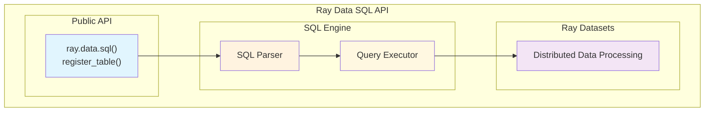

# Ray Data SQL API

<div align="center">

**A SQL interface for Ray Datasets**

*Execute SQL queries on distributed data using Ray's parallel processing*

[](https://ray.io)
[](https://sqlglot.com)

</div>

---

## Table of Contents

- [Overview](#overview)
- [Installation](#installation)
- [Quick Start](#quick-start)
- [SQL Operations](#sql-operations)
- [API Reference](#api-reference)
- [Configuration](#configuration)
- [Examples](#examples)

---

## Overview

The Ray Data SQL API allows you to run SQL queries on Ray Datasets. It supports standard SQL operations like SELECT, WHERE, JOIN, GROUP BY, and ORDER BY, with results returned as Ray Datasets that work with the full Ray Data API.

### Architecture



---

## Installation

```bash
pip install ray[data] sqlglot
```

---

## Quick Start

```python
import ray.data
from ray.data.sql import register_table, sql

# Create datasets
users = ray.data.from_items([
    {"id": 1, "name": "Alice", "age": 25, "city": "Seattle"},
    {"id": 2, "name": "Bob", "age": 30, "city": "Portland"},
    {"id": 3, "name": "Charlie", "age": 35, "city": "Seattle"}
])

orders = ray.data.from_items([
    {"user_id": 1, "amount": 100, "product": "laptop"},
    {"user_id": 2, "amount": 75, "product": "mouse"},
    {"user_id": 1, "amount": 200, "product": "monitor"}
])

# Register as SQL tables
register_table("users", users)
register_table("orders", orders)

# Run SQL queries
result = sql("""
    SELECT u.name, SUM(o.amount) as total_spent
    FROM users u
    JOIN orders o ON u.id = o.user_id
    GROUP BY u.name
    ORDER BY total_spent DESC
""")

# Use result as Ray Dataset
print(result.take_all())
print(f"Found {result.count()} users")
```

### Auto-Registration

```python
# Create datasets (auto-registration uses variable names)
customers = ray.data.from_items([...])
products = ray.data.from_items([...])

# SQL automatically finds tables by variable name
result = ray.data.sql("""
    SELECT c.name, p.price 
    FROM customers c 
    JOIN products p ON c.product_id = p.id
""")
```

---

## SQL Operations

### SELECT

```sql
-- Select all columns
SELECT * FROM users;

-- Select specific columns
SELECT name, age FROM users;

-- Select with expressions
SELECT name, age + 5 as future_age FROM users;

-- Select with aliases
SELECT name AS full_name, age AS years FROM users;
```

### WHERE

```sql
-- Simple filtering
SELECT * FROM users WHERE age > 25;

-- Multiple conditions
SELECT * FROM users WHERE age > 25 AND city = 'Seattle';

-- Pattern matching
SELECT * FROM users WHERE name LIKE 'A%';

-- NULL checks
SELECT * FROM users WHERE email IS NOT NULL;
```

### JOIN

```sql
-- Inner join
SELECT u.name, o.amount 
FROM users u 
JOIN orders o ON u.id = o.user_id;

-- Left join
SELECT u.name, o.amount 
FROM users u 
LEFT JOIN orders o ON u.id = o.user_id;
```

### GROUP BY

```sql
-- Group with aggregates
SELECT city, COUNT(*) as user_count, AVG(age) as avg_age
FROM users 
GROUP BY city;

-- Global aggregates
SELECT COUNT(*) as total_users, AVG(age) as avg_age 
FROM users;
```

### ORDER BY and LIMIT

```sql
-- Sort by single column
SELECT * FROM users ORDER BY age DESC;

-- Sort by multiple columns
SELECT * FROM users ORDER BY city, age DESC;

-- Limit results
SELECT * FROM users ORDER BY age DESC LIMIT 5;
```

### Supported Functions

| Function | Description | Example |
|----------|-------------|---------|
| `COUNT(*)` | Count rows | `SELECT COUNT(*) FROM users` |
| `SUM(col)` | Sum values | `SELECT SUM(amount) FROM orders` |
| `AVG(col)` | Average | `SELECT AVG(age) FROM users` |
| `MIN(col)` | Minimum | `SELECT MIN(age) FROM users` |
| `MAX(col)` | Maximum | `SELECT MAX(amount) FROM orders` |
| `UPPER(col)` | Uppercase | `SELECT UPPER(name) FROM users` |
| `LOWER(col)` | Lowercase | `SELECT LOWER(city) FROM users` |

---

## API Reference

### Core Functions

#### `sql(query: str) -> Dataset`
Execute a SQL query and return a Ray Dataset.

```python
result = sql("SELECT * FROM users WHERE age > 25")
```

#### `register_table(name: str, dataset: Dataset)`
Register a Ray Dataset as a SQL table.

```python
register_table("users", users_dataset)
```

#### `list_tables() -> List[str]`
List all registered tables.

```python
tables = list_tables()
print(f"Available tables: {tables}")
```

#### `clear_tables()`
Remove all registered tables.

```python
clear_tables()
```

### Configuration

You can configure the SQL engine through Ray's DataContext:

```python
from ray.data import DataContext

ctx = DataContext.get_current()
ctx.sql_config = {
    "log_level": "INFO",
    "max_join_partitions": 20
}
```

Available options:
- `log_level`: Logging level ("DEBUG", "INFO", "WARNING", "ERROR")
- `max_join_partitions`: Number of partitions for joins (default: 10)
- `strict_mode`: Enable strict error checking (default: True)

---

## Examples

### Basic Analytics

```python
# Sample sales data
sales = ray.data.from_items([
    {"product": "laptop", "amount": 1200, "region": "north"},
    {"product": "mouse", "amount": 25, "region": "south"},
    {"product": "laptop", "amount": 1200, "region": "south"},
    {"product": "keyboard", "amount": 75, "region": "north"},
])

register_table("sales", sales)

# Sales by region
regional_sales = sql("""
    SELECT 
        region,
        COUNT(*) as num_sales,
        SUM(amount) as total_revenue,
        AVG(amount) as avg_sale
    FROM sales 
    GROUP BY region 
    ORDER BY total_revenue DESC
""")

print("Regional Sales:")
for row in regional_sales.take_all():
    print(f"  {row['region']}: ${row['total_revenue']} ({row['num_sales']} sales)")
```

### Customer Analysis

```python
customers = ray.data.from_items([
    {"id": 1, "name": "Alice", "tier": "premium"},
    {"id": 2, "name": "Bob", "tier": "standard"},
    {"id": 3, "name": "Charlie", "tier": "premium"},
])

orders = ray.data.from_items([
    {"customer_id": 1, "amount": 500},
    {"customer_id": 2, "amount": 200},
    {"customer_id": 1, "amount": 300},
])

register_table("customers", customers)
register_table("orders", orders)

# Customer spending by tier
tier_analysis = sql("""
    SELECT 
        c.tier,
        COUNT(DISTINCT c.id) as num_customers,
        SUM(o.amount) as total_spent,
        AVG(o.amount) as avg_order
    FROM customers c
    LEFT JOIN orders o ON c.id = o.customer_id
    GROUP BY c.tier
    ORDER BY total_spent DESC
""")

print("Customer Analysis by Tier:")
for row in tier_analysis.take_all():
    print(f"  {row['tier']}: {row['num_customers']} customers, ${row['total_spent']} total")
```

### Integration with Ray Data API

```python
# Use SQL for complex aggregation, then Ray operations for further processing
summary = sql("""
    SELECT region, SUM(amount) as revenue 
    FROM sales 
    GROUP BY region
""")

# Continue with Ray Dataset operations
processed = summary.filter(lambda row: row["revenue"] > 500).map(
    lambda row: {
        **row, 
        "performance": "high" if row["revenue"] > 1000 else "medium"
    }
)

print(processed.take_all())
```

---

<div align="center" style="background: linear-gradient(90deg, #667eea, #764ba2); padding: 20px; border-radius: 10px; color: white; margin: 20px 0;">

## Support

For help and questions:
- **Documentation**: [Ray Data Docs](https://docs.ray.io/en/latest/data/overview.html)
- **Issues**: [GitHub Issues](https://github.com/ray-project/ray/issues)
- **Community**: [Ray Discuss](https://discuss.ray.io/)

</div> 