# Comparison

The learning curves over 10 runs are plotted, where the bold lines are the score averaged over multiple runs. 

MPE Scenario| RLlib MADDPG             | OpenAI MADDPG 
:-------------------------:|:-------------------------:|:-------------------------:
simple|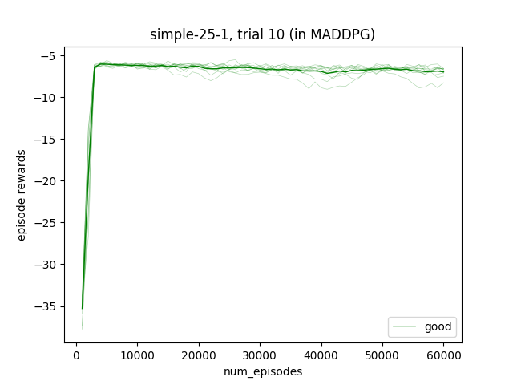|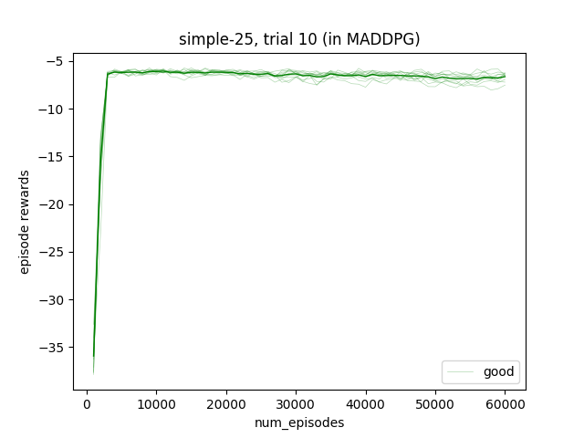
simple_adversary|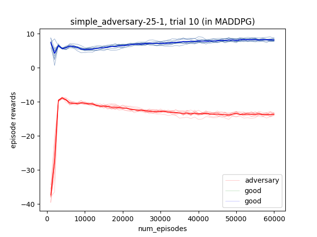|
simple_crypto|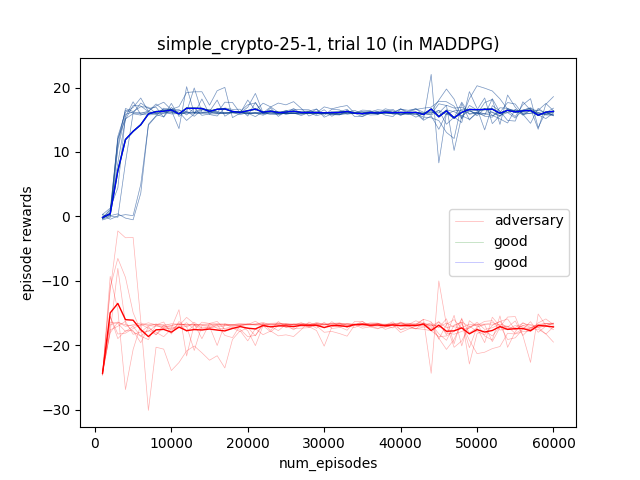|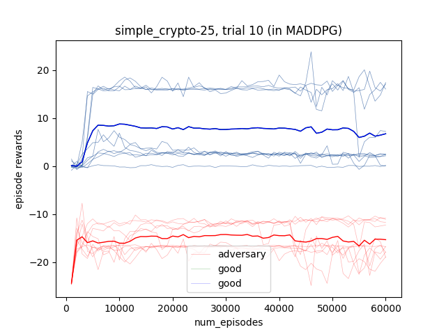
simple_speaker_listener||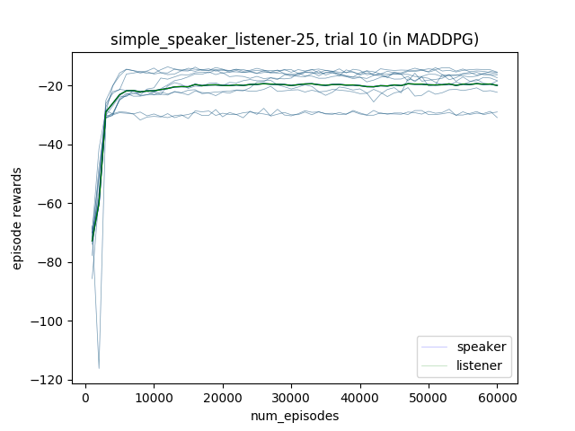
simple_spread|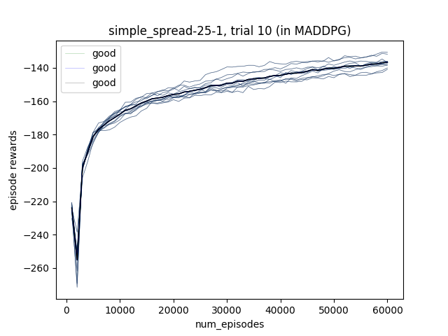|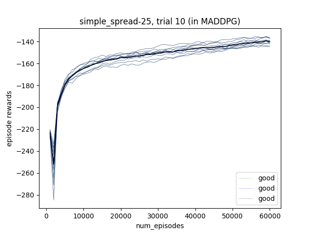
simple_push|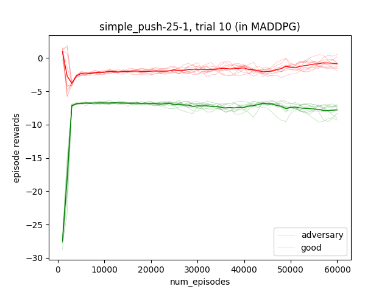|
simple_tag|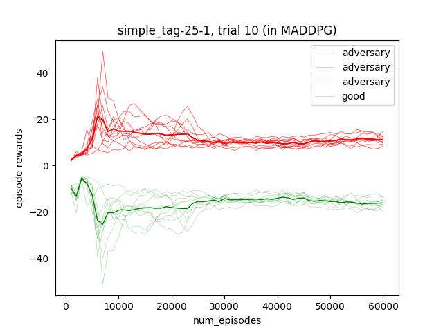|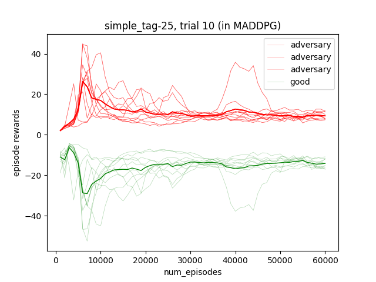

