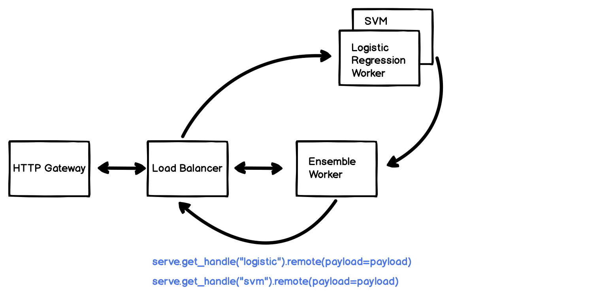

Serve Tutorial: scikit-learn and Model Compositions
===================================================

In this tutorial, we will show you: - how to deploy scikit-learn models
with Ray Serve - how to compose multiple models together using
RayServeHandle

`scikit-learn <https://scikit-learn.org/>`__ is a popular library with
easy to use classification and regression models. In this tutorial, we
will train several models to tackle a simple classification task with
the iris dataset and compose them together.

.. code:: ipython3

    # Install dependencies
    !pip install scikit-learn numpy ray

Part 1: Training Classifers
---------------------------

We will be using the classical ``iris`` dataset, consisting of 150
samples and 3 categories.

Let’s train a models and validate its accuracy. We will use gradient
boosted trees to start.

.. code:: ipython3

    from sklearn.datasets import load_iris
    from sklearn.ensemble import GradientBoostingClassifier
    from sklearn.metrics import mean_squared_error
    
    import numpy as np

.. code:: ipython3

    # Load data
    data, target, target_names, description, feature_names, _ = load_iris().values()
    
    # Instantiate model
    model = GradientBoostingClassifier()
    
    # Training and validation split
    np.random.shuffle(data), np.random.shuffle(target)
    train_x, train_y = data[:100], target[:100]
    val_x, val_y = data[100:], target[100:]
    
    # Train and evaluate models
    model.fit(train_x, train_y)
    print("MSE:", mean_squared_error(model.predict(val_x), val_y))

.. parsed-literal::

    MSE: 1.38

Part 2: Save the model and deploy to RayServe
---------------------------------------------

In this part, we will deploy the model to RayServe and issue queries.

.. code:: ipython3

    from ray import serve
    
    serve.init()

.. parsed-literal::

    2020-04-08 18:59:16,795	INFO resource_spec.py:212 -- Starting Ray with 33.06 GiB memory available for workers and up to 0.09 GiB for objects. You can adjust these settings with ray.init(memory=<bytes>, object_store_memory=<bytes>).
    2020-04-08 18:59:17,201	INFO services.py:1148 -- View the Ray dashboard at localhost:8265

.. parsed-literal::

    (pid=37037) INFO:     Started server process [37037]
    (pid=37037) INFO:     Waiting for application startup.
    (pid=37037) INFO:     Application startup complete.

.. code:: ipython3

    # Save the model and label to file
    import pickle
    import json
    
    with open("/tmp/iris_model_logistic_regression.pkl", "wb") as f:
        pickle.dump(model, f)
    with open("/tmp/iris_labels.json", "w") as f:
        json.dump(target_names.tolist(), f)

Our models are now available as files in temp folder.

.. code:: ipython3

    !ls /tmp/iris_model_logistic_regression.pkl

.. parsed-literal::

    /tmp/iris_model_logistic_regression.pkl

Let’s first deploy the logistic regression model

.. code:: ipython3

    @serve.route("/logistic_regressor")
    class LogisticRegressionModel:
        def __init__(self):
            with open("/tmp/iris_model_logistic_regression.pkl", "rb") as f:
                self.model = pickle.load(f)
            with open("/tmp/iris_labels.json") as f:
                self.label_list = json.load(f)
    
        def __call__(self, flask_request):
            payload = flask_request.json
            print("Worker: received flask request with data", payload)
    
            input_vector = [
                payload["sepal length"],
                payload["sepal width"],
                payload["petal length"],
                payload["petal width"],
            ]
            prediction = self.model.predict([input_vector])[0]
            human_name = self.label_list[prediction]
            return human_name

Let’s query it

.. code:: ipython3

    import requests
    
    sample_request_input = {
        "sepal length": 1.2,
        "sepal width": 1.0,
        "petal length": 1.1,
        "petal width": 0.9,
    }
    response = requests.get(
        "http://localhost:8000/logistic_regressor", json=sample_request_input
    )
    response.text

.. parsed-literal::

    'setosa'

.. parsed-literal::

    (pid=37038) Worker: received flask request with data {'sepal length': 1.2, 'sepal width': 1.0, 'petal length': 1.1, 'petal width': 0.9}

Part 3: Deploy multiple models as a pipeline
--------------------------------------------

Often time we need to deploy multiple model to form a pipeline. In this
tutorial, we will deploy an *ensemble* pipeline that compose two models
and aggregate their responses.

::

             -> Logistic Regression -->
            /                          \
   Request ->                           -> Ensemble -> Response
            \                          /
             ->   SVM Classifier   -->

To begin, let’s train both classifiers and save them.

.. code:: ipython3

    from sklearn.linear_model import LogisticRegression
    from sklearn.svm import SVC
    
    models = {"logistic_regression": LogisticRegression(), "svm_classifier": SVC()}
    for name, model in models.items():
        model.fit(train_x, train_y)
        with open("/tmp/iris_{}.pkl".format(name), "wb") as f:
            pickle.dump(model, f)

With the models saved to disk, let’s define our deployment class and
deploy them with Serve’s low level deployment API. We will enable the
sklearn model to accept *Python* input.

.. code:: ipython3

    class SKLearnModel:
        def __init__(self, model_path, label_path="/tmp/iris_labels.json"):
            with open(model_path, "rb") as f:
                self.model = pickle.load(f)
            with open(label_path) as f:
                self.label_list = json.load(f)
    
        def __call__(self, flask_request, *, payload=None):
            if serve.context.web:
                payload = flask_request.json
            else:
                payload = payload
    
            input_vector = [
                payload["sepal length"],
                payload["sepal width"],
                payload["petal length"],
                payload["petal width"],
            ]
            prediction = self.model.predict([input_vector])[0]
            human_name = self.label_list[prediction]
            return human_name

Serve’s endpoints are logical names for the service. It can be
associated with several backends. Each backend correspond to a function
or a class.

.. code:: ipython3

    serve.create_endpoint(endpoint_name="logistic", route="/logistic")
    serve.create_endpoint(endpoint_name="svm", route="/smv")

.. code:: ipython3

    serve.create_backend(SKLearnModel, "logistic:v1", "/tmp/iris_logistic_regression.pkl")
    serve.create_backend(SKLearnModel, "svm:v1", "/tmp/iris_svm_classifier.pkl")

.. code:: ipython3

    serve.link("logistic", "logistic:v1")
    serve.link("svm", "svm:v1")

How can we implement the ensemble function? Each endpoints in Serve is
reachable via RayServeHandle. You can directly call the it via python.

.. code:: ipython3

    handle = serve.get_handle("svm")
    handle

.. parsed-literal::

    
    RayServeHandle(
        Endpoint="svm",
        URL="http://127.0.0.1:8000/svm",
    )

.. code:: ipython3

    sample_input = {
        "sepal length": 1.2,
        "sepal width": 1.0,
        "petal length": 1.1,
        "petal width": 0.9,
    }

When you invoke the handle, an ``ObjectID`` is returned immediately. The
``ObjectID`` contains the future result from prediction. You can
retrieve the result via ``ray.get``

.. code:: ipython3

    object_id = handle.remote(payload=sample_input)
    object_id

.. parsed-literal::

    ObjectID(0bead116322a6c2b93415054010000c801000000)

.. code:: ipython3

    import ray
    ray.get(object_id)

.. parsed-literal::

    'versicolor'

We can implement our ensemble function this way.

.. code:: ipython3

    @serve.route("/ensemble")
    def ensemble(flask_request):
        payload = flask_request.json
    
        # Both requests are fired at the same time
        logistic_out_object_id = serve.get_handle("logistic").remote(payload=payload)
        svm_out_object_id = serve.get_handle("svm").remote(payload=payload)
    
        # We retrieve from both models together
        logistic_out, svm_out = ray.get([logistic_out_object_id, svm_out_object_id])
    
        # We will return both output
        return {"logistic": logistic_out, "svm": svm_out}

.. code:: ipython3

    print(requests.get("http://127.0.0.1:8000/ensemble", json=sample_input).text)

.. parsed-literal::

    {
      "logistic": "virginica",
      "svm": "versicolor"
    }

What just happened?
~~~~~~~~~~~~~~~~~~~

There is only a single HTTP request fired to ensemble. The ensemble
worker queries logistic regression and SVM *directly* inside the Serve
system without going through HTTP again. This is how Serve enable fast
and scalable model composition. Keep in mind that both logistic
regression and SVM models are evaluated *in parallel*!

   serve_sklearn_ensemble.png
