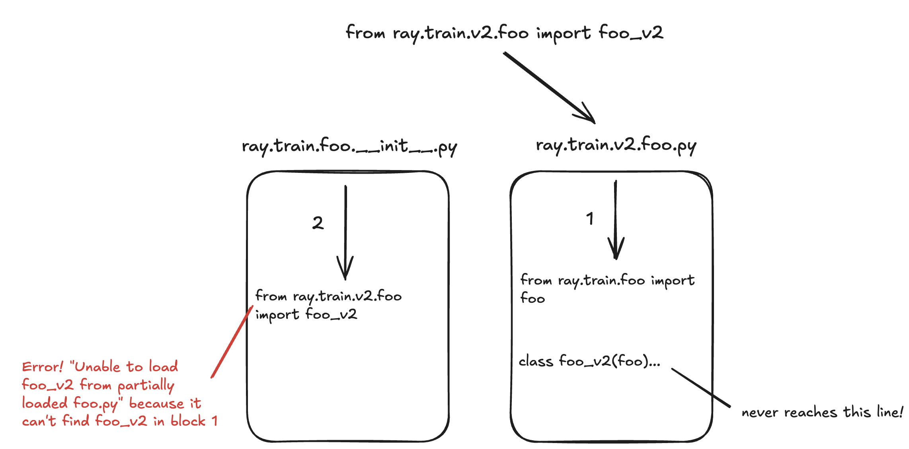
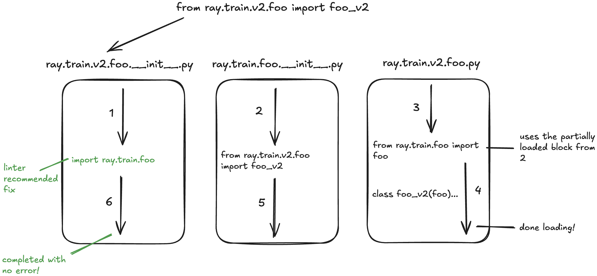
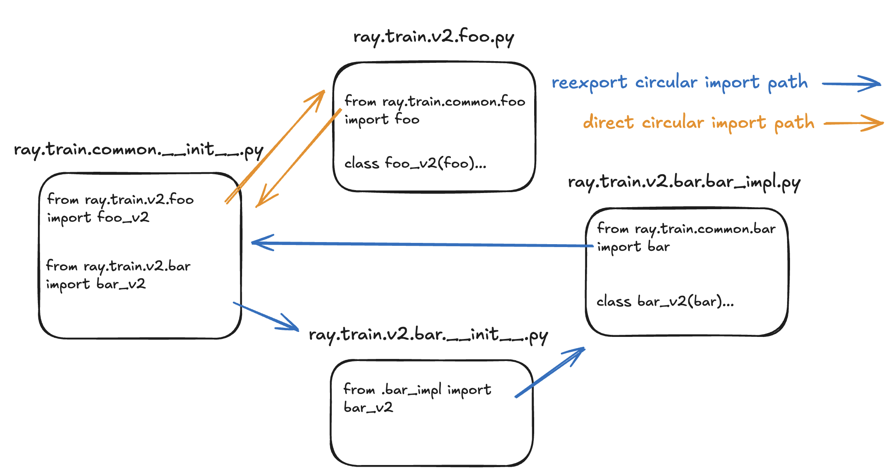

## Ray Train Circular Import Linter

Ray Train functionality is overrided or "patched" by functionality from other directories. For instance, Ray Train is patched by functionality from Ray Train v2 when `RAY_TRAIN_V2_ENABLED=1`, making Ray Train dependent on Ray Train v2. In turn, the patching directory often imports functionality from the "base" Ray Train directory (`ray/python/ray/train`), resulting in a circular dependency. The Ray Train Circular Import Linter takes a patching directory, `patch_dir`, and detects circular imports between it and the base Ray Train directory- displaying violations to users via pre-commit.

### The Problem:

When there is a circular dependency present in the codebase, import errors are triggered by importing directly from the patching directory. For example, directly importing the v2 TensorflowTrainer with `from ray.train.v2.tensorflow.tensorflow_trainer import TensorflowTrainer` rather than relying on the conventional routing logic via `from ray.train.tensorflow import TensorflowTrainer` results in a `ImportError: cannot import name TensorflowTrainer from partially initialized ray.train.v2.tensorflow.tensorflow_trainer`. This happens in the case of user API misuse or during the deserialization of the train function on train worker setup. The following image depicts the error path of such erroneous imports.

### The Fix:

To make Ray Train resilient to such erroneous imports, this linter proactively detects circular imports and specifies how to fix it. The fix perscribed by the linter prevents import errors by importing the base Train packages early within in the patching directory. In the below example, the previously depicted circular import is resolved by the linter's suggested fix to import `ray.train.foo` early in `ray.train.v2.foo`.

The key observation is that the fix redirects the import path of `from ray.train.v2.foo import foo_v2` so that the base Train init file (e.g. `ray.train.foo.__init__.py`) runs before the patching file (e.g. `ray.train.v2.foo.py`), avoiding the error in the previous example.

### Linter Specification

The linter implements an `ast.NodeVisitor` to parse imports within the base Train directory and the patching directory to detect circular imports. The below example depicts two circular imports that would be detected by the linter originating from a `ray.train.common.__init__.py` file.

The linter parses all `__init__.py` files in the base Train directory and collects their imports. For each patching import (e.g. `from ray.train.v2.foo import foo_v2`), the linter will also collect the imports in the patching file (e.g. `ray.train.v2.foo.py`) and if any of these imports point back to the same base Train file (e.g. `ray.train.common.__init__.py`), a violation is detected.

However, notice from the diagram that the linter also detects violations in the case of reexports. If the base Train file points to a patching package file (e.g. `ray.train.v2.bar.__init__.py`), the linter will also collect the imports of the referenced implementation file (e.g. `ray.train.v2.bar.bar_impl.py`) to search for a violation.

That said, in both cases, if the linter finds that the base Train file is imported early in the patching package file (e.g. `ray.train.common` is imported in `ray.train.v2.foo.__init__.py`/`ray.train.v2.bar.__init__.py`), then the violation will be suppressed. Otherwise, this is the fix that will be reccommended by the linter.
