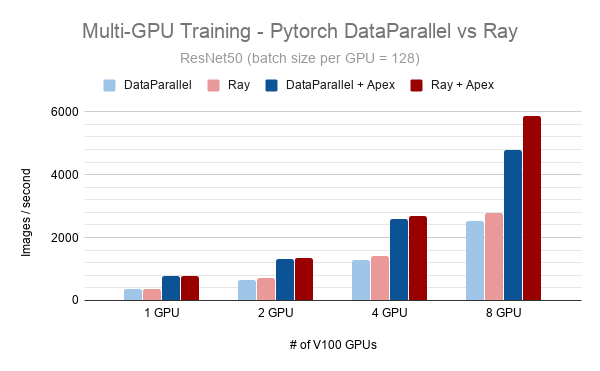
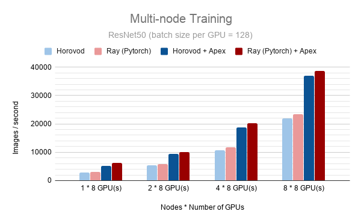

Running benchmarks
==================

RaySGD provides comparable or better performance than other existing solutions for parallel or distributed training.

You can run ``ray/python/ray/util/sgd/torch/examples/benchmarks/benchmark.py`` for benchmarking the RaySGD TorchTrainer implementation. To benchmark training on a multi-node multi-gpu cluster, you can use the `Ray Autoscaler <https://docs.ray.io/en/master/autoscaling.html#aws>`_.

DISCLAIMER: RaySGD does not provide any custom communication primitives. If you see any performance issues, you may need to file them on the PyTorch github repository.

Single Node Results
-------------------

Here are benchmarking results comparing the following:

* torch.nn.DataParallel
* torch.nn.DataParallel with ``apex.amp`` enabled (``O1``)
* Ray (wrapping Pytorch DistributedDataParallel)
* Ray (wrapping Pytorch DistributedDataParallel) with ``apex.amp`` enabled (``O1``)

on synthetic ImageNet data (via ``benchmark.py`` and ``dp_benchmark.py``) as of 03/04/2020.

Framework versions used:

* PyTorch Version: torch-1.4.0-cp36-cp36m
* Torchvision Version: torchvision-0.5.0-cp36-cp36m
* Apex Version: commit hash 5633f6d

.. code-block::

    # Images per second for ResNet50
    # Batch size per worker = 128
    # GPU Type = V100
    # Run on AWS us-east-1c, p3dn.24xlarge instance.

    Number   DataParallel  Ray (PyTorch)  DataParallel  Ray (PyTorch)
    of GPUs                               + Apex        + Apex
    =======  ============  =============  ============  ==============
    1        355.5         356            776           770
    2        656           701            1303          1346
    4        1289          1401           2606          2695
    8        2521          2795           4795          5862

Multi Node Results
------------------

Here are benchmarking results comparing the following:

* Horovod
* Horovod with ``apex.amp`` enabled  (``O1``)
* Ray (wrapping Pytorch DistributedDataParallel)
* Ray (wrapping Pytorch DistributedDataParallel) with ``apex.amp`` enabled (``O1``)

on synthetic ImageNet data (via ``benchmark.py`` and ``horovod_benchmark_apex.py``) as of 03/04/2020.

Framework versions used:

* PyTorch Version: torch-1.4.0-cp36-cp36m
* Torchvision Version: torchvision-0.5.0-cp36-cp36m
* Apex Version: commit hash 5633f6d
* Horovod Version: horovod-0.19.0

.. code-block:: bash

    # Images per second for ResNet50
    # Batch size per worker = 128
    # GPU Type = V100
    # Run on AWS us-east-1c, p3dn.24xlarge instances.

    Number   Horovod  Ray (PyTorch)  Horovod  Ray (PyTorch)
    of GPUs                          + Apex   + Apex
    =======  =======  =============  =======  ==============
    1 * 8    2769.7   2962.7         5143     6172
    2 * 8    5492.2   5886.1         9463     10052.8
    4 * 8    10733.4  11705.9        18807    20319.5
    8 * 8    21872.5  23317.9        36911.8  38642

Simple Instructions
-------------------

Note that these instructions are not maintained and may require a bit of wrangling to get working.

First, ``git clone https://github.com/ray-project/ray && cd ray/python/ray/util/sgd/torch/examples/``.

You can use ``sgd-development.yaml`` to setup your cluster configuration and ``ray up sgd-development.yaml`` to launch the cluster.

You can specify the number of nodes you want to use with the following configuration:

.. code-block::

    # The maximum number of workers nodes to launch in addition to the head
    # node. This takes precedence over min_workers. min_workers default to 0.
    min_workers: <NUMBER_OF_NODES>  # Change this to a custom quantity
    max_workers:  <NUMBER_OF_NODES>  # same as above

You may want to install FP16 support for PyTorch with the following configuration in the YAML file:

.. code-block:: yaml

    setup_commands:
        - ray || pip install -U ray[rllib]
        - pip install -U ipdb torch torchvision
        # Install apex, but continue if this command fails.
        # For faster installation purposes, we do not install the apex cpp bindings
        # The cpp bindings can improve your benchmarked performance.
        - git clone https://github.com/NVIDIA/apex && cd apex && pip install -v --no-cache-dir  ./ || true

You should then run ``ray monitor sgd-development.yaml`` to monitor the progress of the cluster setup. When the cluster is done setting up, you should see something like the following:

.. code-block:: bash

    2020-03-05 01:24:53,613 INFO log_timer.py:17 -- AWSNodeProvider: Set tag ray-node-status=up-to-date on ['i-07ba946522fcb1d3d'] [LogTimer=134ms]
    2020-03-05 01:24:53,734 INFO log_timer.py:17 -- AWSNodeProvider: Set tag ray-runtime-config=c12bae3df69d4d6a207e90948dc4bf763319d7ed on ['i-07ba946522fcb1d3d'] [LogTimer=121ms]
    2020-03-05 01:24:58,475 INFO autoscaler.py:733 -- StandardAutoscaler: 7/7 target nodes (0 pending)
    2020-03-05 01:24:58,476 INFO autoscaler.py:734 -- LoadMetrics: MostDelayedHeartbeats={'172.31.38.189': 0.21588897705078125, '172.31.38.95': 0.21587467193603516, '172.31.42.196': 0.21586227416992188, '172.31.34.227': 0.2158496379852295, '172.31.42.101': 0.2158372402191162}, NodeIdleSeconds=Min=6 Mean=27 Max=40, NumNodesConnected=8, NumNodesUsed=0.0, ResourceUsage=0.0/512.0 CPU, 0.0/64.0 GPU, 0.0 GiB/4098.67 GiB memory, 0.0/1.0 node:172.31.34.227, 0.0/1.0 node:172.31.36.8, 0.0/1.0 node:172.31.36.82, 0.0/1.0 node:172.31.38.189, 0.0/1.0 node:172.31.38.95, 0.0/1.0 node:172.31.42.101, 0.0/1.0 node:172.31.42.196, 0.0/1.0 node:172.31.45.185, 0.0 GiB/5.45 GiB object_store_memory, TimeSinceLastHeartbeat=Min=0 Mean=0 Max=0

You can then launch a synthetic benchmark run with the following command:

.. code-block:: bash

    $ ray submit sgd-development.yaml benchmarks/benchmark.py --args="--batch-size 128"

    # Or with apex fp16
    $ ray submit sgd-development.yaml benchmarks/benchmark.py --args="--batch-size 128 --use-fp16"

You should see something like:

.. code-block:: bash

    Model: resnet50
    Batch size: 128
    Number of GPUs: 16
    Iter #0: 354.2 img/sec per GPU
    Iter #1: 354.0 img/sec per GPU
    Iter #2: 353.0 img/sec per GPU
    Iter #3: 353.3 img/sec per GPU
    Iter #4: 352.8 img/sec per GPU
    Iter #5: 348.5 img/sec per GPU
    Iter #6: 352.5 img/sec per GPU
    Iter #7: 352.5 img/sec per GPU
    Iter #8: 352.1 img/sec per GPU
    Iter #9: 352.2 img/sec per GPU
    Img/sec per GPU: 352.5 +-3.0
    Total img/sec on 16 GPU(s): 5640.2 +-47.2

You can run ``ray up benchmarks/horovod-benchmark.yaml`` to launch an AWS cluster that sets up Horovod on each machine.
See ``https://github.com/horovod/horovod`` for launching Horovod training. ``horovod_benchmark_apex.py`` can be used with ``horovodrun`` to obtain benchmarking results.

Note: Training can also be launched using :ref:`Ray Job Submission <jobs-overview>`, which is in beta starting with Ray 1.12.  Try it out!
