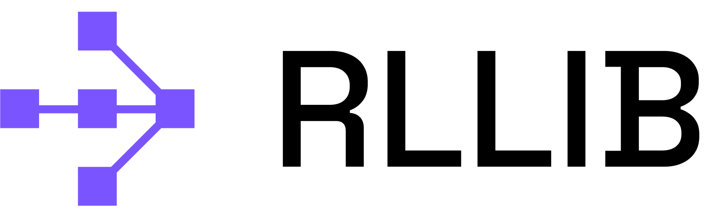

<p align="center">
  
</p>

# RLlib: Industry-Grade, Scalable Reinforcement Learning

**RLlib** is an open source library for reinforcement learning (**RL**), offering support for
production-level, highly scalable, and fault-tolerant RL workloads, while maintaining simple and unified
APIs for a large variety of industry applications.

Whether training policies in a **multi-agent** setup, from historic **offline** data,
or using **externally connected simulators**, RLlib offers simple solutions for each of
these autonomous decision making needs and enables you to start running your experiments within hours.

## Installation and getting started

Install RLlib and [PyTorch](https://pytorch.org), as shown below:

```bash
pip install "ray[rllib]" torch
```

Once installed, you can start coding against RLlib. Here is an example for running the PPO algorithm on the
[Taxi domain](https://gymnasium.farama.org/environments/toy_text/taxi/).
You first create a `config` for the algorithm, which defines the RL environment and any other needed settings and parameters.

```python
from ray.rllib.algorithms.ppo import PPOConfig
from ray.rllib.connectors.env_to_module import FlattenObservations

# Configure the algorithm.
config = (
    PPOConfig()
    .environment("Taxi-v3")
    .env_runners(
        num_env_runners=2,
        # Observations are discrete (ints) -> We need to flatten (one-hot) them.
        env_to_module_connector=lambda env: FlattenObservations(),
    )
    .evaluation(evaluation_num_env_runners=1)
)

# Build the algorithm.
algo = config.build_algo()

# Train it for 2 iterations ...
for _ in range(2):
    print(algo.train())

# ... and evaluate it.
print(algo.evaluate())

# Release the algo's resources (remote actors, like EnvRunners and Learners).
algo.stop()
```

## In-depth documentation

For an in-depth overview of RLlib and everything it has to offer, including
hands-on tutorials of important industry use cases and workflows, head over to
our [documentation pages](https://docs.ray.io/en/master/rllib/index.html).

## Citing RLlib

If RLlib helps with your academic research, the Ray RLlib team encourages you to cite these papers:

```
@inproceedings{liang2021rllib,
    title={{RLlib} Flow: Distributed Reinforcement Learning is a Dataflow Problem},
    author={
        Wu, Zhanghao and
        Liang, Eric and
        Luo, Michael and
        Mika, Sven and
        Gonzalez, Joseph E. and
        Stoica, Ion
    },
    booktitle={Conference on Neural Information Processing Systems ({NeurIPS})},
    year={2021},
    url={https://proceedings.neurips.cc/paper/2021/file/2bce32ed409f5ebcee2a7b417ad9beed-Paper.pdf}
}

@inproceedings{liang2018rllib,
    title={{RLlib}: Abstractions for Distributed Reinforcement Learning},
    author={
        Eric Liang and
        Richard Liaw and
        Robert Nishihara and
        Philipp Moritz and
        Roy Fox and
        Ken Goldberg and
        Joseph E. Gonzalez and
        Michael I. Jordan and
        Ion Stoica,
    },
    booktitle = {International Conference on Machine Learning ({ICML})},
    year={2018},
    url={https://arxiv.org/pdf/1712.09381}
}
```
