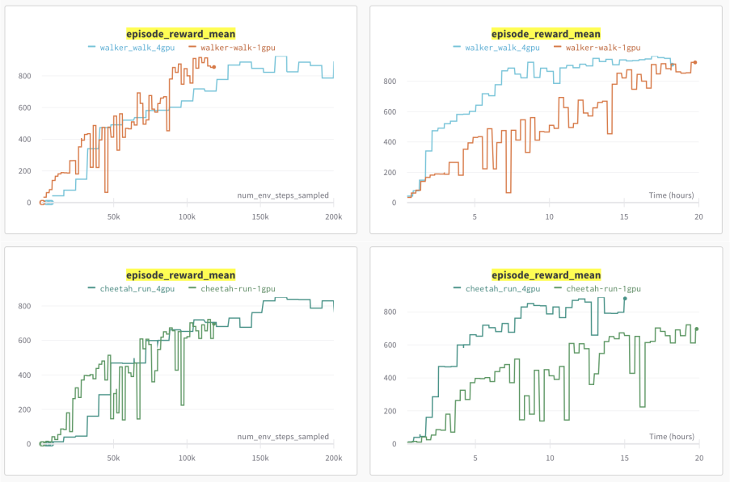

# DreamerV3


## Overview
An RLlib-based implementation of the
[DreamerV3 model-based reinforcement learning algorithm](https://arxiv.org/pdf/2301.04104v1.pdf)
by D. Hafner et al. (Google DeepMind) 2023, in PyTorch.

This implementation allows scaling up training by using multi-GPU machines for
neural network updates (see below for tips and tricks, example configs, and command lines).

DreamerV3 trains a world model in supervised fashion using real environment
interactions. The world model's objective is to correctly predict all aspects
of the transition dynamics of the RL environment, which includes predicting the
correct next environment state, received rewards, as well as a boolean episode
continuation flag.
Just like in a standard policy gradient algorithm (e.g. REINFORCE), the critic tries to
predict a correct value function and the actor tries to come up with good actions
choices that maximize accumulated rewards over time.
However, both actor and critic are never trained on real environment data, but solely on
dreamed trajectories produced by the world model.

For more specific details about DreamerV3 architecture and math refer to the
[original paper](https://arxiv.org/pdf/2301.04104v1.pdf) (see below for all references).

## Note on Hyperparameter Tuning for DreamerV3
DreamerV3 is an extremely versatile and stable algorithm that not only works well on
different action- and observation spaces (i.e. discrete and continuous actions, as well
as image and vector observations) and reward functions (sparse or dense),
but also has very little hyperparameters that require tuning.

All you need is a simple "model size" setting (from "XS" to "XL") and a value for the training ratio, which
specifies how many steps to replay from the buffer for a training update vs how many
steps to take in the actual environment.

Here are some examples on how to set these config settings within your `DreamerV3Config` objects:

## Example Configs and Command Lines

<b>Note:</b> For a quick setup guide on how to get started with RLlib, refer to this
[documentation page here](https://docs.ray.io/en/latest/rllib/index.html#rllib-in-60-seconds).

Use the config examples and templates in the
[tuned_examples folder](../../tuned_examples/dreamerv3)
in combination with the following scripts and command lines in order to run RLlib's DreamerV3 algorithm in your experiments:

### [Atari100k](../../tuned_examples/dreamerv3/atari_100k_dreamerv3.py)
```shell
$ cd ray/rllib/tuned_examples/dreamerv3/
$ python atari_100k_dreamerv3.py --env ale_py:ALE/Pong-v5
```

### [DeepMind Control Suite (vision)](../../tuned_examples/dreamerv3/dm_control_suite_vision_dreamerv3.py)
```shell
$ cd ray/rllib/tuned_examples/dreamerv3/
$ python dm_control_suite_vision_dreamerv3.py --env DMC/cartpole/swingup
```
Other `--env` options for the DM Control Suite would be `--env DMC/hopper/hop`, `--env DMC/walker/walk`, etc..
Note that you can also switch on WandB logging with the above script via the options
`--wandb-key=[your WandB API key] --wandb-project=[some project name] --wandb-run-name=[some run name]`

## Running DreamerV3 with arbitrary Envs and Configs
Can I run DreamerV3 with any gym or custom environments? Yes, you can!


Let's try the Flappy Bird gymnasium env. It's image space is a cellphone-style
288 x 512 RGB, very different from DreamerV3's Atari benchmark norm (which is 64x64 RGB).
So we will have to custom-wrap observations to resize/normalize FlappyBird's ``Box(0, 255, (288, 512, 3), f32)``
space into a new ``Box(-1, 1, (64, 64, 3), f32)``.

First we quickly install ``flappy_bird_gymnasium`` in our dev environment:
```shell
$ pip install flappy_bird_gymnasium
```

Now, let's create a new python file for this RLlib experiment and call it ``flappy_bird.py``:

```python
from ray import tune
from ray.rllib.algorithms.dreamerv3.dreamerv3 import DreamerV3Config


def _env_creator(ctx):
    import flappy_bird_gymnasium  # doctest: +SKIP
    import gymnasium as gym
    from supersuit.generic_wrappers import resize_v1
    from ray.rllib.env.wrappers.atari_wrappers import NormalizedImageEnv

    return NormalizedImageEnv(
        resize_v1(  # resize to 64x64 and normalize images
            gym.make("FlappyBird-rgb-v0", audio_on=False), x_size=64, y_size=64
        )
    )


# Register the FlappyBird-rgb-v0 env including necessary wrappers via the
# `tune.register_env()` API.
tune.register_env("flappy-bird", _env_creator)

# Define the `config` variable to use for training.
config = (
    DreamerV3Config()
    # set the env to the pre-registered string
    .environment("flappy-bird")
    # play around with the insanely high number of hyperparameters for DreamerV3 ;)
    .training(
        model_size="S",
        training_ratio=1024,
    )
)

# Run the tuner job.
results = tune.Tuner(trainable="DreamerV3", param_space=config).fit()
```

Great! Now, let's run this experiment:

```shell
$ python flappy_bird.py
```

This should be it. Feel free to try out running this on multiple GPUs using these
more advanced config examples [here (Atari100k)](../../tuned_examples/dreamerv3/atari_100k_dreamerv3.py) and
[here (DM Control Suite)](../../tuned_examples/dreamerv3/dm_control_suite_vision_dreamerv3.py).
Also see the notes below on good recipes for running on multiple GPUs.

<b>IMPORTANT:</b> DreamerV3 out-of-the-box only supports image observation spaces of
shape 64x64x3 as well as any vector observations (1D float32 Box spaces).
Should you require a special world model encoder- and decoder for other observation
spaces (e.g. a text embedding or images of other dimensions), you will have to
subclass [DreamerV3's catalog class](dreamerv3_catalog.py) and then configure this
new catalog via your ``DreamerV3Config`` object as follows:

```python
from ray.rllib.algorithms.dreamerv3.torch.dreamerv3_torch_rl_module import DreamerV3TorchRLModule
from ray.rllib.core.rl_module.rl_module import RLModuleSpec

config.rl_module(
    rl_module_spec=RLModuleSpec(
        module_class=DreamerV3TorchRLModule,
        catalog_class=[your DreamerV3Catalog subclass],
    )
)
```


## Note on multi-GPU Training with DreamerV3
We found that when using multiple GPUs for DreamerV3 training, the following simple
adjustments should be made on top of the default config.

- Multiply the batch size (default `B=16`) by the number of GPUs you are using.
  Use the `DreamerV3Config.training(batch_size_B=..)` API for this. For example, for 2 GPUs,
  use a batch size of `B=32`.
- Multiply the number of environments you sample from in parallel by the number of GPUs you are using.
  Use the `DreamerV3Config.env_runners(num_envs_per_env_runner=..)` for this.
  For example, for 4 GPUs and a default environment count of 8 (the single-GPU default for
  this setting depends on the benchmark you are running), use 32
  parallel environments instead.
- Roughly use learning rates that are the default values multiplied by the square root of the number of GPUs.
  For example, when using 4 GPUs, multiply all default learning rates (for world model, critic, and actor) by 2.
  - Additionally, a "priming"-style warmup schedule might help. Thereby, increase the learning rates from 0.0
    to the final value(s) over the first ~10% of total env steps needed for the experiment.
  - For examples on how to set such schedules within your `DreamerV3Config`, see below.
  - [See here](https://aws.amazon.com/blogs/machine-learning/the-importance-of-hyperparameter-tuning-for-scaling-deep-learning-training-to-multiple-gpus/) for more details on learning rate "priming".


## Results
Our results on the Atari 100k and (visual) DeepMind Control Suite benchmarks match those
reported in the paper.

### Pong-v5 (100k) 1GPU vs 2GPUs vs 4GPUs


### Atari 100k


### DeepMind Control Suite (vision)



## Running Action Inference after Training

To run action inference on a DreamerV3 Algorithm object, you can use
[this simple environment loop script](https://github.com/ray-project/ray/tree/master/doc/source/rllib/doc_code/dreamerv3_inference.py).

Note the slight complexity caused by the fact that DreamerV3 a) uses a recurrent model,
b) uses the new RLModule-based API stack (no Policy class), and c) outputs actions in a one-hot
fashion for discrete action spaces.


## References
For more algorithm details, see the original Dreamer-V3 paper:

[1] [Mastering Diverse Domains through World Models - 2023 D. Hafner, J. Pasukonis, J. Ba, T. Lillicrap](https://arxiv.org/pdf/2301.04104v1.pdf)

.. and the (predecessor) Dreamer-V2 paper:

[2] [Mastering Atari with Discrete World Models - 2021 D. Hafner, T. Lillicrap, M. Norouzi, J. Ba](https://arxiv.org/pdf/2010.02193.pdf)
