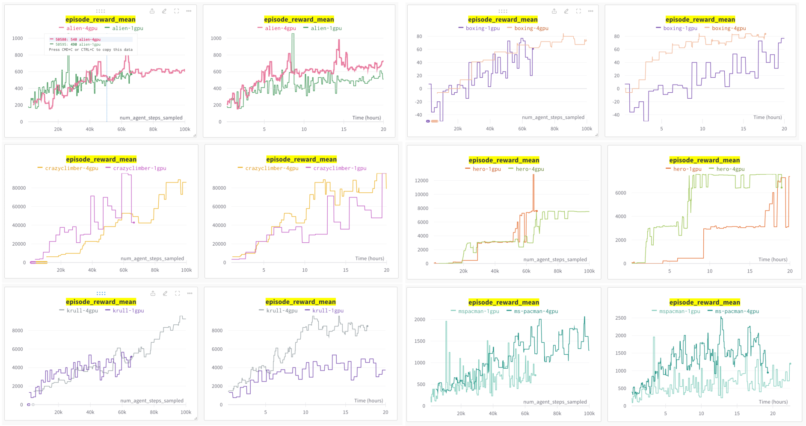

# DreamerV3

## Overview
An RLlib-based implementation of the
[DreamerV3 model-based reinforcement learning algorithm](https://arxiv.org/pdf/2301.04104v1.pdf)
by D. Hafner et al. (Google DeepMind) 2023, in TensorFlow/Keras. 

This implementation allows scaling up the training by using multi-GPU machines for
neural network updates (see below for tips and tricks, example configs, and command lines).

DreamerV3 trains a world model in supervised fashion using real environment
interactions. The world model's objective is to correctly predict all aspects
of the transition dynamics of the RL environment, which includes predicting the
correct next observations, the received rewards, as well as a boolean episode
continuation flag.
Just like in a standard policy gradient algorithm (e.g. REINFORCE), the critic tries to
predict a correct value function (based on the world model-predicted rewards), whereas
the actor tries to come up with good actions to take for maximizing accumulated rewards
over time.
In other words, the actual RL components of the model (actor and critic) are never
trained on real environment data, but on dreamed trajectories only.

For more specific details about the algorithm refer to the
[original paper](https://arxiv.org/pdf/2301.04104v1.pdf) (see below for all references).

## Note on Hyperparameter Tuning for DreamerV3
DreamerV3 is an extremely versatile and stable algorithm that not only works well on
different action- and observation spaces (i.e. discrete and continuous actions, as well
as image and vector observations), but also has very little hyperparameters that require tuning.
All you need is a simple "model size" setting (from "XS" to "XL") and a value for the training ratio, which
specifies how many steps to replay from the buffer for a training update vs how many
steps to take in the actual environment.

For examples on how to set these config settings within your `DreamerV3Config`, see below.


## Note on multi-GPU Training with DreamerV3
We found that when using multiple GPUs for DreamerV3 training, the following simple
adjustments should be made on top of the default config.

- Multiply the batch size (default `B=16`) by the number of GPUs you are using.
  Use the `DreamerV3Config.training(batch_size_B=..)` API for this. For example, for 2 GPUs,
  use a batch size of `B=32`.
- Multiply the number of environments you sample from in parallel by the number of GPUs you are using.
  Use the `DreamerV3Config.rollouts(num_envs_per_worker=..)` for this.
  For example, for 4 GPUs and a default environment count of 8 (the single-GPU default for
  this setting depends on the benchmark you are running), use 32 parallel environments instead.
- Use a learning rate schedule for all learning rates (world model, actor, critic) with "priming".
  - In particular, the first ~10% of total env step needed for the experiment should use low
    rates of `0.4` times of the published rates (i.e. world model: `4e-5`, critic and actor: `1.2e-5`). 
  - Over the course of the next ~10% of total env steps, linearly increase all rates to
    n times their published values, where `n=max(4, [num GPUs])`.
  - For examples on how to set these LR-schedules within your `DreamerV3Config`, see below.
  - [See here](https://aws.amazon.com/blogs/machine-learning/the-importance-of-hyperparameter-tuning-for-scaling-deep-learning-training-to-multiple-gpus/) for more details on learning rate "priming".


## Example Configs and Command Lines
Use the config examples and templates in
[the tuned_examples folder here](https://github.com/ray-project/ray/tree/master/rllib/tuned_examples/dreamerv3)
in combination with the following scripts and command lines in order to run RLlib's DreamerV3 algorithm in your experiments:

### Atari100k
```shell
$ cd ray/rllib
$ rllib train file tuned_examples/dreamerv3/atari_100k.py --env ALE/Pong-v5 
```

### DeepMind Control Suite (vision)
```shell
$ cd ray/rllib
$ rllib train file tuned_examples/dreamerv3/dm_control_suite_vision.py --env DMC/cartpole/swingup 
```
Other `--env` options for the DM Control Suite would be `--env DMC/hopper/hop`, `--env DMC/walker/walk`, etc..
Note that you can also switch on WandB logging with the above script via the options
`--wandb-key=[your WandB API key] --wandb-project=[some project name] --wandb-run-name=[some run name]`


## Results
Our results on the Atari 100k and (visual) DeepMind Control Suite benchmarks match those
reported in the paper.

### Pong-v5 (100k) 1GPU vs 2GPUs vs 4GPUs


### Atari 100k


### DeepMind Control Suite (vision)


## References
For more algorithm details, see the original Dreamer-V3 paper:

[1] [Mastering Diverse Domains through World Models - 2023 D. Hafner, J. Pasukonis, J. Ba, T. Lillicrap](https://arxiv.org/pdf/2301.04104v1.pdf)

.. and the Dreamer-V2 paper:

[2] [Mastering Atari with Discrete World Models - 2021 D. Hafner, T. Lillicrap, M. Norouzi, J. Ba](https://arxiv.org/pdf/2010.02193.pdf)
