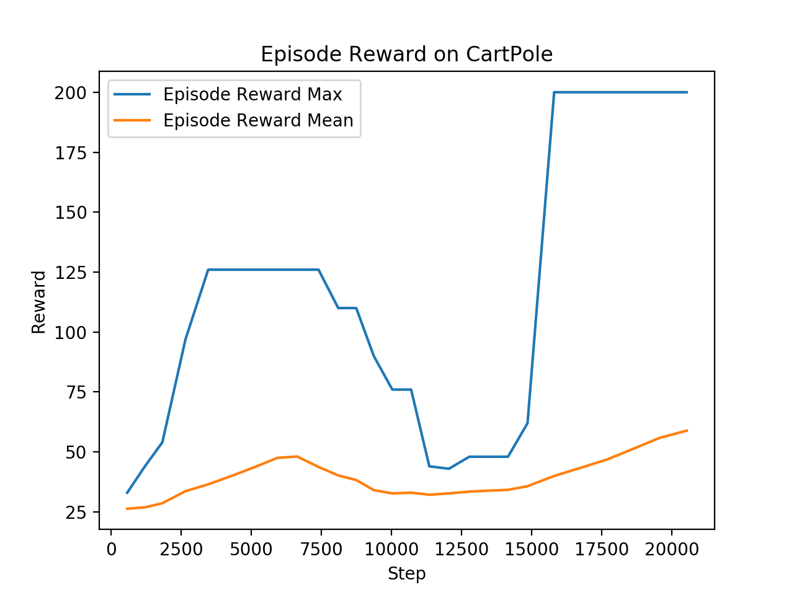

# AlphaZero implementation for Ray/RLlib
## Notes

This code implements a one-player AlphaZero agent. It includes the "ranked rewards" (R2) strategy which simulates the self-play in the two-player AlphaZero in forcing the agent to be better than its previous self. R2 is also very helpful to normalize dynamically the rewards. 

The code is Pytorch based. It assumes that the environment is a gym environment, has a discrete action space and returns an observation as a dictionary with two keys:

 - `obs` that contains an observation under either the form of a state vector or an image
 - `action_mask` that contains a mask over the legal actions
 
 It should also implement a `get_state`and a `set_state` function.
 
 The model used in AlphaZero trainer should extend `ActorCriticModel` and implement the method `compute_priors_and_value`. 
 
## Example on CartPole

Note that both mean and max rewards are obtained with the MCTS in exploration mode: dirichlet noise is added to priors and actions are sampled from the tree policy vectors. We will add later the display of the MCTS in exploitation mode: no dirichlet noise and actions are chosen as tree policy vectors argmax.

## References

- AlphaZero: https://arxiv.org/abs/1712.01815
- Ranked rewards: https://arxiv.org/abs/1807.01672
