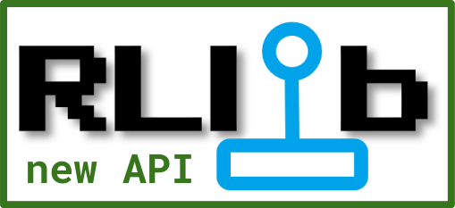

-  |new_stack| `Curriculum learning with the custom callbacks API <https://github.com/ray-project/ray/blob/master/rllib/examples/curriculum/curriculum_learning.py>`__:
   Example of how to make the environment go through different levels of difficulty (from easy to harder to solve)
   and thus help the learning algorithm to cope with an otherwise unsolvable task.
   Also see the :doc:`curriculum learning how-to </rllib/rllib-advanced-api#curriculum-learning>` from the documentation.

