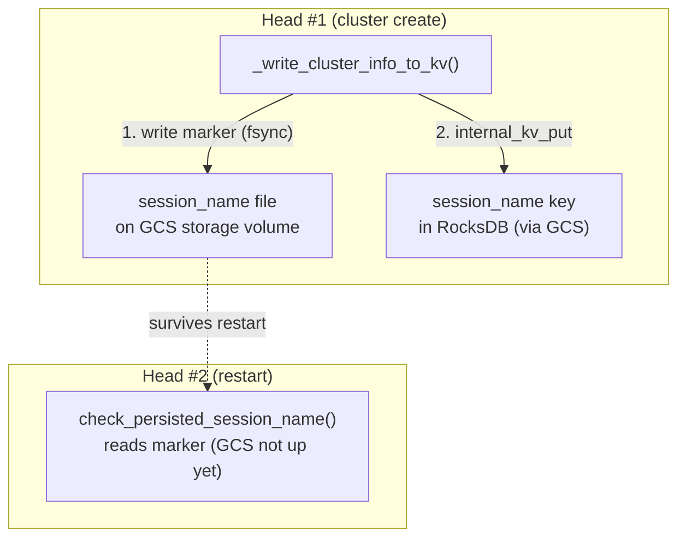

# RocksDB GCS: `session_name` recovery via the marker file

This note explains the one piece of the RocksDB GCS backend that lives outside
the store client itself: how a restarting head process recovers the cluster's
`session_name`. The logic is in `python/ray/_private/node.py`
(`check_persisted_session_name` for the read path,
`_write_cluster_info_to_kv` for the write path).

## What `session_name` is

`session_name` (e.g. `session_2026-06-19_..._12345`) identifies one Ray session.
It names `/tmp/ray/session_*` and is stored in GCS `internal_kv` under the
`session_name` key. On head **restart**, the head must recover the *same* name
instead of minting a new one — otherwise GCS still holds the old persisted value
and a later assertion trips on the mismatch.

## The bootstrap problem RocksDB introduces

Recovery runs **before GCS is up**. Where the prior name can be read from depends
on the backend:

| Backend | Where the prior name lives | Readable pre-GCS? |
|---|---|---|
| Redis | A *separate* Redis process, already running | Yes — connect to Redis directly |
| RocksDB | *Embedded inside the GCS server process* | No — reachable only *through* GCS, which isn't up |

So with RocksDB the only component that can read the persisted name (GCS) is
exactly the one that hasn't started. `internal_kv` is unusable at that moment.

## The marker file bridges the gap

A plain file at `<gcs_storage_path>/session_name`, on the **same persistent
volume** as the RocksDB database files. The previous head writes it; the next
head reads it before GCS exists. Because the storage path is durable (it holds
RocksDB's own data), the file survives the restart we're recovering from.

Why a file and not something cleverer: we can't query `internal_kv` pre-GCS, and
opening the RocksDB DB directly from the Python head would add a second writer to
a single-writer database. A plain, co-located file is the simplest thing that is
correct, and its durability domain matches the data it describes (same volume
lives and dies together).

## Two invariants the write path must hold

1. **Order: marker file *before* `internal_kv_put`.** This keeps the invariant
   "file present ⇒ RocksDB has (or is about to have) the name." A crash between
   the two is safe: the next restart reads the file and the `internal_kv_put`
   (with `overwrite=False`) inserts cleanly. The reverse order is the dangerous
   one — RocksDB could hold a name with no file, so the next head can't recover,
   mints a fresh name, and trips the assert.

2. **Durability: atomic write (tmp + fsync + rename + dir fsync).** The
   `internal_kv_put` is durable via RocksDB's WAL fsync, so the file must be
   equally durable; otherwise a power-loss crash could leave RocksDB's state on
   disk but the file lost in the page cache. A marker-write failure is treated as
   **fatal** — the same path holds RocksDB's files, so an unwritable path means
   GCS can't function anyway; failing loudly beats limping into the assert.

In one sentence: the marker file is a tiny, durable, co-located breadcrumb that
lets a restarting head learn the prior `session_name` during the window when the
only other source of truth (RocksDB-via-GCS) is provably unavailable.
