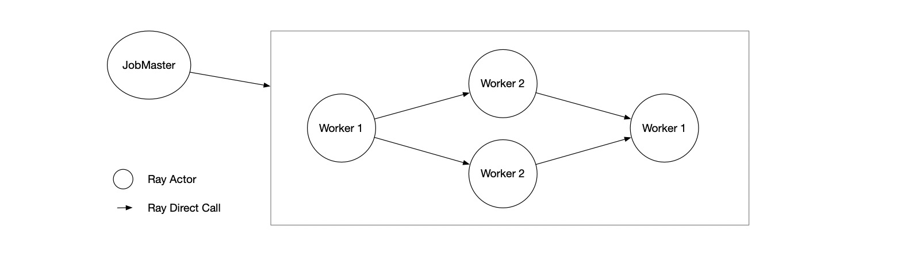

Ray Streaming
=============

Ray Streaming is a streaming data processing framework built on ray. It will be helpful for you to build jobs dealing with real-time data.

Key Features
------------

#. 
   **Cross Language**. Based on Ray's multi-language actor, Ray Streaming can also run in multiple
   languages(only Python and Java is supported currently) with high efficiency. You can implement your
   operator in different languages and run them in one job.

#. 
   **Single Node Failover**. We designed a special failover mechanism that only needs to rollback the
   failed node it's own, in most cases, to recover the job. This will be a huge benefit if your job is
   sensitive about failure recovery time. In other frameworks like Flink, instead, the entire job should
   be restarted once a node has failure.

Examples
--------

Python
^^^^^^

.. code-block:: Python

   import ray
   from ray.streaming import StreamingContext

   ctx = StreamingContext.Builder() \
       .build()
   ctx.read_text_file(__file__) \
       .set_parallelism(1) \
       .flat_map(lambda x: x.split()) \
       .map(lambda x: (x, 1)) \
       .key_by(lambda x: x[0]) \
       .reduce(lambda old_value, new_value:
               (old_value[0], old_value[1] + new_value[1])) \
       .filter(lambda x: "ray" not in x) \
       .sink(lambda x: print("result", x))
   ctx.submit("word_count")

Java
^^^^

.. code-block:: Java

   StreamingContext context = StreamingContext.buildContext();
   List<String> text = Collections.singletonList("hello world");
   DataStreamSource.fromCollection(context, text)
       .flatMap((FlatMapFunction<String, WordAndCount>) (value, collector) -> {
           String[] records = value.split(" ");
           for (String record : records) {
               collector.collect(new WordAndCount(record, 1));
           }
       })
       .filter(pair -> !pair.word.contains("world"))
       .keyBy(pair -> pair.word)
       .reduce((oldValue, newValue) ->
               new WordAndCount(oldValue.word, oldValue.count + newValue.count))
       .sink(result -> System.out.println("sink result=" + result));
   context.execute("testWordCount");

Use Java Operators in Python
^^^^^^^^^^^^^^^^^^^^^^^^^^^^

.. code-block:: Python

   import ray
   from ray.streaming import StreamingContext

   ctx = StreamingContext.Builder().build()
   ctx.from_values("a", "b", "c") \
       .as_java_stream() \
       .map("io.ray.streaming.runtime.demo.HybridStreamTest$Mapper1") \
       .filter("io.ray.streaming.runtime.demo.HybridStreamTest$Filter1") \
       .as_python_stream() \
       .sink(lambda x: print("result", x))
   ctx.submit("HybridStreamTest")

Use Python Operators in Java
^^^^^^^^^^^^^^^^^^^^^^^^^^^^

.. code-block:: Java

   StreamingContext context = StreamingContext.buildContext();
   DataStreamSource<String> streamSource =
       DataStreamSource.fromCollection(context, Arrays.asList("a", "b", "c"));
   streamSource
       .map(x -> x + x)
       .asPythonStream()
       .map("ray.streaming.tests.test_hybrid_stream", "map_func1")
       .filter("ray.streaming.tests.test_hybrid_stream", "filter_func1")
       .asJavaStream()
       .sink(value -> System.out.println("HybridStream sink=" + value));
   context.execute("HybridStreamTestJob");

Installation
------------

Python
^^^^^^

Ray Streaming is packaged together with Ray, install Ray with: ``pip install ray``\ ,
this wheel contains all dependencies your need to run Python streaming, including Java operators supporting.

Java
^^^^

Import Ray Streaming using maven:

.. code-block:: xml

   <dependency>
       <artifactId>ray-api</artifactId>
       <groupId>io.ray</groupId>
       <version>1.0.1</version>
   </dependency>
   <dependency>
       <artifactId>ray-runtime</artifactId>
       <groupId>io.ray</groupId>
       <version>1.0.1</version>
   </dependency>
   <dependency>
       <artifactId>streaming-api</artifactId>
       <groupId>io.ray</groupId>
       <version>1.0.1</version>
   </dependency>
   <dependency>
       <artifactId>streaming-runtime</artifactId>
       <groupId>io.ray</groupId>
       <version>1.0.1</version>
   </dependency>

Internal Design
---------------

Overall Architecture
^^^^^^^^^^^^^^^^^^^^

Ray Streaming is built on Ray. We use Ray's actor to run everything, and use Ray's direct call for communication.

There are two main types of actor: job master and job worker.

When you execute ``context.submit()`` in your driver, we'll first create a job master, then job master will create all job workers needed to run your operator. Then job master will be responsible to coordinate all workers, including checkpoint, failover, etc.

Check `Ray Streaming Proposal <https://docs.google.com/document/d/1EubVMFSFJqNLmbNztnYKj6m0VMzg3a8ZVQZg-mgbLQ0>`_
to get more detailed information about the overall design.

Fault Tolerance Mechanism
^^^^^^^^^^^^^^^^^^^^^^^^^

As mentioned above, different from other frameworks, We designed a special failover mechanism that only needs to rollback the failed node it's own, in most cases, to recover the job. The main idea to achieve this feature is saving messages for each node, and replay them from upstream when node has failure.

Check `Fault Tolerance Proposal <https://docs.google.com/document/d/1NKjGr7fi-45cEzWA-N_wJ5CoUgaJfnsW9YeWsSg1shY>`_
for more detailed information about our fault tolerance mechanism.

Development Guides
------------------

#. 
   Build streaming java

   * build ray

     * ``bazel build //java:gen_maven_deps``
     * ``cd java && mvn clean install -Dmaven.test.skip=true && cd ..``

   * build streaming

     * ``bazel build //streaming/java:gen_maven_deps``
     * ``mvn clean install -Dmaven.test.skip=true``

#. 
   Build ray python will build ray streaming python.

#. 
   Run examples

   .. code-block:: bash

       # c++ test
       cd streaming/ && bazel test ...
       sh src/test/run_streaming_queue_test.sh
       cd ..

       # python test
       pushd python/ray/streaming/
       pushd examples
       python simple.py --input-file toy.txt
       popd
       pushd tests
       pytest .
       popd
       popd

       # java test
       cd streaming/java/streaming-runtime
       mvn test

More Information
----------------

* `Ray Streaming implementation plan <https://github.com/ray-project/ray/issues/6184>`_
* `Fault Tolerance Proposal <https://docs.google.com/document/d/1NKjGr7fi-45cEzWA-N_wJ5CoUgaJfnsW9YeWsSg1shY>`_
* `Data Transfer Proposal <https://docs.google.com/document/d/1cpGr40e9N8knmynqUnnrKhbNnz_6ucn5I2Koq2p4Xp8>`_
* `Ray Streaming Proposal <https://docs.google.com/document/d/1EubVMFSFJqNLmbNztnYKj6m0VMzg3a8ZVQZg-mgbLQ0>`_
* `Open Source Plan <https://docs.google.com/document/d/1fHFpPgXy853z0m--BZ_L1wmQADf2KXDrLQ1ebFlHLws>`_

Getting Involved
----------------

- `Community Slack`_: Join our Slack workspace.
- `GitHub Discussions`_: For discussions about development, questions about usage, and feature requests.
- `GitHub Issues`_: For reporting bugs.

.. _`GitHub Discussions`: https://github.com/ray-project/ray/discussions
.. _`GitHub Issues`: https://github.com/ray-project/ray/issues
.. _`Community Slack`: https://forms.gle/9TSdDYUgxYs8SA9e8
