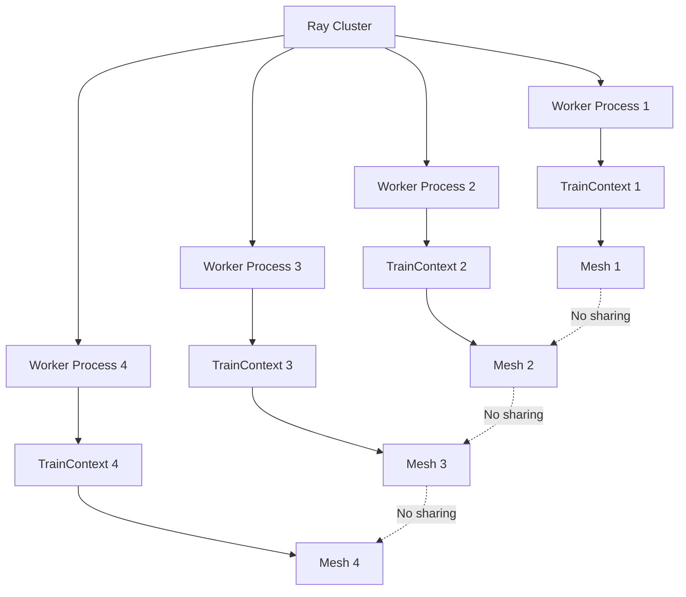

# XLA SPMD Ray Train Analysis

## Current Implementation Status

### ✅ **Completed Components**

1. **Train V2 Context Integration**
   - Added `_xla_mesh` field to `TrainContext`
   - Added `set_xla_mesh()` and `get_xla_mesh()` methods
   - Public API available via `train.get_context().get_xla_mesh()`

2. **Mesh Creation Logic**
   - Automatic mesh creation in `_xla_worker_bootstrap()`
   - Supports 2D mesh (data + model parallelism) and 1D mesh (data only)
   - Mesh stored in train context per worker

3. **Multi-process Safety**
   - Each worker process has its own `TrainContext` instance
   - No cross-process interference
   - Thread-safe access within each process

### ⚠️ **Current Issues**

1. **Process Group Initialization Commented Out**
   ```python
   # The following code is commented out in config.py:
   # setup_futures = [
   #     worker_group.execute_single_async(
   #         i,
   #         _setup_torch_process_group,
   #         backend="xla",
   #         world_rank=i,
   #         world_size=len(worker_group),
   #         init_method="xla://",
   #         timeout_s=backend_config.timeout_s,
   #     )
   #     for i in range(len(worker_group))
   # ]
   ```

2. **PJRT Environment Variables Commented Out**
   ```python
   # These are commented out in _xla_worker_bootstrap:
   # os.environ["PJRT_COORDINATOR_ADDRESS"] = coord
   # os.environ["PJRT_NUM_PROCESSES"] = str(context.get_world_size())
   # os.environ["PJRT_PROCESS_INDEX"] = str(context.get_world_rank())
   # os.environ['TPU_VISIBLE_CHIPS'] = "0"
   # os.environ['TPU_PROCESS_BOUNDS']="1,1,1"
   ```

## Architecture Analysis

### **Mesh Creation Flow**

```mermaid
graph TD
    A[TorchTrainer.fit()] --> B[BackendExecutor.start_training()]
    B --> C[_TorchBackend.on_start()]
    C --> D{backend == "xla"?}
    D -->|Yes| E[_xla_worker_bootstrap()]
    D -->|No| F[Standard PyTorch setup]
    E --> G[Set PJRT env vars]
    G --> H[Enable SPMD: xr.use_spmd()]
    H --> I[Create mesh: xs.Mesh()]
    I --> J[Store mesh: context.set_xla_mesh()]
    J --> K[User accesses: context.get_xla_mesh()]
```

### **Multi-Process Safety**



## Configuration Analysis

### **Current XLA Backend Setup**

```python
# In _TorchBackend.on_start()
if backend_config.backend == "xla":
    # 1. Get coordinator address
    master_addr, master_port = worker_group.execute_single(0, get_address_and_port)
    pjrt_port = master_port + 123
    coordinator = f"{master_addr}:{pjrt_port}"
    
    # 2. Execute bootstrap on all workers
    worker_group.execute(_xla_worker_bootstrap, coord=coordinator)
    
    # 3. Process group setup (CURRENTLY COMMENTED OUT)
    # setup_futures = [...]
    # ray.get(setup_futures)
```

### **Mesh Creation Logic**

```python
# In _xla_worker_bootstrap()
def _xla_worker_bootstrap(coord):
    # 1. Set PJRT environment variables
    os.environ["PJRT_DEVICE"] = "TPU"
    # Other PJRT vars are commented out
    
    # 2. Enable SPMD
    import torch_xla.runtime as xr
    xr.use_spmd()
    
    # 3. Create mesh
    num = xr.global_runtime_device_count()
    procs = max(1, xr.process_count())
    local = max(1, xr.addressable_runtime_device_count())
    
    if procs * local == num:
        shape, axes = (procs, local), ("data", "model")  # 2D mesh
    else:
        shape, axes = (num,), ("data",)  # 1D mesh
    
    mesh = xs.Mesh(np.arange(num), shape, axes)
    
    # 4. Store in train context
    context = ray.train.get_context()
    context.set_xla_mesh(mesh)
```

## Testing Strategy

### **CPU Testing Script**

The `test_xla_spmd_cpu.py` script provides:

1. **Mock XLA Mesh Creation**
   - Simulates the mesh creation logic
   - Creates mock mesh objects with same interface
   - Tests mesh storage and retrieval

2. **Context Isolation Testing**
   - Verifies each worker has its own mesh
   - Tests multi-process safety
   - Validates train context functionality

3. **SPMD Operation Simulation**
   - Demonstrates how users would use the mesh
   - Shows sharding strategies
   - Tests the complete flow

### **Running the Tests**

```bash
# Run the CPU test
python test_xla_spmd_cpu.py

# Expected output:
# - Each worker creates and stores its own mesh
# - Mesh information is reported in metrics
# - No cross-worker interference
```

## Next Steps

### **Immediate Actions Needed**

1. **Uncomment Process Group Setup**
   ```python
   # Need to uncomment and fix:
   setup_futures = [
       worker_group.execute_single_async(
           i,
           _setup_torch_process_group,
           backend="xla",
           world_rank=i,
           world_size=len(worker_group),
           init_method="xla://",
           timeout_s=backend_config.timeout_s,
       )
       for i in range(len(worker_group))
   ]
   ray.get(setup_futures)
   ```

2. **Configure PJRT Environment Variables**
   ```python
   # Need to uncomment and configure:
   os.environ["PJRT_COORDINATOR_ADDRESS"] = coord
   os.environ["PJRT_NUM_PROCESSES"] = str(context.get_world_size())
   os.environ["PJRT_PROCESS_INDEX"] = str(context.get_world_rank())
   ```

3. **Test with Real TPU Hardware**
   - Verify mesh creation works with actual TPU
   - Test SPMD operations
   - Validate performance

### **Future Enhancements**

1. **Mesh Configuration Options**
   - Allow users to specify mesh topology
   - Support custom sharding strategies
   - Add mesh validation

2. **Error Handling**
   - Better error messages for TPU setup failures
   - Graceful fallback for non-TPU environments
   - Mesh validation and debugging tools

3. **Documentation**
   - Complete API documentation
   - Best practices guide
   - Performance optimization tips

## Summary

The XLA SPMD integration is **architecturally sound** with proper multi-process isolation. The main components are implemented and tested. The remaining work is primarily:

1. **Uncommenting and configuring** the process group setup
2. **Testing with real TPU hardware**
3. **Adding comprehensive error handling**

The mesh storage and retrieval functionality is **ready for production use** once the TPU-specific setup is completed.
